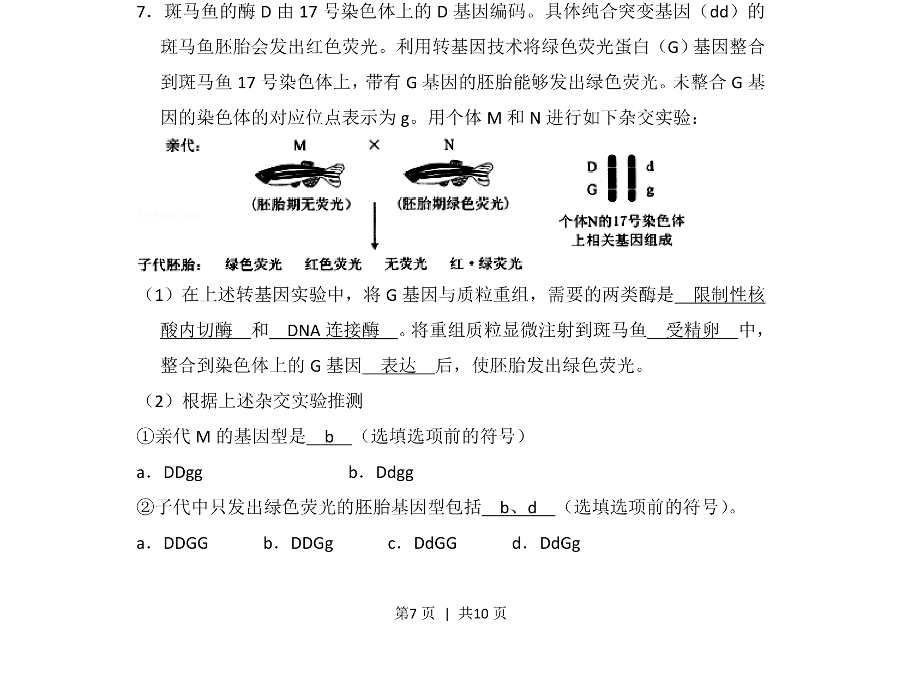
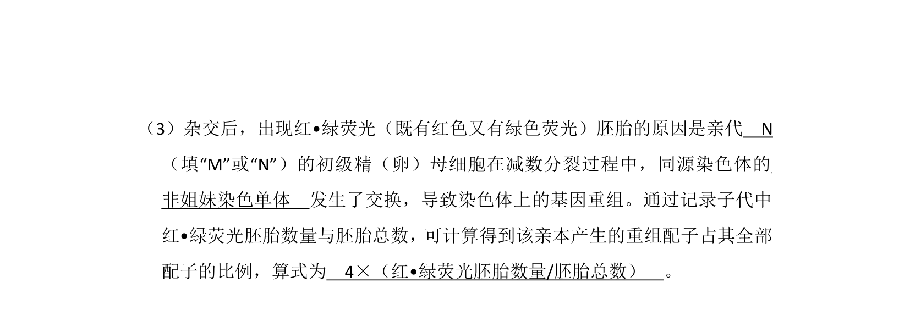
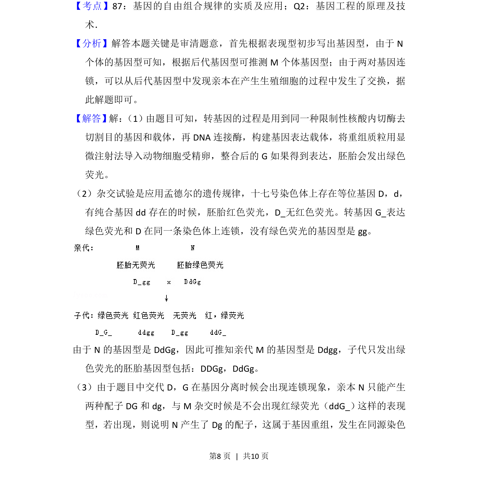
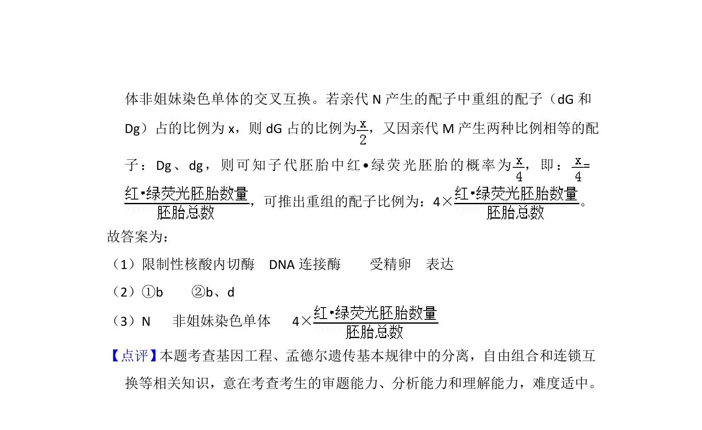

## 题面

## 摘要

该题考查基因工程工具酶及转基因斑马鱼杂交实验中基因型的推断。

## 关联考点

- [[411-基因工程|基因工程]]
- [[422-限制性核酸内切酶|限制酶]]
- [[409-DNA连接酶|DNA连接酶]]
- [[576-基因型推断|基因型推断]]

## 答案与解析

> 📄 原 PDF 第 7 页：`素材/真题/北京/2008-2024·（北京）生物高考真题/2013年高考生物试卷（北京）（解析卷）.pdf`
