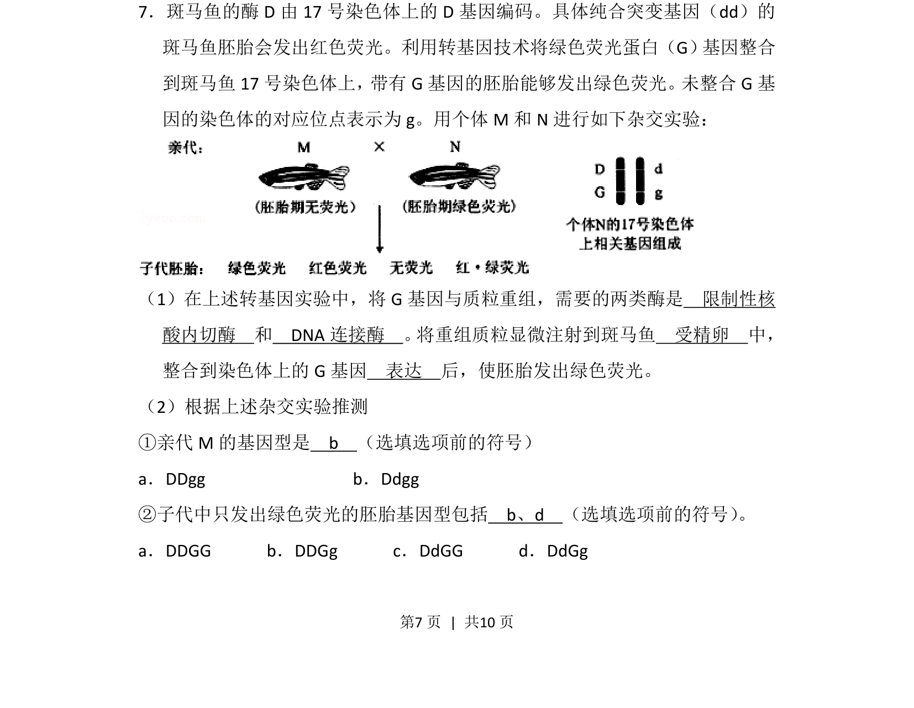
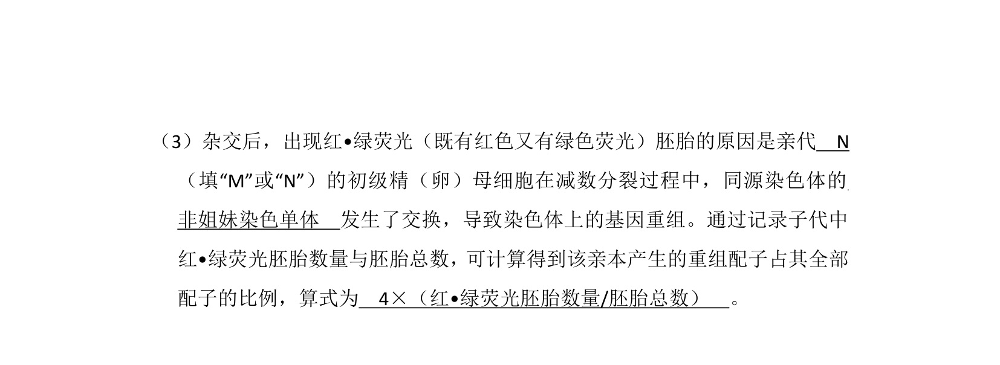
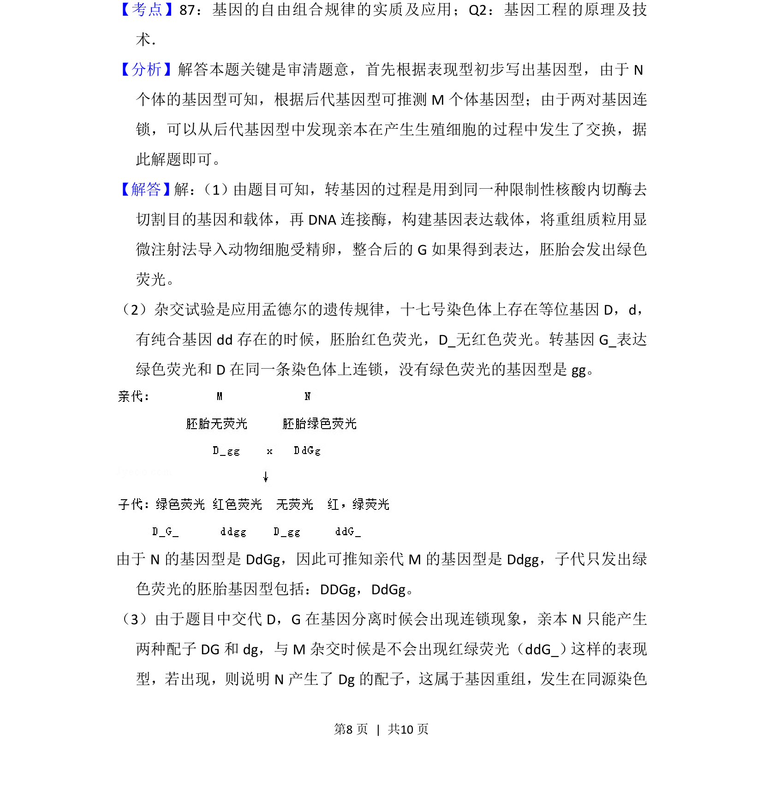
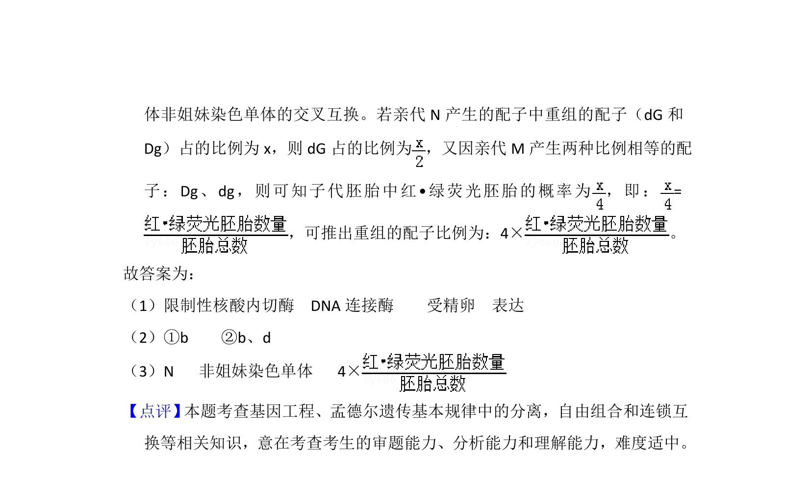

## 题面

## 摘要

该题考查基因工程工具酶及转基因斑马鱼杂交实验中基因型的推断。

## 关联考点

- [[411-基因工程|基因工程]]
- [[422-限制性核酸内切酶|限制酶]]
- [[409-DNA连接酶|DNA连接酶]]
- [[576-基因型推断|基因型推断]]

## 答案与解析

> 📄 原 PDF 第 7 页：`素材/真题/北京/2008-2024·（北京）生物高考真题/2013年高考生物试卷（北京）（解析卷）.pdf`

<!-- 题干文本-start -->
## 题干文本
7．斑马鱼的酶D由17号染色体上的D基因编码。具体纯合突变基因（dd）的
斑马鱼胚胎会发出红色荧光。利用转基因技术将绿色荧光蛋白（G） 基因整合
到斑马鱼17号染色体上，带有G基因的胚胎能够发出绿色荧光。未整合G基
因的染色体的对应位点表示为g。用个体M和N进行如下杂交实验：
（1）在上述转基因实验中，将G基因与质粒重组，需要的两类酶是　限制性核
酸内切酶　和　DNA连接酶　。 将重组质粒显微注射到斑马鱼　受精卵　中，
整合到染色体上的G基因　表达　后，使胚胎发出绿色荧光。
（2）根据上述杂交实验推测
①亲代M的基因型是　b　（选填选项前的符号）
a．DDgg                b．Ddgg
②子代中只发出绿色荧光的胚胎基因型包括　b、d　（选填选项前的符号） 。
a．DDGG      b．DDGg      c．DdGG      d．DdGg
<!-- 题干文本-end -->

<!-- 解析文本-start -->
## 解析文本

<!-- 解析文本-end -->
