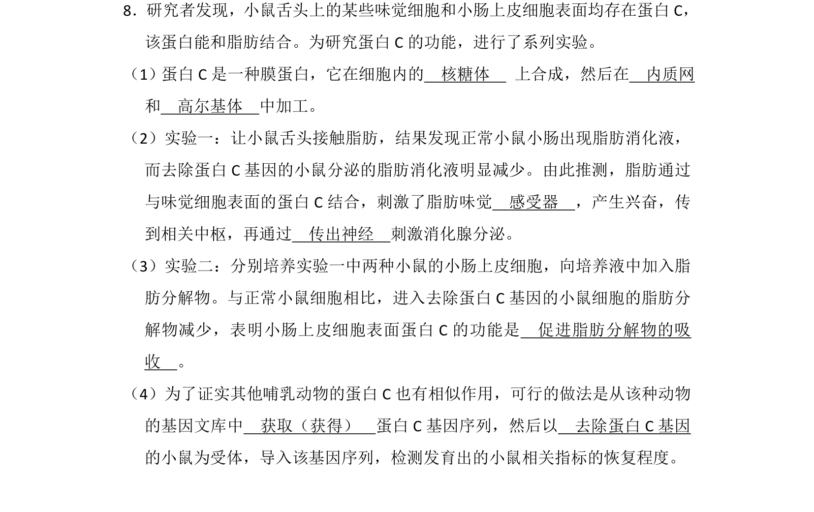
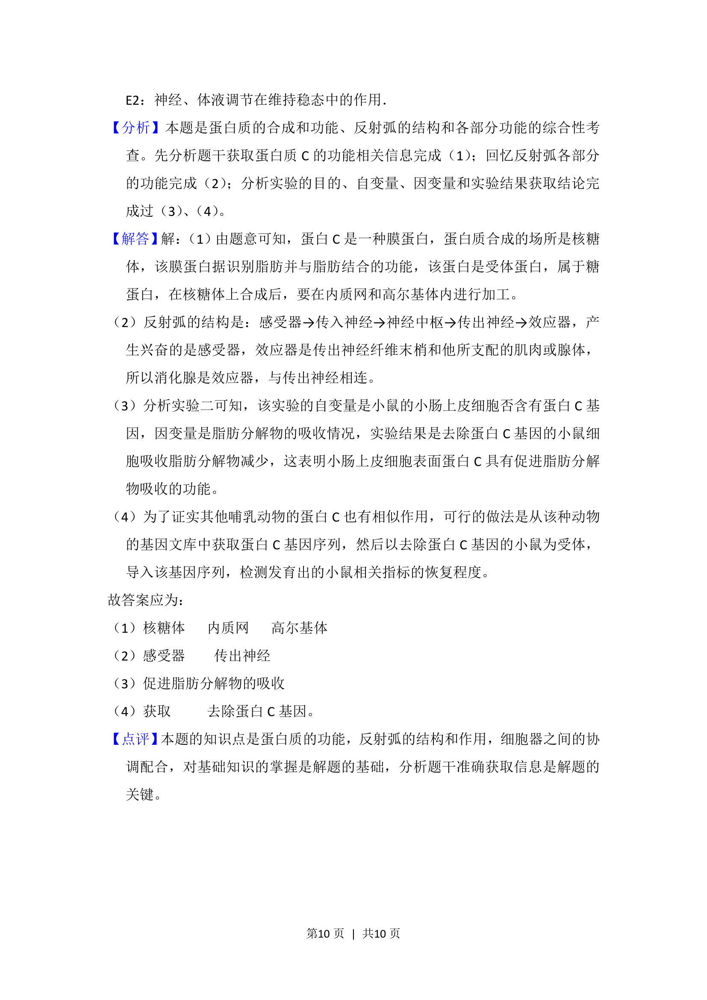

## 题面

## 摘要

探究膜蛋白C在味觉细胞和小肠上皮细胞的合成、定位及功能。

## 关联考点

- [[696-蛋白质功能|蛋白质功能]]
- [[细胞器协调配合]]
- [[085-反射弧（初中）|反射弧]]
- [[411-基因工程|基因工程]]

## 答案与解析

> 📄 原 PDF 第 9 页：`素材/真题/北京/2008-2024·（北京）生物高考真题/2013年高考生物试卷（北京）（解析卷）.pdf`
