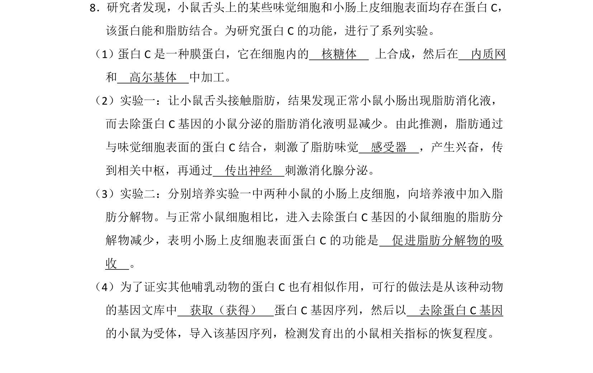
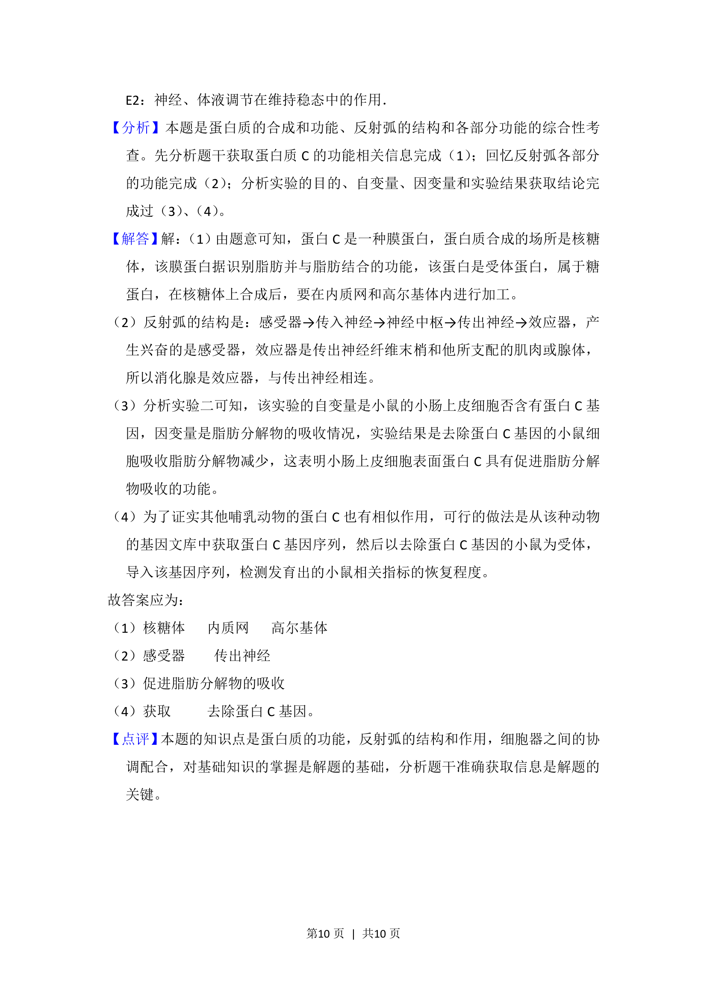

## 题面

## 摘要

探究膜蛋白C在味觉细胞和小肠上皮细胞的合成、定位及功能。

## 关联考点

- [[696-蛋白质功能|蛋白质功能]]
- [[细胞器协调配合]]
- [[085-反射弧（初中）|反射弧]]
- [[411-基因工程|基因工程]]

## 答案与解析

> 📄 原 PDF 第 9 页：`素材/真题/北京/2008-2024·（北京）生物高考真题/2013年高考生物试卷（北京）（解析卷）.pdf`

<!-- 题干文本-start -->
## 题干文本
8．研究者发现，小鼠舌头上的某些味觉细胞和小肠上皮细胞表面均存在蛋白C，
该蛋白能和脂肪结合。为研究蛋白C的功能，进行了系列实验。
（1）蛋白C是一种膜蛋白，它在细胞内的　核糖体　 上合成，然后在　内质网　
和　高尔基体　中加工。
（2）实验一：让小鼠舌头接触脂肪，结果发现正常小鼠小肠出现脂肪消化液，
而去除蛋白C基因的小鼠分泌的脂肪消化液明显减少。由此推测，脂肪通过
与味觉细胞表面的蛋白C结合，刺激了脂肪味觉　感受器　，产生兴奋，传
到相关中枢，再通过　传出神经　刺激消化腺分泌。
（3）实验二：分别培养实验一中两种小鼠的小肠上皮细胞，向培养液中加入脂
肪分解物。与正常小鼠细胞相比，进入去除蛋白C基因的小鼠细胞的脂肪分
解物减少，表明小肠上皮细胞表面蛋白C的功能是　促进脂肪分解物的吸
收　。
（4）为了证实其他哺乳动物的蛋白C也有相似作用，可行的做法是从该种动物
的基因文库中　获取（获得）　蛋白C基因序列，然后以　去除蛋白C基因　
的小鼠为受体，导入该基因序列，检测发育出的小鼠相关指标的恢复程度。
<!-- 题干文本-end -->

<!-- 解析文本-start -->
## 解析文本
【考点】17：蛋白质在生命活动中的主要功能；2H：细胞器之间的协调配合；
<!-- 解析文本-end -->
