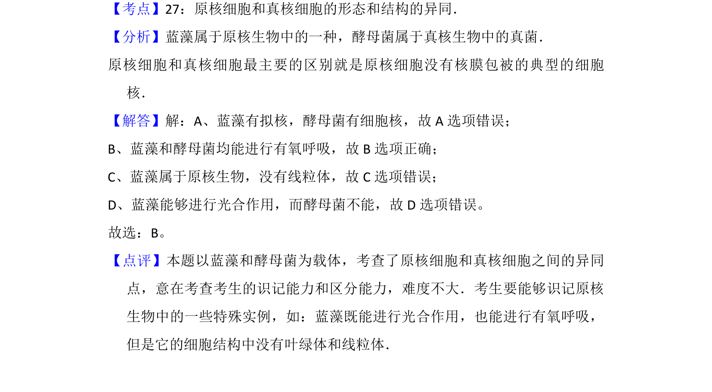

## 题面

## 摘要

该题考查蓝细菌（原核）和酵母菌（真核）在细胞结构与功能上的异同比较。

## 关联考点

- [[原核细胞和真核细胞的形态和结构的异同]]
- [[240-有氧呼吸|有氧呼吸]]
- [[033-光合作用|光合作用]]
- [[细胞器分布]]

## 答案与解析

> 📄 原 PDF 第 1 页：`素材/真题/北京/2008-2024·（北京）生物高考真题/2014年高考生物试卷（北京）（解析卷）.pdf`
