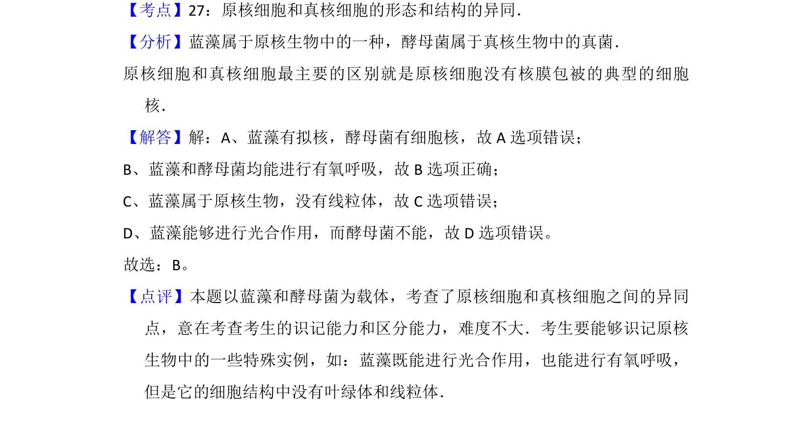

## 题面

## 摘要

该题考查蓝细菌（原核）和酵母菌（真核）在细胞结构与功能上的异同比较。

## 关联考点

- [[原核细胞和真核细胞的形态和结构的异同]]
- [[240-有氧呼吸|有氧呼吸]]
- [[033-光合作用|光合作用]]
- [[细胞器分布]]

## 答案与解析

> 📄 原 PDF 第 1 页：`素材/真题/北京/2008-2024·（北京）生物高考真题/2014年高考生物试卷（北京）（解析卷）.pdf`

<!-- 题干文本-start -->
## 题干文本
1． （6分）蓝细菌（蓝藻）与酵母菌的相同之处是（　　）
A．都有拟核B．均能进行需（有）氧呼吸
C．都有线粒体D．均能进行光合作用
<!-- 题干文本-end -->

<!-- 解析文本-start -->
## 解析文本
【考点】27：原核细胞和真核细胞的形态和结构的异同．菁优网版权所有
【分析】蓝藻属于原核生物中的一种，酵母菌属于真核生物中的真菌．
原核细胞和真核细胞最主要的区别就是原核细胞没有核膜包被的典型的细胞
核．
【解答】解：A、蓝藻有拟核，酵母菌有细胞核，故A选项错误；
B、蓝藻和酵母菌均能进行有氧呼吸，故B选项正确；
C、蓝藻属于原核生物，没有线粒体，故C选项错误；
D、蓝藻能够进行光合作用，而酵母菌不能，故D选项错误。
故选：B。
【点评】本题以蓝藻和酵母菌为载体，考查了原核细胞和真核细胞之间的异同
点，意在考查考生的识记能力和区分能力，难度不大．考生要能够识记原核
生物中的一些特殊实例，如：蓝藻既能进行光合作用，也能进行有氧呼吸，
但是它的细胞结构中没有叶绿体和线粒体．
<!-- 解析文本-end -->
