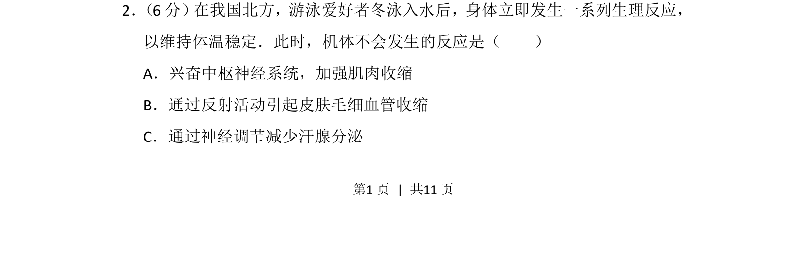
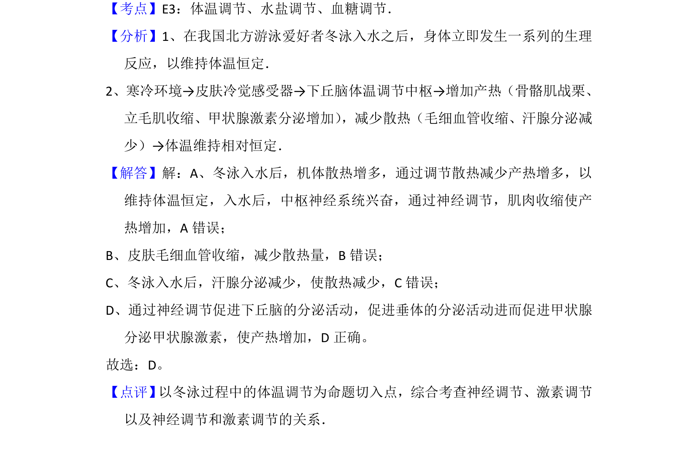

## 题面

## 摘要

冬泳时体温调节过程中不会发生的反应是减少汗腺分泌，因寒冷环境下汗腺分泌已减少，无需神经调节进一步抑制。

## 关联考点

- [[542-体温调节|体温调节]]
- [[324-神经调节|神经调节]]
- [[084-反射|反射]]
- [[寒冷环境]]

## 答案与解析

> 📄 原 PDF 第 1 页：`素材/真题/北京/2008-2024·（北京）生物高考真题/2014年高考生物试卷（北京）（解析卷）.pdf`
