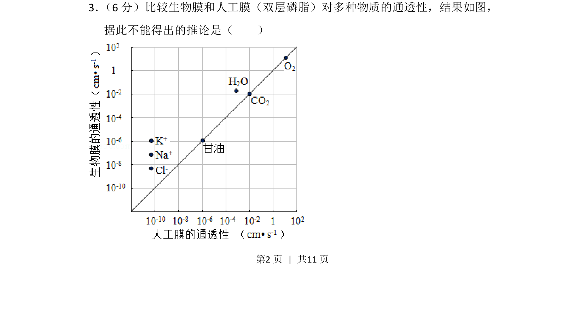
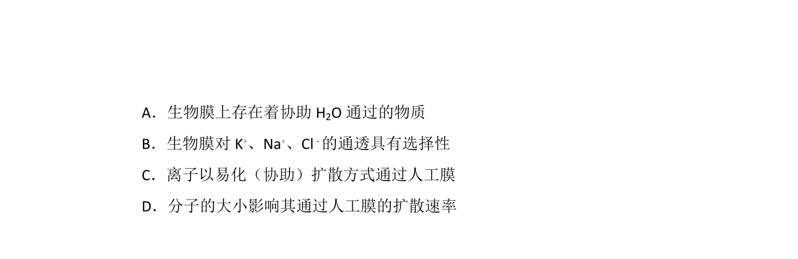
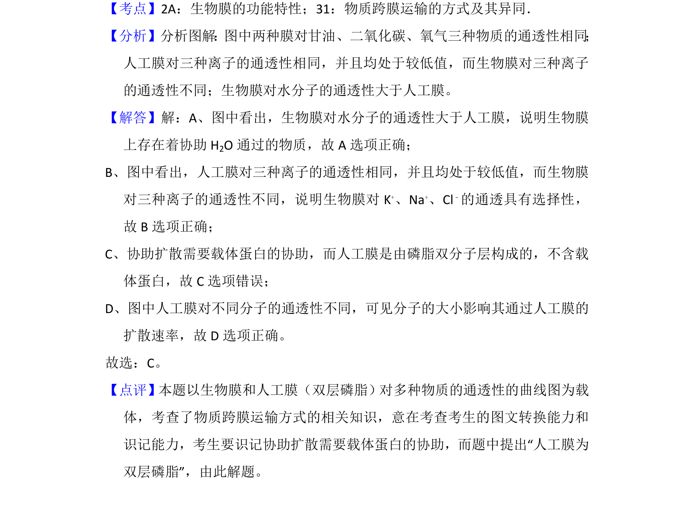

## 题面

## 摘要

比较生物膜与人工膜通透性的差异，考查膜的选择透过性及物质跨膜运输方式

## 关联考点

- [[生物膜]]
- [[人工膜]]
- [[905-选择透过性|选择透过性]]
- [[635-物质跨膜运输|物质跨膜运输]]

## 答案与解析

> 📄 原 PDF 第 2 页：`素材/真题/北京/2008-2024·（北京）生物高考真题/2014年高考生物试卷（北京）（解析卷）.pdf`
