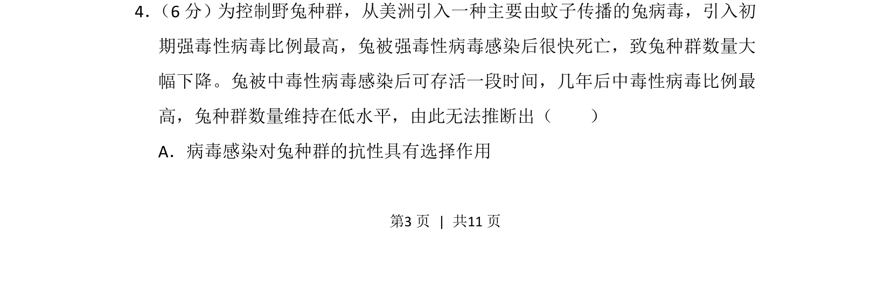
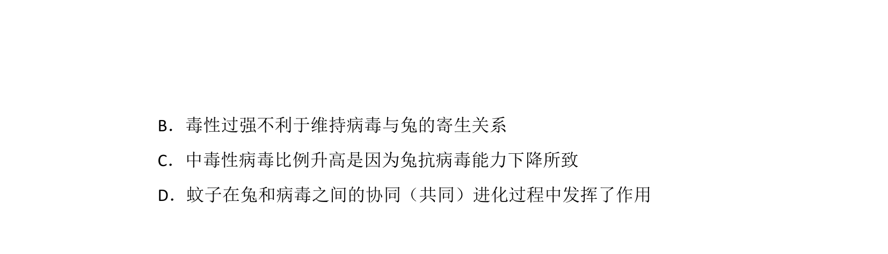
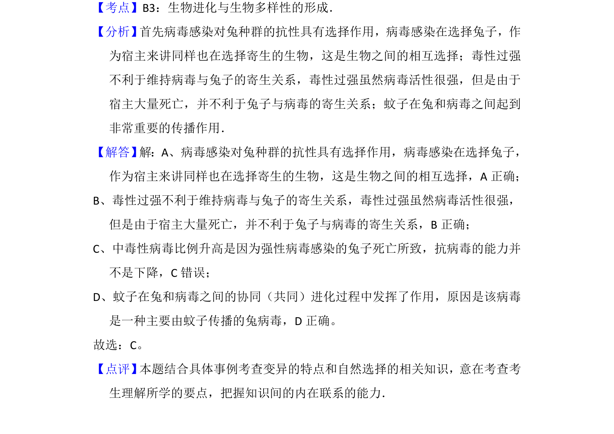

## 题面

## 摘要

考查病毒引入后对兔种群的选择作用及协同进化，要求选出无法推断的选项

## 关联考点

- [[184-自然选择|自然选择]]
- [[308-共同进化|协同进化]]
- [[种群数量调节]]

## 答案与解析

> 📄 原 PDF 第 3 页：`素材/真题/北京/2008-2024·（北京）生物高考真题/2014年高考生物试卷（北京）（解析卷）.pdf`

<!-- 题干文本-start -->
## 题干文本
4． （6分）为控制野兔种群，从美洲引入一种主要由蚊子传播的兔病毒，引入初
期强毒性病毒比例最高，兔被强毒性病毒感染后很快死亡，致兔种群数量大
幅下降。兔被中毒性病毒感染后可存活一段时间，几年后中毒性病毒比例最
高，兔种群数量维持在低水平，由此无法推断出（　　）
A．病毒感染对兔种群的抗性具有选择作用
<!-- 题干文本-end -->

<!-- 解析文本-start -->
## 解析文本

<!-- 解析文本-end -->
