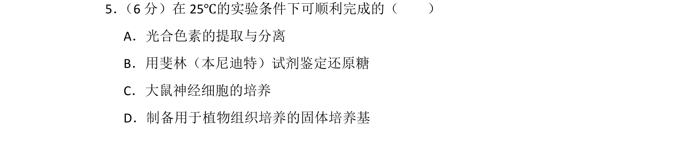
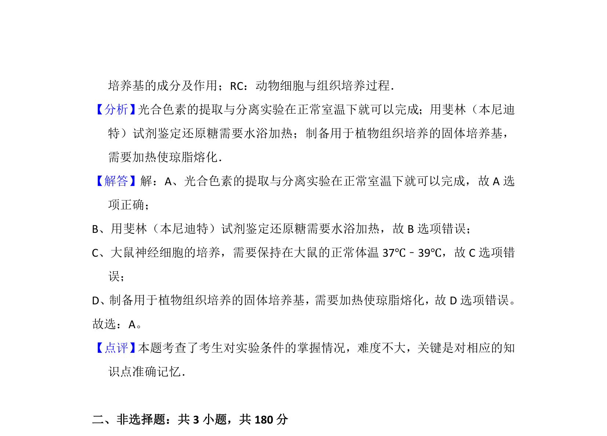

## 题面

## 摘要

考查实验条件的适宜温度，涉及色素提取、还原糖鉴定、细胞培养和培养基制备

## 关联考点

- [[检测还原糖的实验]]
- [[568-叶绿体色素的提取和分离实验|叶绿体色素的提取和分离实验]]
- [[178-组织培养|组织培养]]

## 答案与解析

> 📄 原 PDF 第 4 页：`素材/真题/北京/2008-2024·（北京）生物高考真题/2014年高考生物试卷（北京）（解析卷）.pdf`
