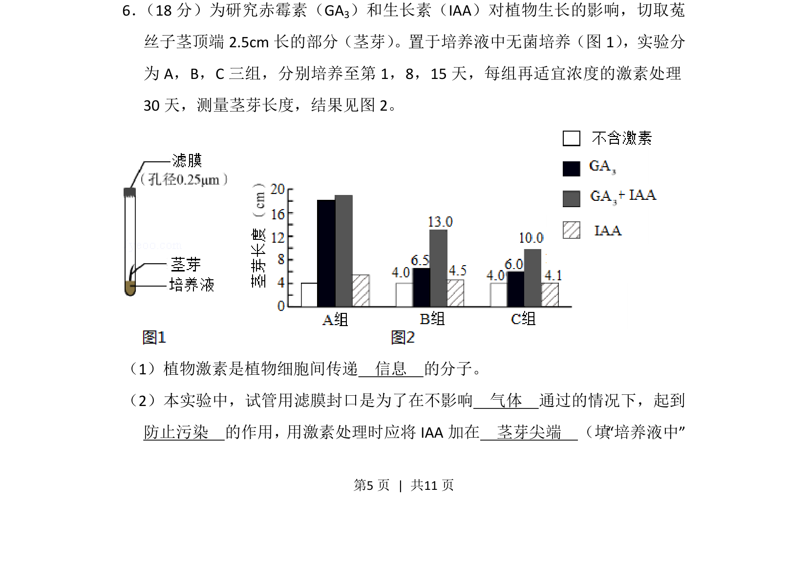
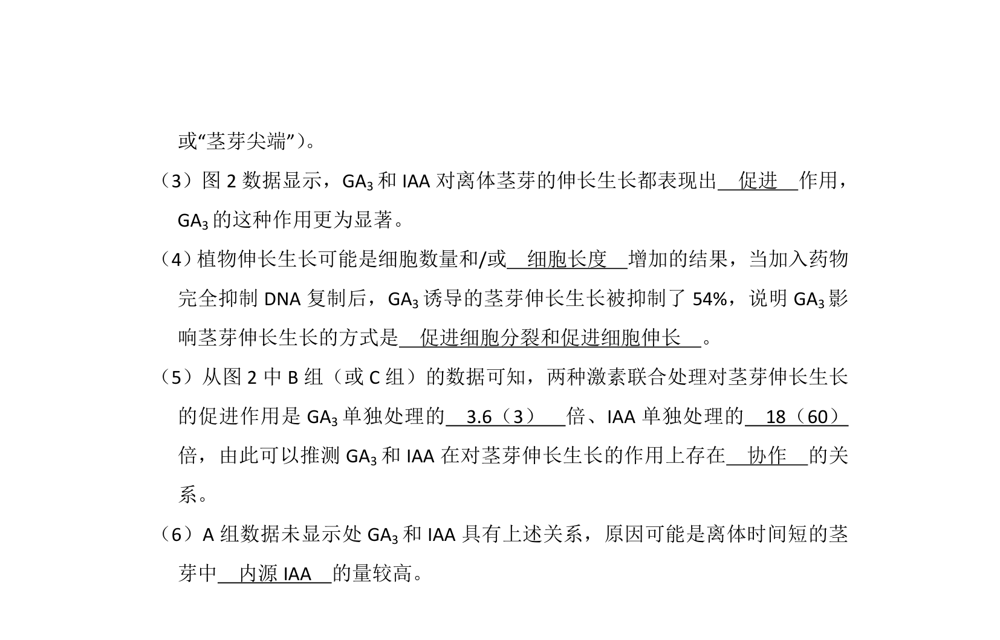
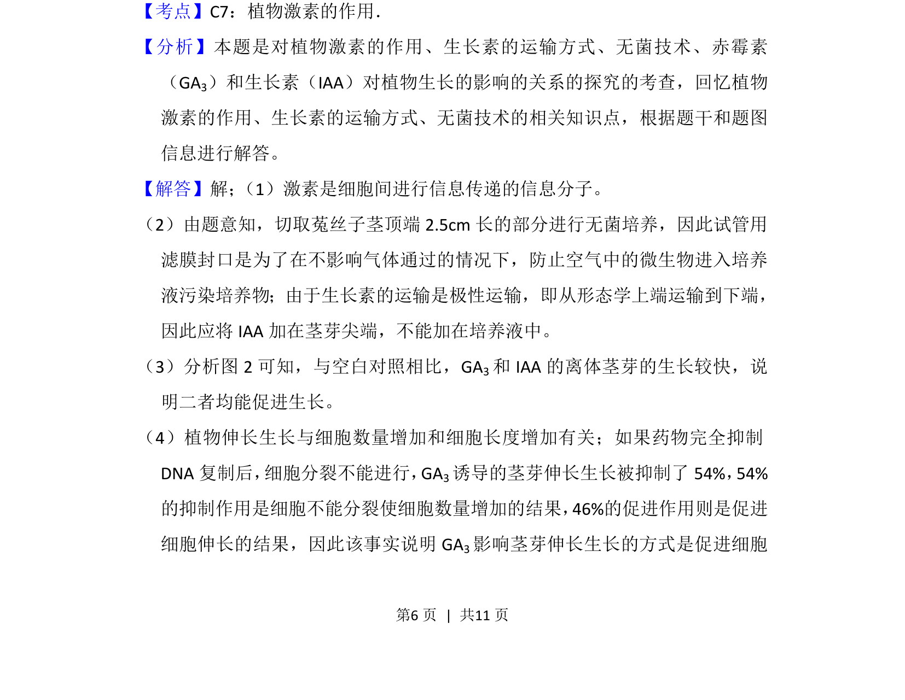
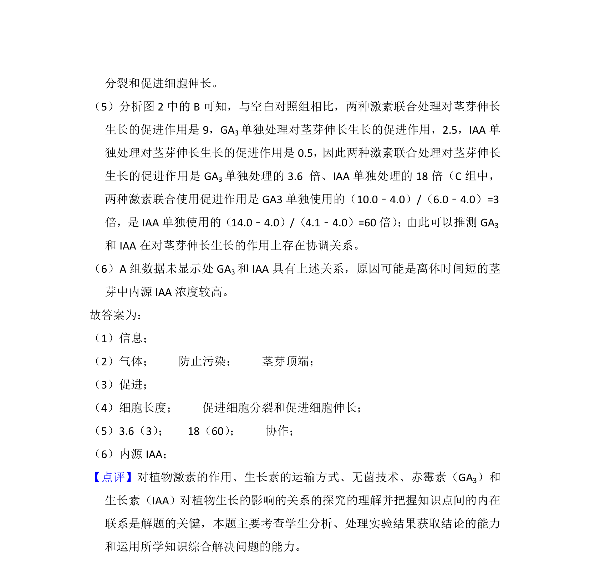

## 题面

## 摘要

该题以菟丝子茎芽为材料，探究赤霉素和生长素对植物生长的影响及无菌培养实验操作。

## 关联考点

- [[345-植物激素|植物激素]]
- [[347-生长素|生长素]]
- [[351-赤霉素|赤霉素]]
- [[无菌培养]]

## 答案与解析

> 📄 原 PDF 第 5 页：`素材/真题/北京/2008-2024·（北京）生物高考真题/2014年高考生物试卷（北京）（解析卷）.pdf`
