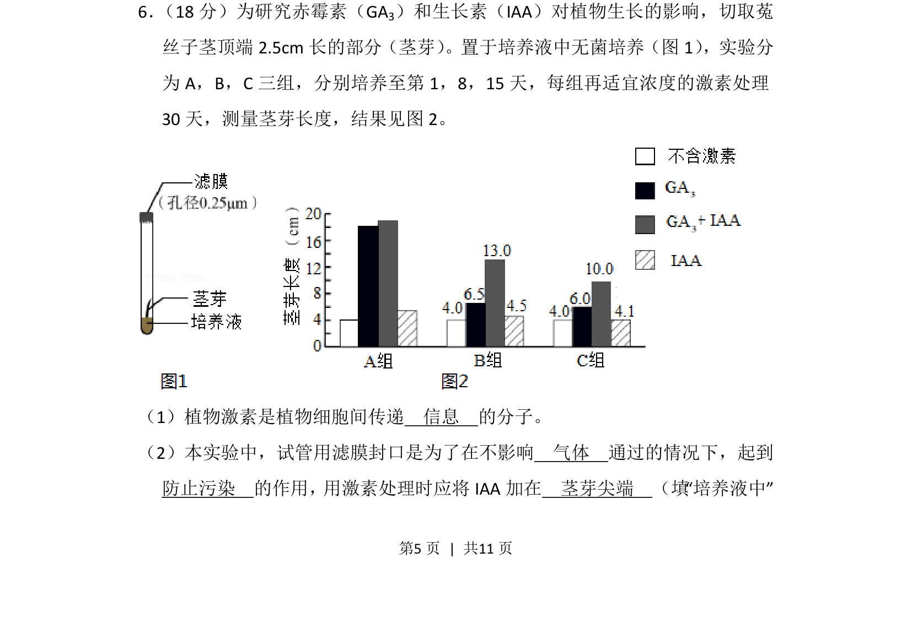
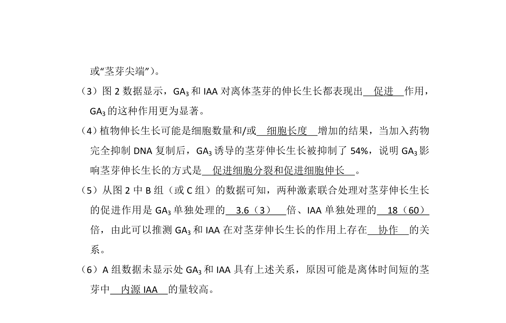
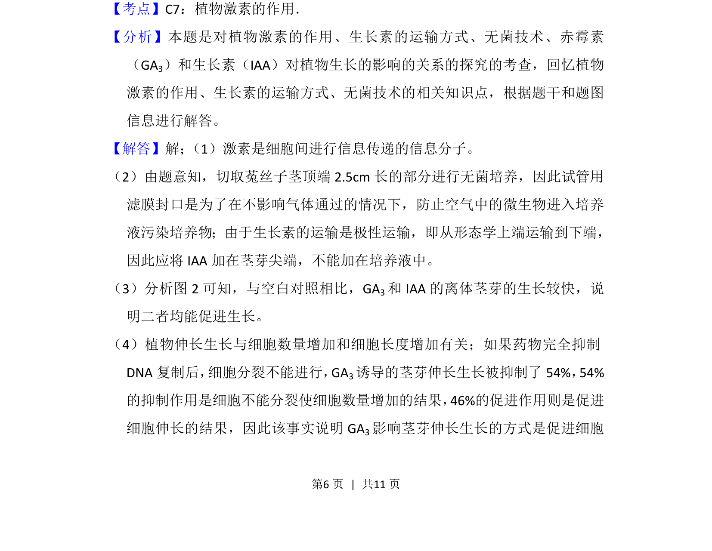
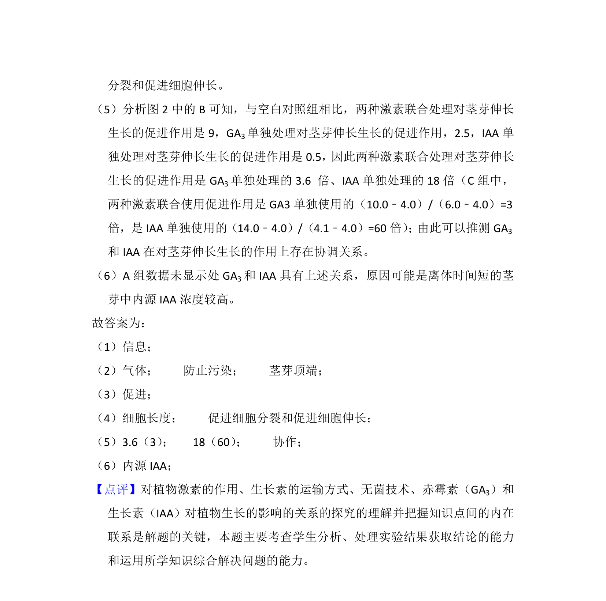

## 题面

## 摘要

该题以菟丝子茎芽为材料，探究赤霉素和生长素对植物生长的影响及无菌培养实验操作。

## 关联考点

- [[345-植物激素|植物激素]]
- [[347-生长素|生长素]]
- [[351-赤霉素|赤霉素]]
- [[无菌培养]]

## 答案与解析

> 📄 原 PDF 第 5 页：`素材/真题/北京/2008-2024·（北京）生物高考真题/2014年高考生物试卷（北京）（解析卷）.pdf`

<!-- 题干文本-start -->
## 题干文本
6． （18分）为研究赤霉素（GA3）和生长素（IAA）对植物生长的影响，切取菟
丝子茎顶端2.5cm长的部分（茎芽） 。置于培养液中无菌培养（图1） ，实验分
为A，B，C三组，分别培养至第1，8，15天，每组再适宜浓度的激素处理
30天，测量茎芽长度，结果见图2。
（1）植物激素是植物细胞间传递　信息　的分子。
（2）本实验中，试管用滤膜封口是为了在不影响　气体　通过的情况下，起到　
防止污染　的作用，用激素处理时应将IAA加在　茎芽尖端　（填“培养液中”
<!-- 题干文本-end -->

<!-- 解析文本-start -->
## 解析文本

<!-- 解析文本-end -->
