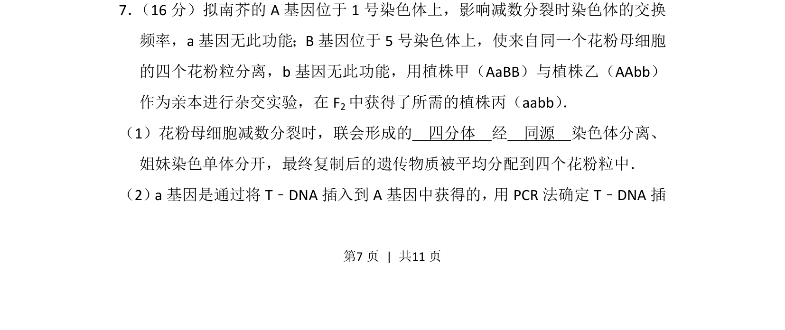
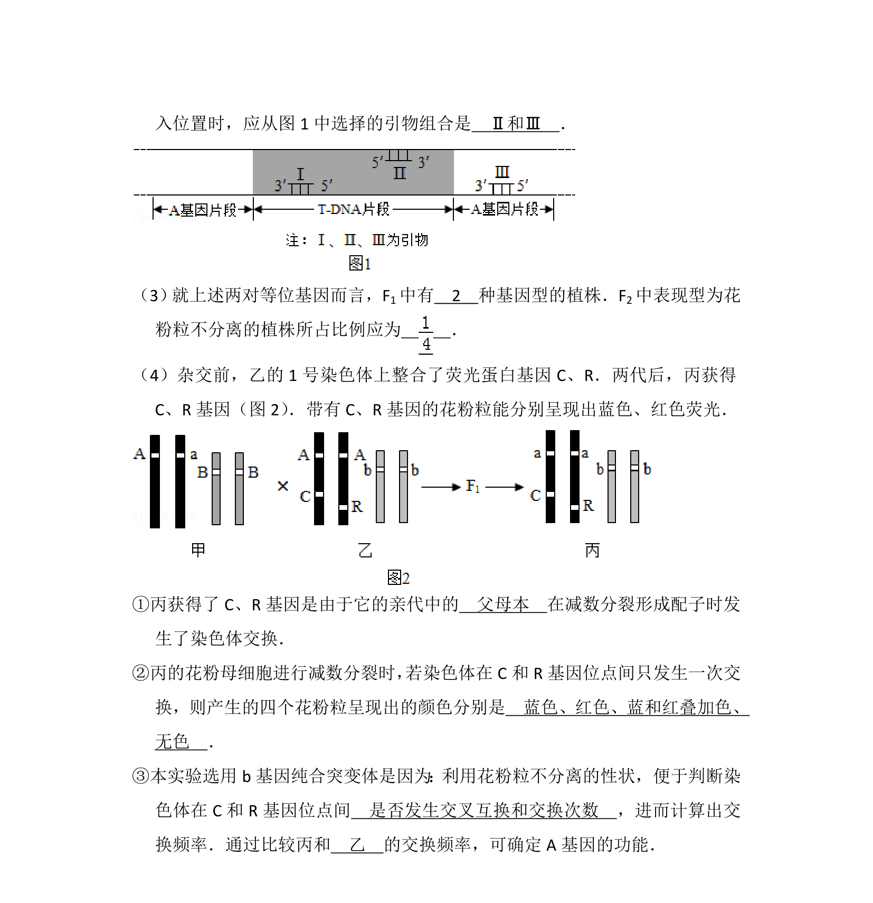
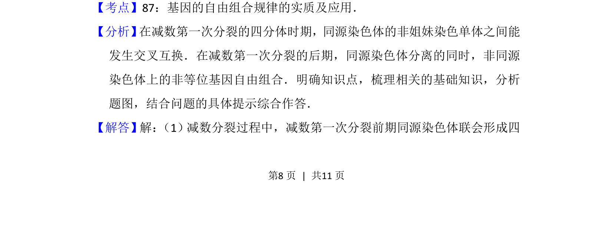
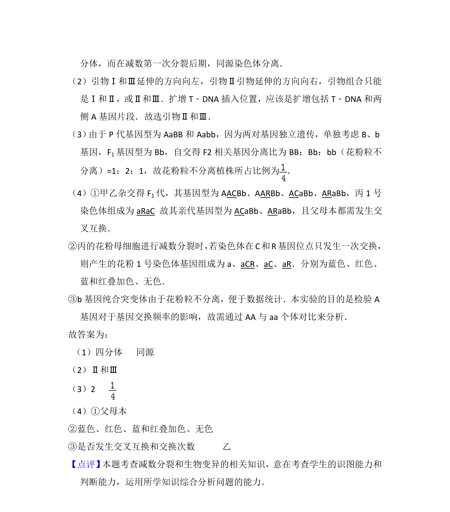

## 题面

## 摘要

该题考查减数分裂过程中染色体行为、基因功能及PCR技术在T-DNA插入检测中的应用。

## 关联考点

- [[277-减数分裂（高中必二）|减数分裂]]
- [[302-基因重组|基因重组]]
- [[827-PCR技术|PCR技术]]
- [[遗传杂交]]

## 答案与解析

> 📄 原 PDF 第 7 页：`素材/真题/北京/2008-2024·（北京）生物高考真题/2014年高考生物试卷（北京）（解析卷）.pdf`
