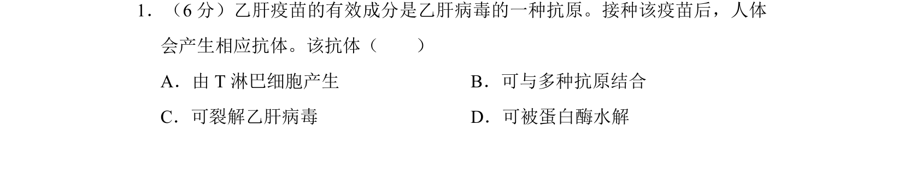
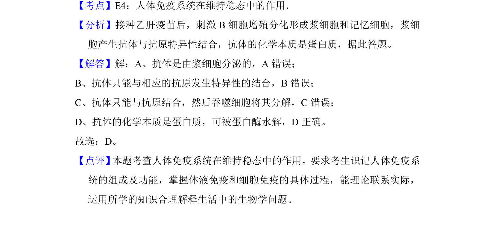

## 题面

## 摘要

接种乙肝疫苗后产生的抗体是蛋白质，可被蛋白酶水解。

## 关联考点

- [[162-抗体|抗体]]
- [[134-蛋白质|蛋白质]]
- [[353-体液免疫|体液免疫]]
- [[蛋白酶水解]]

## 答案与解析

> 📄 原 PDF 第 1 页：`素材/真题/北京/2008-2024·（北京）生物高考真题/2015年高考生物试卷（北京）（解析卷）.pdf`
