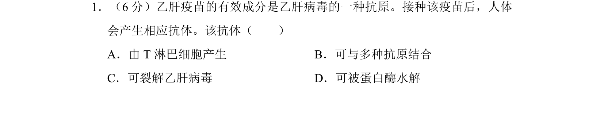
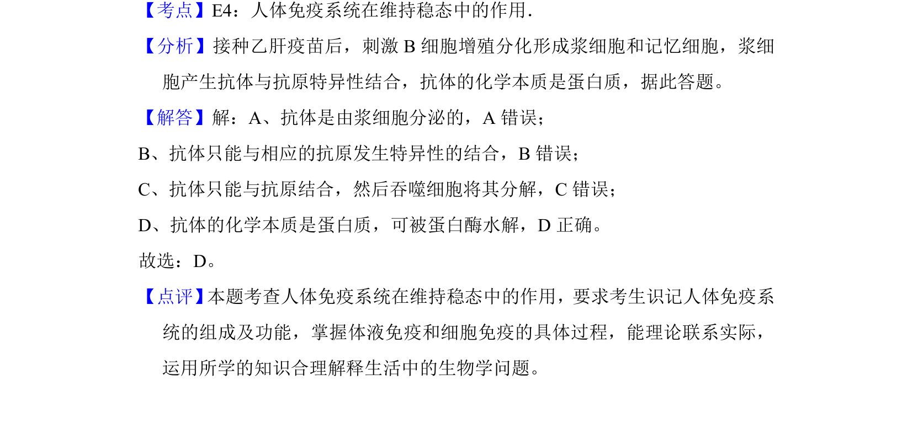

## 题面

## 摘要

接种乙肝疫苗后产生的抗体是蛋白质，可被蛋白酶水解。

## 关联考点

- [[162-抗体|抗体]]
- [[134-蛋白质|蛋白质]]
- [[353-体液免疫|体液免疫]]
- [[蛋白酶水解]]

## 答案与解析

> 📄 原 PDF 第 1 页：`素材/真题/北京/2008-2024·（北京）生物高考真题/2015年高考生物试卷（北京）（解析卷）.pdf`

<!-- 题干文本-start -->
## 题干文本
1．（6分）乙肝疫苗的有效成分是乙肝病毒的一种抗原。接种该疫苗后，人体
会产生相应抗体。该抗体（　　）
A．由T淋巴细胞产生B．可与多种抗原结合
C．可裂解乙肝病毒D．可被蛋白酶水解
<!-- 题干文本-end -->

<!-- 解析文本-start -->
## 解析文本
【考点】E4：人体免疫系统在维持稳态中的作用．菁优网版权所有
【分析】接种乙肝疫苗后，刺激B细胞增殖分化形成浆细胞和记忆细胞，浆细
胞产生抗体与抗原特异性结合，抗体的化学本质是蛋白质，据此答题。
【解答】解：A、抗体是由浆细胞分泌的，A错误；
B、抗体只能与相应的抗原发生特异性的结合，B错误；
C、抗体只能与抗原结合，然后吞噬细胞将其分解，C错误；
D、抗体的化学本质是蛋白质，可被蛋白酶水解，D正确。
故选：D。
【点评】 本题考查人体免疫系统在维持稳态中的作用，要求考生识记人体免疫系
统的组成及功能，掌握体液免疫和细胞免疫的具体过程，能理论联系实际，
运用所学的知识合理解释生活中的生物学问题。
<!-- 解析文本-end -->
