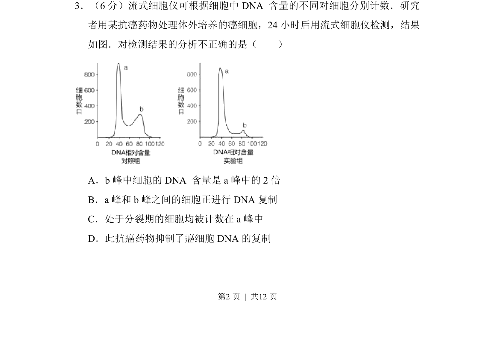
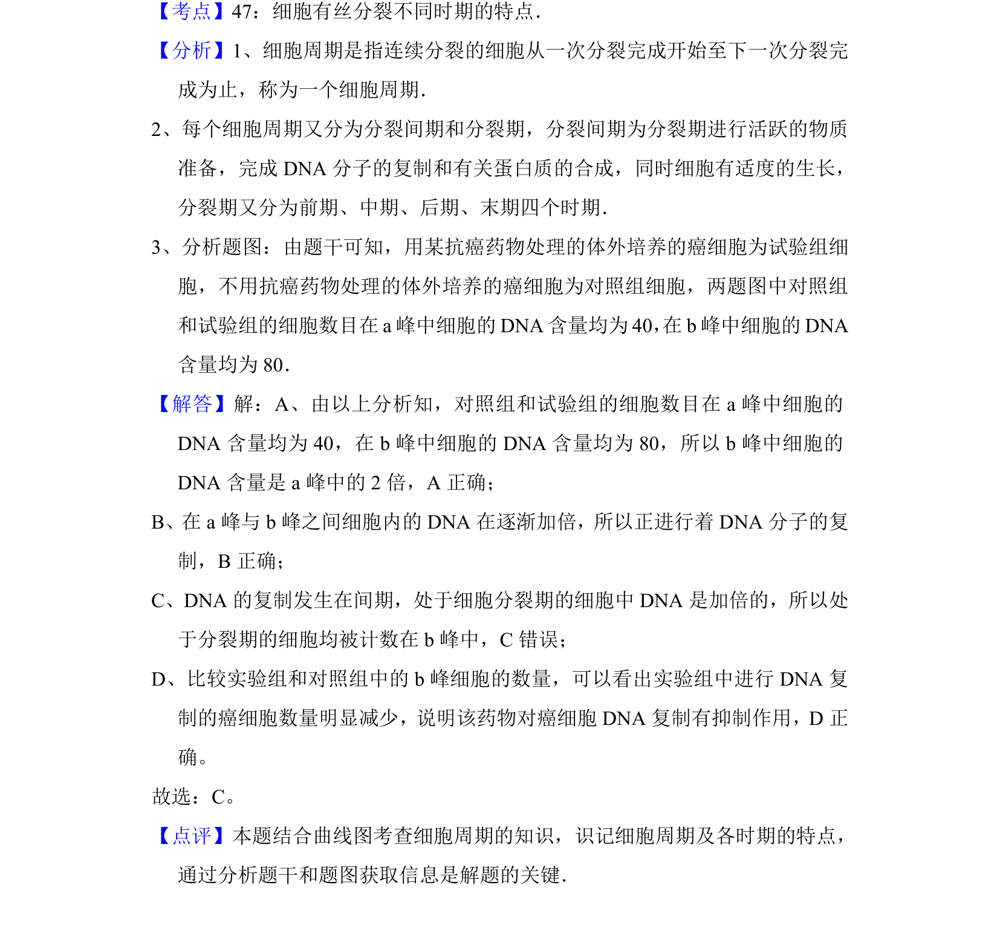

## 题面

## 摘要

本题比较了蛋白质合成、转录、光合产物形成等场所，综合考查细胞结构与功能知识。

## 关联考点

- [[225-核糖体|核糖体]]
- [[298-转录|转录]]
- [[叶绿体基质]]
- [[205-原核细胞|原核细胞]]

## 答案与解析

> 📄 原 PDF 第 2 页：`素材/真题/北京/2008-2024·（北京）生物高考真题/2015年高考生物试卷（北京）（解析卷）.pdf`
