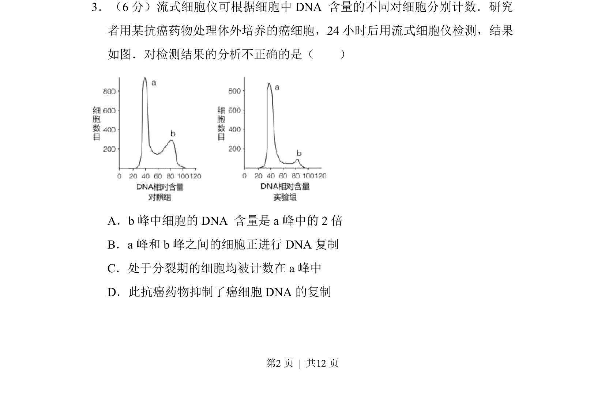
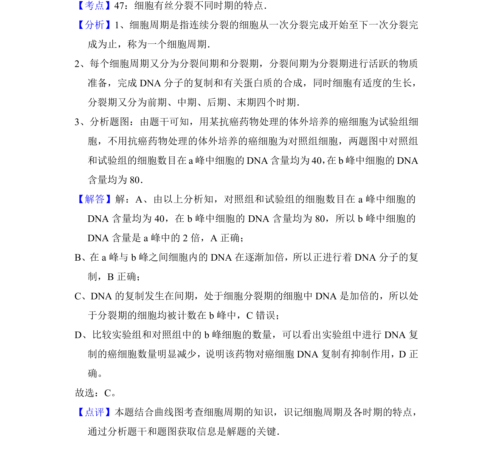

## 题面

## 摘要

本题比较了蛋白质合成、转录、光合产物形成等场所，综合考查细胞结构与功能知识。

## 关联考点

- [[225-核糖体|核糖体]]
- [[298-转录|转录]]
- [[叶绿体基质]]
- [[205-原核细胞|原核细胞]]

## 答案与解析

> 📄 原 PDF 第 2 页：`素材/真题/北京/2008-2024·（北京）生物高考真题/2015年高考生物试卷（北京）（解析卷）.pdf`

<!-- 题干文本-start -->
## 题干文本
3、糖类等光合产物的形成发生在叶绿体基质．
<!-- 题干文本-end -->

<!-- 解析文本-start -->
## 解析文本
【解答】 解：A、蛋白质的合成场所是核糖体，高尔基体是分泌蛋白的加工场所，
A错误；
B、mRNA是转录的产物，而转录的主要场所是细胞核，B正确；
C、细菌是原核生物，没有细胞核，C错误；
D、叶肉细胞在叶绿体基质中合成淀粉，D错误。
故选：B。
【点评】 本题考查了蛋白质的合成场所、光合作用的过程、转录场所、原核细胞
的结构、综合性较强，难度不大．
　
3．（6分）流式细胞仪可根据细胞中DNA 含量的不同对细胞分别计数．研究
者用某抗癌药物处理体外培养的癌细胞，24小时后用流式细胞仪检测，结果
如图．对检测结果的分析不正确的是（　　）
A．b峰中细胞的DNA 含量是a峰中的2倍
B．a峰和b峰之间的细胞正进行DNA复制
C．处于分裂期的细胞均被计数在a峰中
D．此抗癌药物抑制了癌细胞DNA的复制
<!-- 解析文本-end -->
