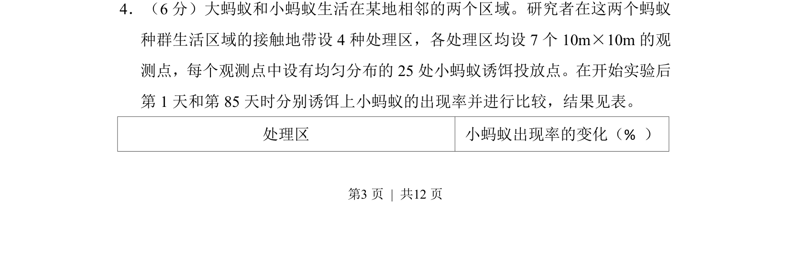
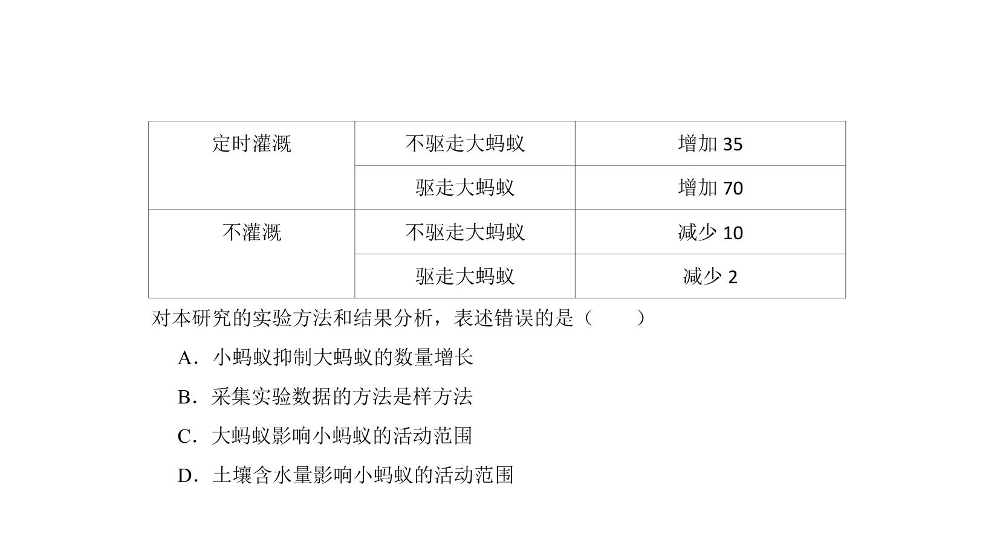
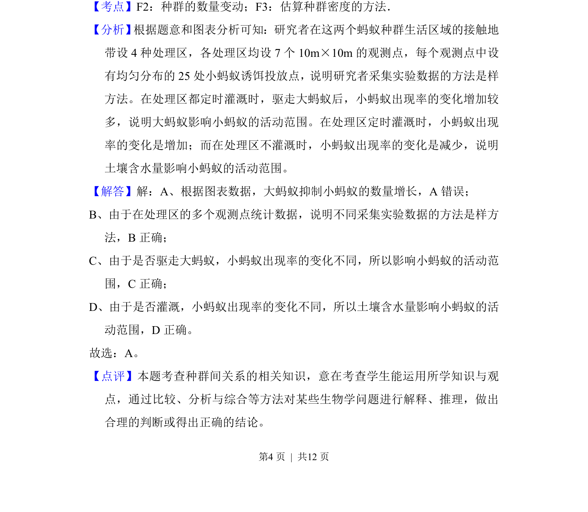

## 题面

## 摘要

研究大蚂蚁与小蚂蚁的种间关系，通过实验分析两种蚂蚁的竞争现象及小蚂蚁出现率的变化。

## 关联考点

- [[022-生物因素|种间关系]]
- [[765-竞争|竞争]]
- [[501-生态位|生态位]]

## 答案与解析

> 📄 原 PDF 第 3 页：`素材/真题/北京/2008-2024·（北京）生物高考真题/2015年高考生物试卷（北京）（解析卷）.pdf`
