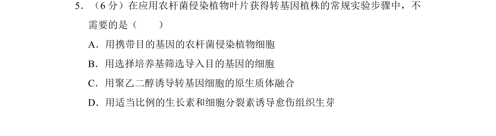
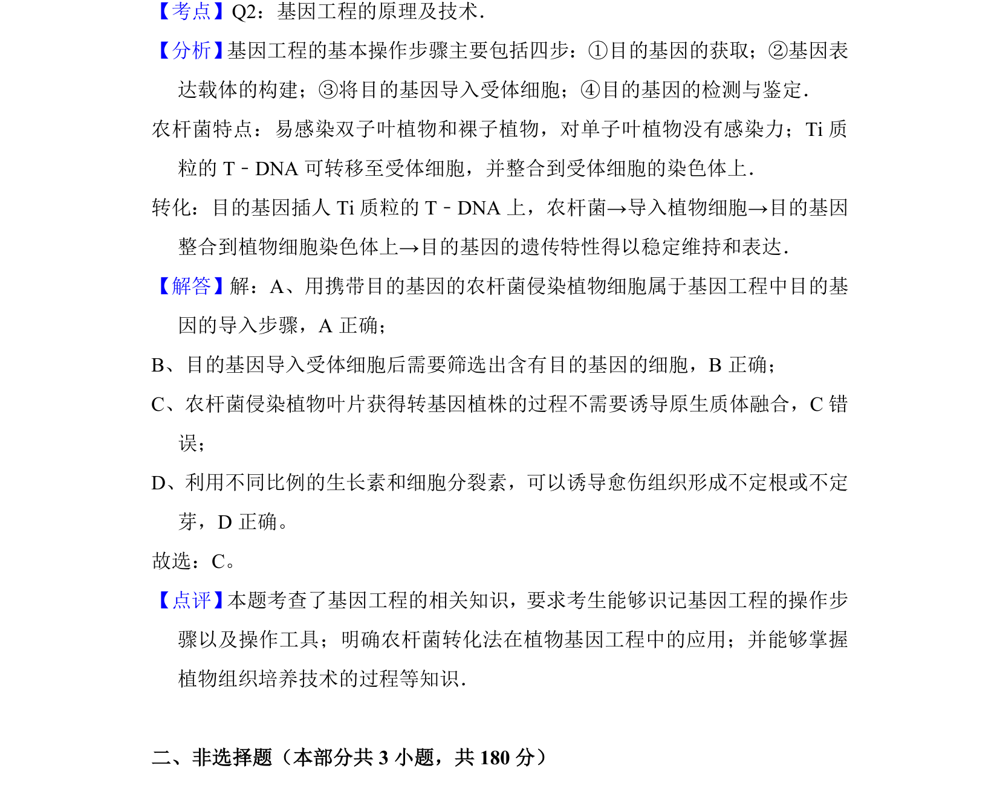

## 题面

## 摘要

本题考查基因工程中农杆菌转化法的操作步骤，辨析不需要原生质体融合的环节。

## 关联考点

- [[411-基因工程|基因工程]]
- [[551-农杆菌转化法|农杆菌转化法]]
- [[437-植物组织培养|植物组织培养]]
- [[目的基因导入]]

## 答案与解析

> 📄 原 PDF 第 5 页：`素材/真题/北京/2008-2024·（北京）生物高考真题/2015年高考生物试卷（北京）（解析卷）.pdf`

<!-- 题干文本-start -->
## 题干文本
5．（6分）在应用农杆菌侵染植物叶片获得转基因植株的常规实验步骤中，不
需要的是（　　）
A．用携带目的基因的农杆菌侵染植物细胞
B．用选择培养基筛选导入目的基因的细胞
C．用聚乙二醇诱导转基因细胞的原生质体融合
D．用适当比例的生长素和细胞分裂素诱导愈伤组织生芽
<!-- 题干文本-end -->

<!-- 解析文本-start -->
## 解析文本
【考点】Q2：基因工程的原理及技术．菁优网版权所有
【分析】 基因工程的基本操作步骤主要包括四步：①目的基因的获取；②基因表
达载体的构建；③将目的基因导入受体细胞；④目的基因的检测与鉴定．
农杆菌特点：易感染双子叶植物和裸子植物，对单子叶植物没有感染力；Ti质
粒的T﹣DNA可转移至受体细胞，并整合到受体细胞的染色体上．
转化：目的基因插人Ti质粒的T﹣DNA上，农杆菌→导入植物细胞→目的基因
整合到植物细胞染色体上→目的基因的遗传特性得以稳定维持和表达．
【解答】解：A、用携带目的基因的农杆菌侵染植物细胞属于基因工程中目的基
因的导入步骤，A正确；
B、目的基因导入受体细胞后需要筛选出含有目的基因的细胞，B正确；
C、农杆菌侵染植物叶片获得转基因植株的过程不需要诱导原生质体融合，C错
误；
D、利用不同比例的生长素和细胞分裂素，可以诱导愈伤组织形成不定根或不定
芽，D正确。
故选：C。
【点评】 本题考查了基因工程的相关知识，要求考生能够识记基因工程的操作步
骤以及操作工具；明确农杆菌转化法在植物基因工程中的应用；并能够掌握
植物组织培养技术的过程等知识．
　
二、非选择题（本部分共3小题，共180分）
<!-- 解析文本-end -->
