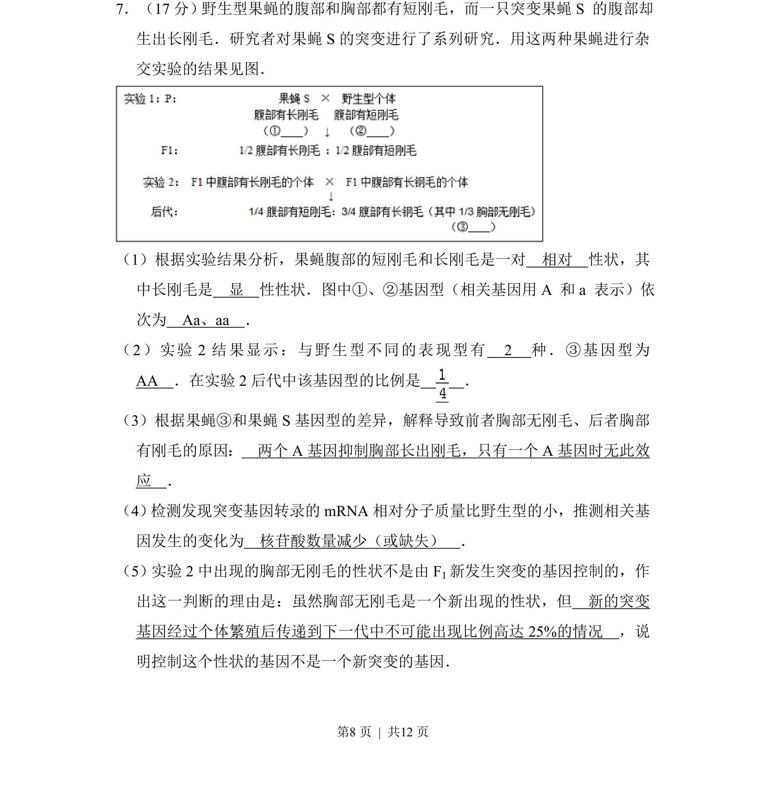
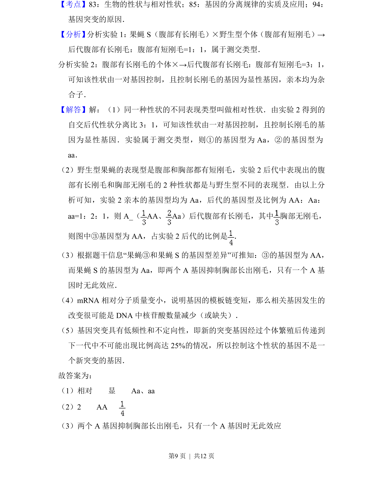
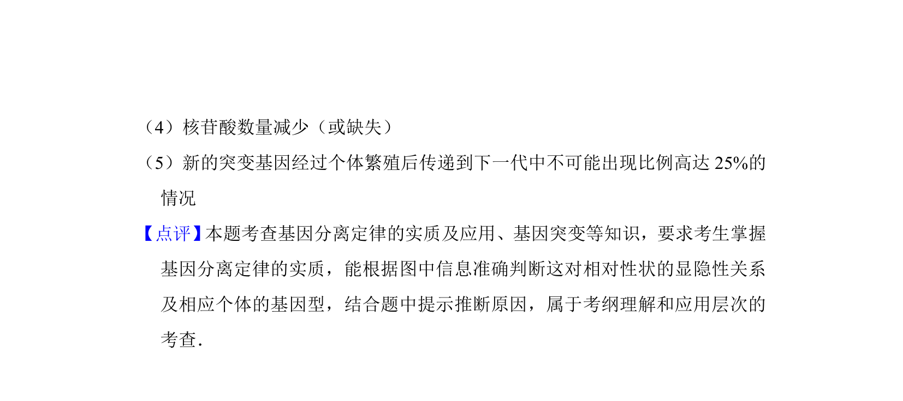

## 题面

## 摘要

果蝇刚毛性状遗传分析，包括显隐性判断、基因型推断、基因互作及突变原因

## 关联考点

- [[910-相对性状|相对性状]]
- [[610-显隐性判断|显隐性判断]]
- [[573-基因互作|基因互作]]
- [[301-基因突变|基因突变]]

## 答案与解析

> 📄 原 PDF 第 8 页：`素材/真题/北京/2008-2024·（北京）生物高考真题/2015年高考生物试卷（北京）（解析卷）.pdf`
