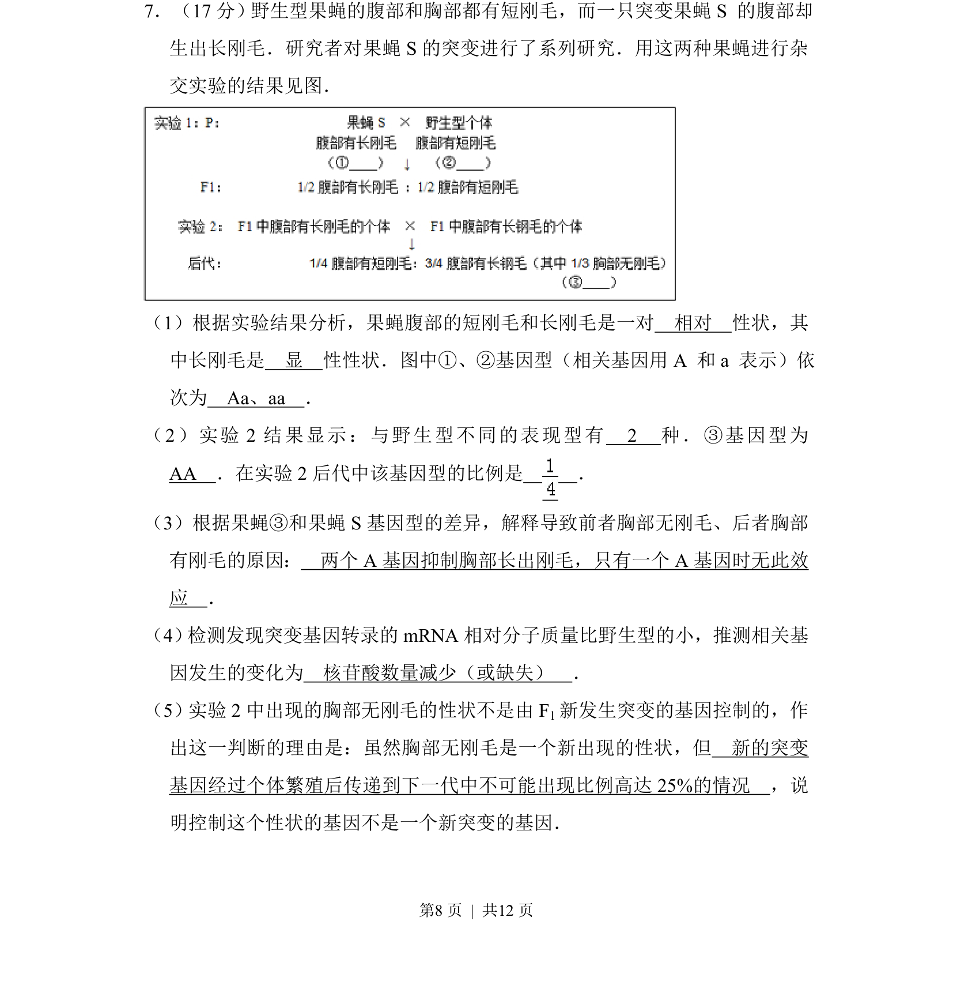
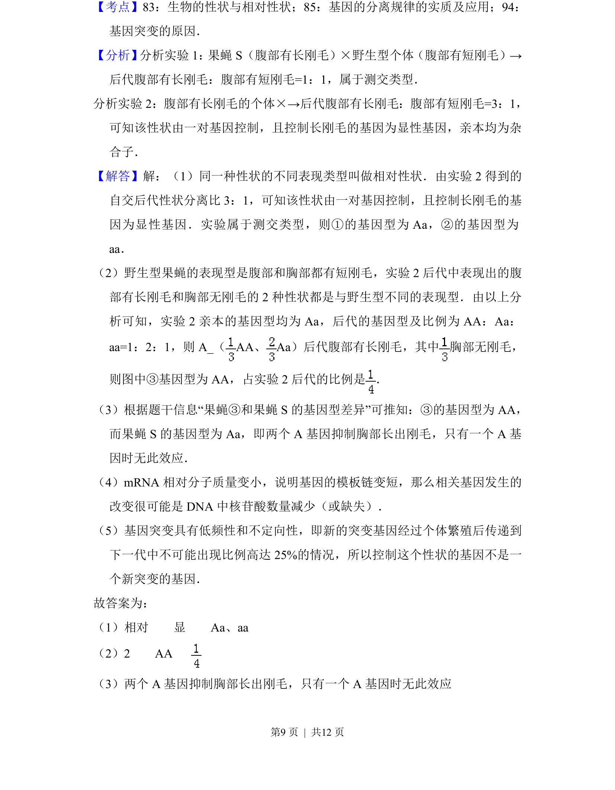
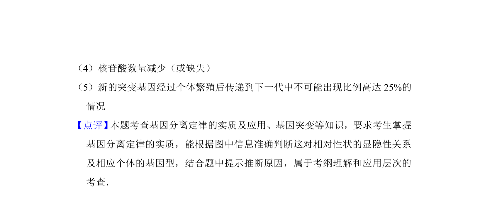

## 题面

## 摘要

果蝇刚毛性状遗传分析，包括显隐性判断、基因型推断、基因互作及突变原因

## 关联考点

- [[910-相对性状|相对性状]]
- [[610-显隐性判断|显隐性判断]]
- [[573-基因互作|基因互作]]
- [[301-基因突变|基因突变]]

## 答案与解析

> 📄 原 PDF 第 8 页：`素材/真题/北京/2008-2024·（北京）生物高考真题/2015年高考生物试卷（北京）（解析卷）.pdf`

<!-- 题干文本-start -->
## 题干文本
7．（17分）野生型果蝇的腹部和胸部都有短刚毛，而一只突变果蝇S 的腹部却
生出长刚毛．研究者对果蝇S的突变进行了系列研究．用这两种果蝇进行杂
交实验的结果见图．
（1）根据实验结果分析，果蝇腹部的短刚毛和长刚毛是一对　相对　性状，其
中长刚毛是　显　性性状．图中①、②基因型（相关基因用A 和a 表示）依
次为　Aa、aa　．
（2）实验2结果显示：与野生型不同的表现型有　2　种．③基因型为　
AA　．在实验2后代中该基因型的比例是　 　．
（3）根据果蝇③和果蝇S基因型的差异，解释导致前者胸部无刚毛、后者胸部
有刚毛的原因：　两个A基因抑制胸部长出刚毛，只有一个A基因时无此效
应　．
（4） 检测发现突变基因转录的mRNA相对分子质量比野生型的小，推测相关基
因发生的变化为　核苷酸数量减少（或缺失）　．
（5）实验2中出现的胸部无刚毛的性状不是由F 1新发生突变的基因控制的，作
出这一判断的理由是：虽然胸部无刚毛是一个新出现的性状，但　新的突变
基因经过个体繁殖后传递到下一代中不可能出现比例高达25%的情况　，说
明控制这个性状的基因不是一个新突变的基因．
<!-- 题干文本-end -->

<!-- 解析文本-start -->
## 解析文本

<!-- 解析文本-end -->
