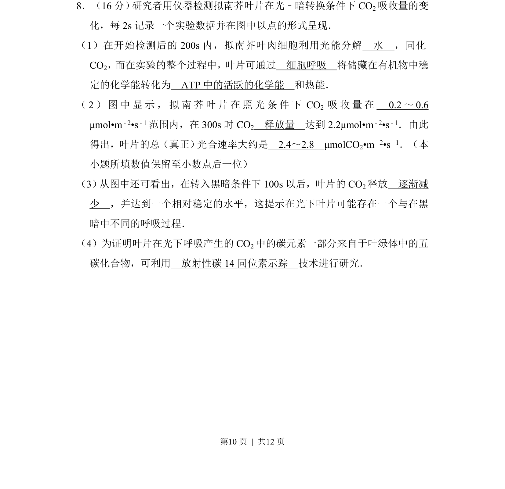
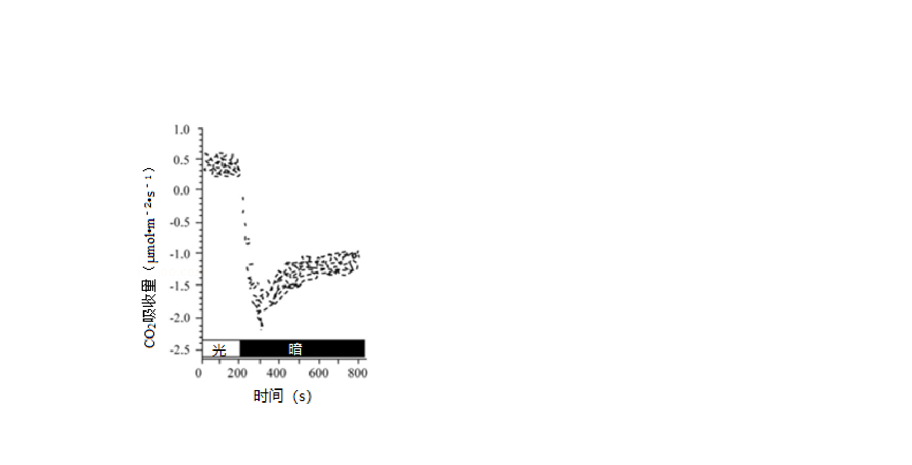
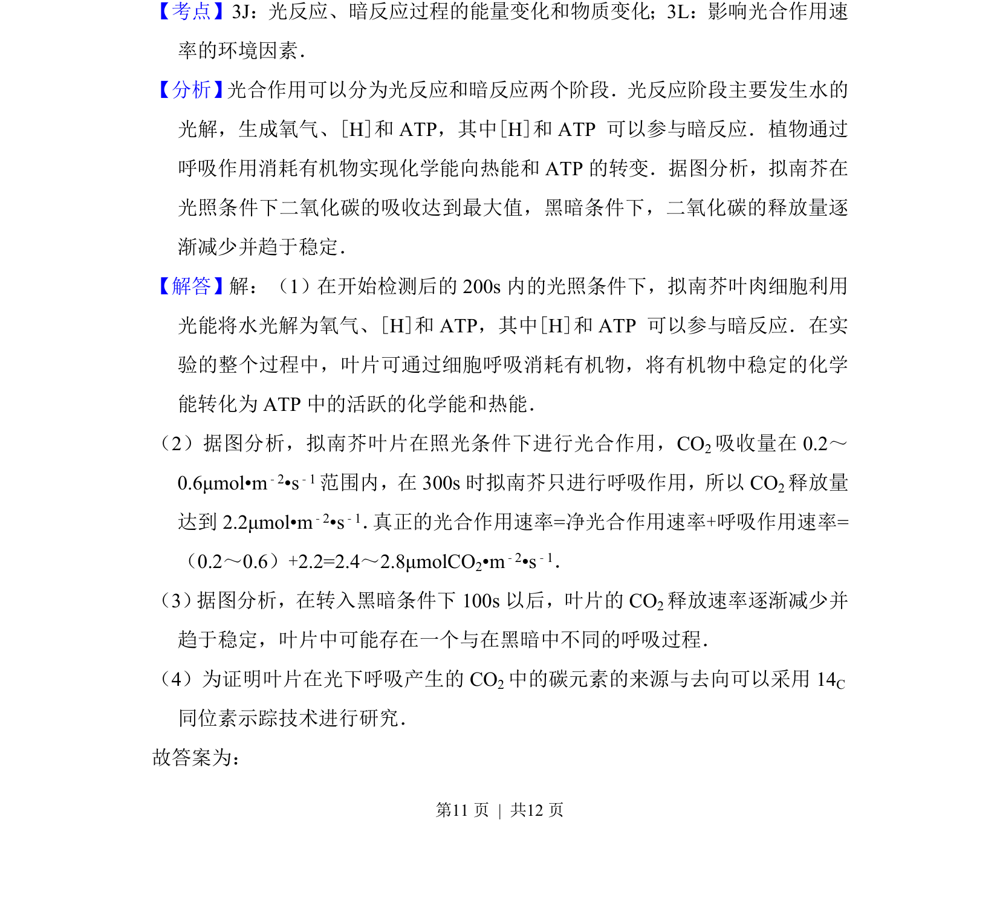
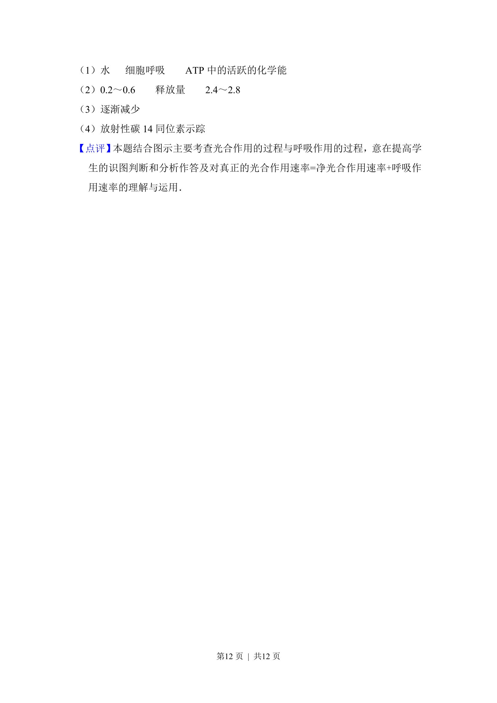

## 题面

## 摘要

拟南芥光暗转换下CO2吸收量变化，分析光合与呼吸作用及速率计算。

## 关联考点

- [[033-光合作用|光合作用]]
- [[241-细胞呼吸|细胞呼吸]]
- [[906-总光合速率|总光合速率]]
- [[888-同位素示踪|同位素示踪]]

## 答案与解析

> 📄 原 PDF 第 10 页：`素材/真题/北京/2008-2024·（北京）生物高考真题/2015年高考生物试卷（北京）（解析卷）.pdf`
