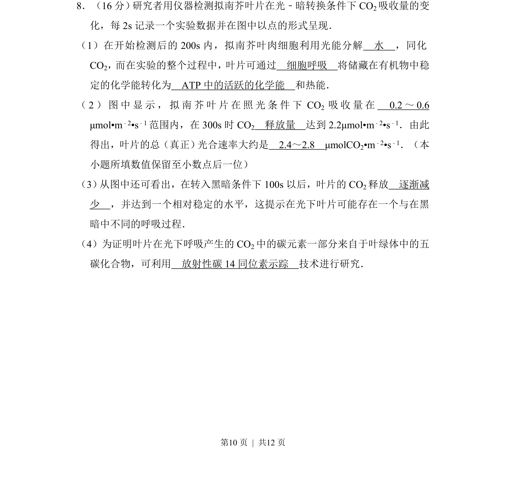
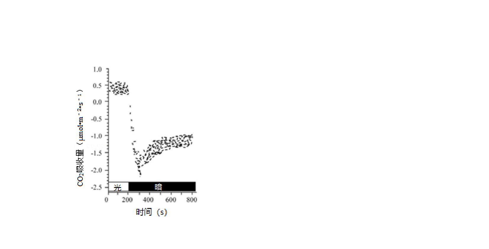
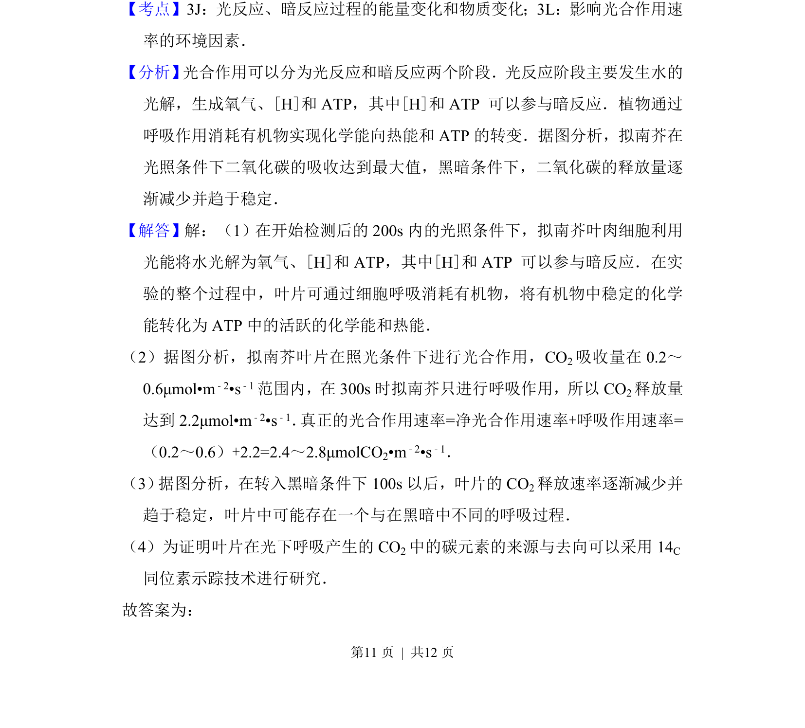
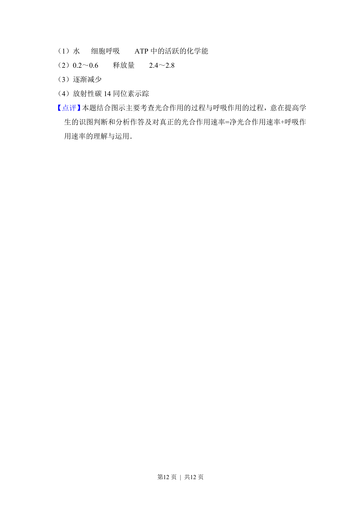

## 题面

## 摘要

拟南芥光暗转换下CO2吸收量变化，分析光合与呼吸作用及速率计算。

## 关联考点

- [[033-光合作用|光合作用]]
- [[241-细胞呼吸|细胞呼吸]]
- [[906-总光合速率|总光合速率]]
- [[888-同位素示踪|同位素示踪]]

## 答案与解析

> 📄 原 PDF 第 10 页：`素材/真题/北京/2008-2024·（北京）生物高考真题/2015年高考生物试卷（北京）（解析卷）.pdf`

<!-- 题干文本-start -->
## 题干文本
8．（16分） 研究者用仪器检测拟南芥叶片在光﹣暗转换条件下CO2吸收量的变
化，每2s记录一个实验数据并在图中以点的形式呈现．
（1）在开始检测后的200s内，拟南芥叶肉细胞利用光能分解　水　，同化
CO2，而在实验的整个过程中，叶片可通过　细胞呼吸　将储藏在有机物中稳
定的化学能转化为　ATP中的活跃的化学能　和热能．
（2）图中显示，拟南芥叶片在照光条件下CO 2 吸收量在　0.2～0.6　
μmol•m﹣2•s﹣1范围内，在300s时CO 2　释放量　达到2.2μmol•m ﹣2•s﹣1．由此
得出，叶片的总（真正） 光合速率大约是　2.4～2.8　μmolCO2•m﹣2•s﹣1．（本
小题所填数值保留至小数点后一位）
（3） 从图中还可看出，在转入黑暗条件下100s以后，叶片的CO2释放　逐渐减
少　，并达到一个相对稳定的水平，这提示在光下叶片可能存在一个与在黑
暗中不同的呼吸过程．
（4）为证明叶片在光下呼吸产生的CO 2中的碳元素一部分来自于叶绿体中的五
碳化合物，可利用　放射性碳14同位素示踪　技术进行研究．
<!-- 题干文本-end -->

<!-- 解析文本-start -->
## 解析文本

<!-- 解析文本-end -->
