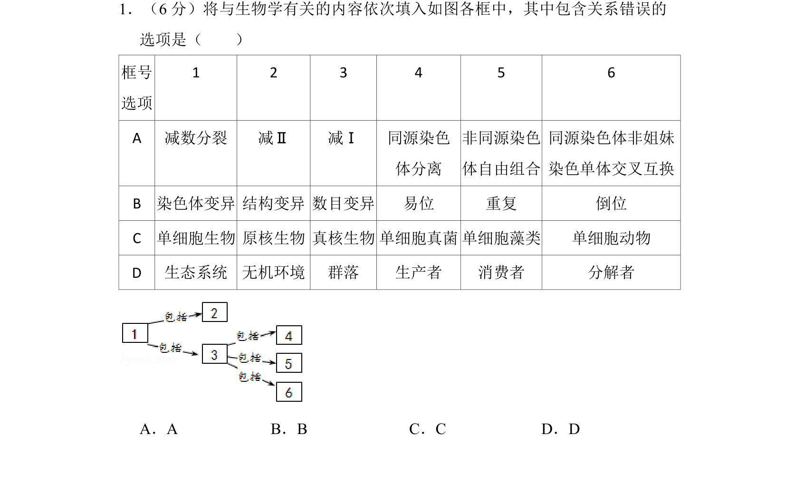
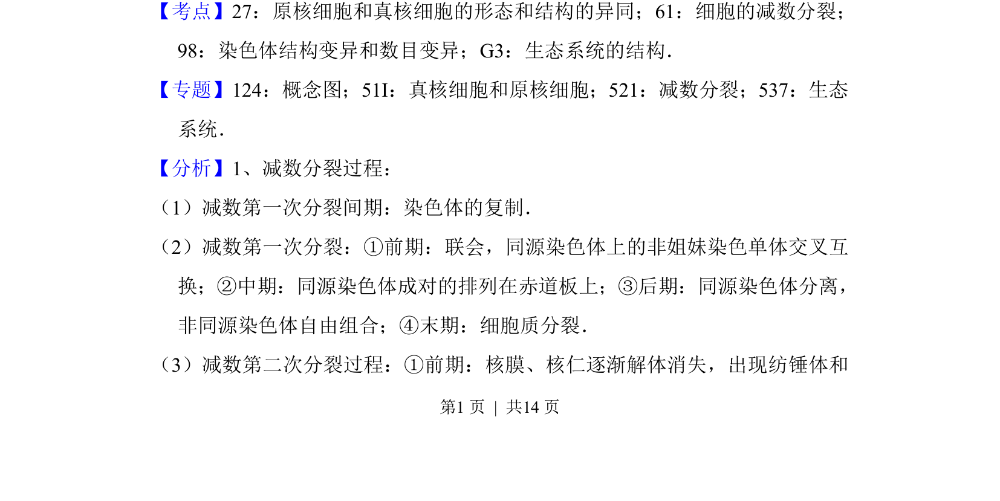
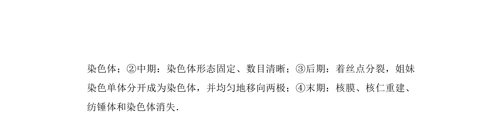

## 题面

## 摘要

该题以概念图形式考查减数分裂、染色体变异、单细胞生物分类及生态系统结构的包含关系。

## 关联考点

- [[277-减数分裂（高中必二）|减数分裂]]
- [[306-染色体结构变异|染色体结构变异]]
- [[305-染色体数目变异|染色体数目变异]]
- [[原核细胞和真核细胞]]
- [[503-生态系统结构|生态系统结构]]

## 答案与解析

> 📄 原 PDF 第 1 页：`素材/真题/北京/2008-2024·（北京）生物高考真题/2016年高考生物试卷（北京）（解析卷）.pdf`
