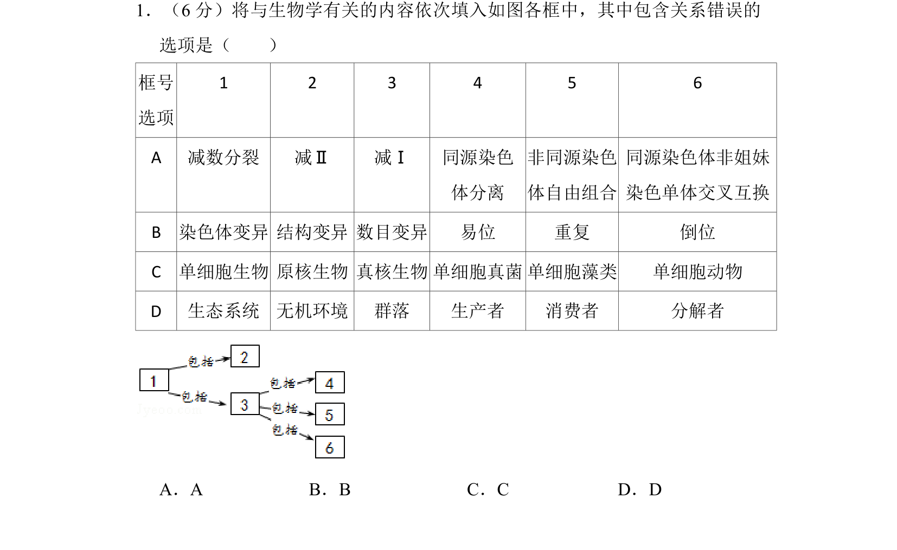
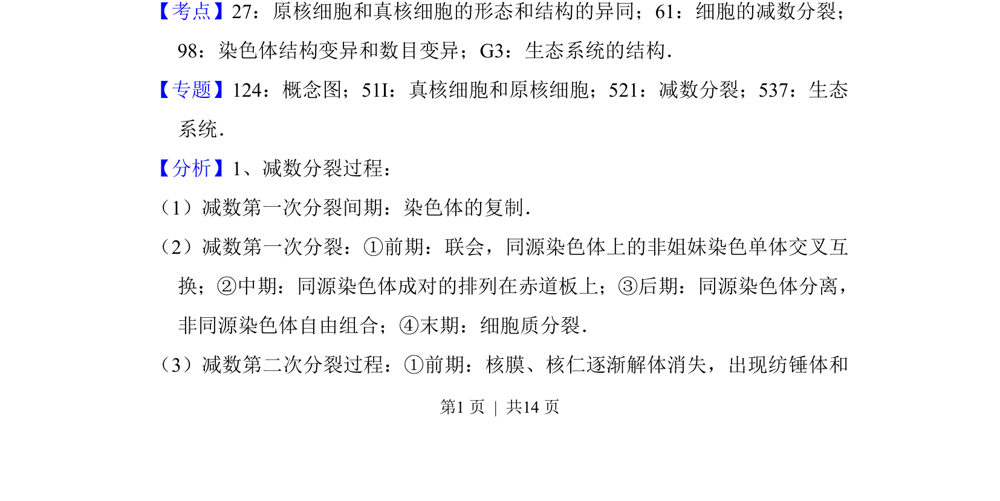
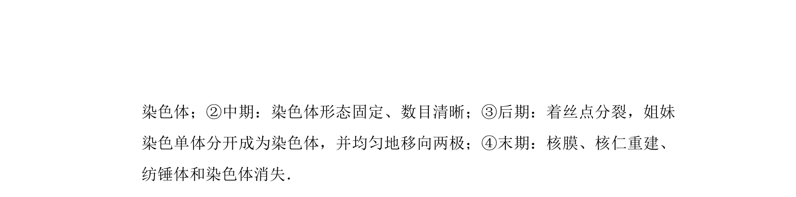

## 题面

## 摘要

该题以概念图形式考查减数分裂、染色体变异、单细胞生物分类及生态系统结构的包含关系。

## 关联考点

- [[277-减数分裂（高中必二）|减数分裂]]
- [[306-染色体结构变异|染色体结构变异]]
- [[305-染色体数目变异|染色体数目变异]]
- [[原核细胞和真核细胞]]
- [[502-生态系统的结构|生态系统结构]]

## 答案与解析

> 📄 原 PDF 第 1 页：`素材/真题/北京/2008-2024·（北京）生物高考真题/2016年高考生物试卷（北京）（解析卷）.pdf`

<!-- 题干文本-start -->
## 题干文本
1．（6分）将与生物学有关的内容依次填入如图各框中，其中包含关系错误的
选项是（　　）
框号
选项
1 2 3 4 5 6
A 减数分裂 减Ⅱ 减Ⅰ 同源染色
体分离
非同源染色
体自由组合
同源染色体非姐妹
染色单体交叉互换
B 染色体变异 结构变异 数目变异 易位 重复 倒位
C 单细胞生物 原核生物 真核生物 单细胞真菌单细胞藻类 单细胞动物
D 生态系统 无机环境 群落 生产者 消费者 分解者
A．A B．B C．C D．D
<!-- 题干文本-end -->

<!-- 解析文本-start -->
## 解析文本
【考点】27：原核细胞和真核细胞的形态和结构的异同；61：细胞的减数分裂；
98：染色体结构变异和数目变异；G3：生态系统的结构．菁优网版权所有
【专题】124：概念图；51I：真核细胞和原核细胞；521：减数分裂；537：生态
系统．
【分析】1、减数分裂过程：
（1）减数第一次分裂间期：染色体的复制．
（2）减数第一次分裂：①前期：联会，同源染色体上的非姐妹染色单体交叉互
换；②中期：同源染色体成对的排列在赤道板上；③后期：同源染色体分离，
非同源染色体自由组合；④末期：细胞质分裂．
（3）减数第二次分裂过程：①前期：核膜、核仁逐渐解体消失，出现纺锤体和
<!-- 解析文本-end -->
