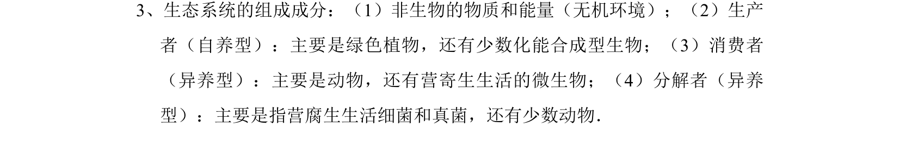
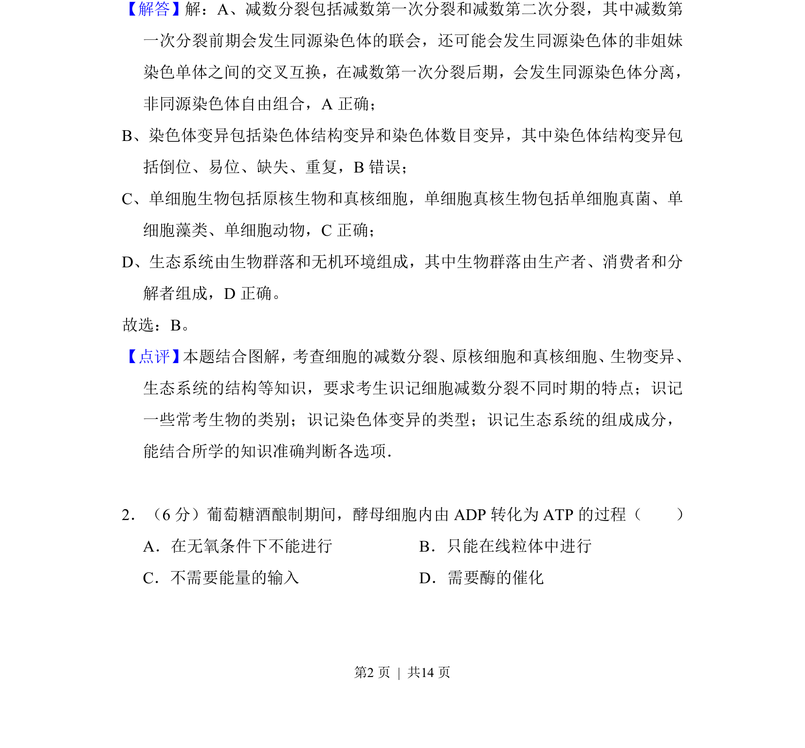
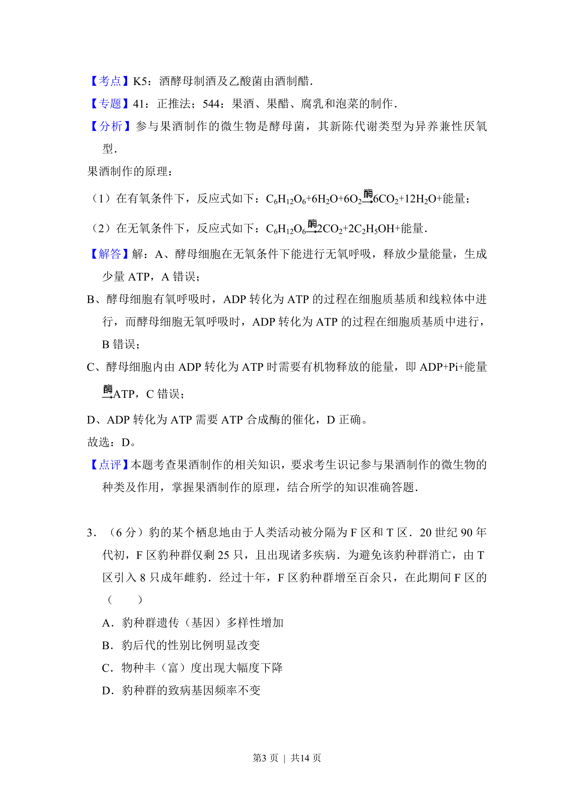
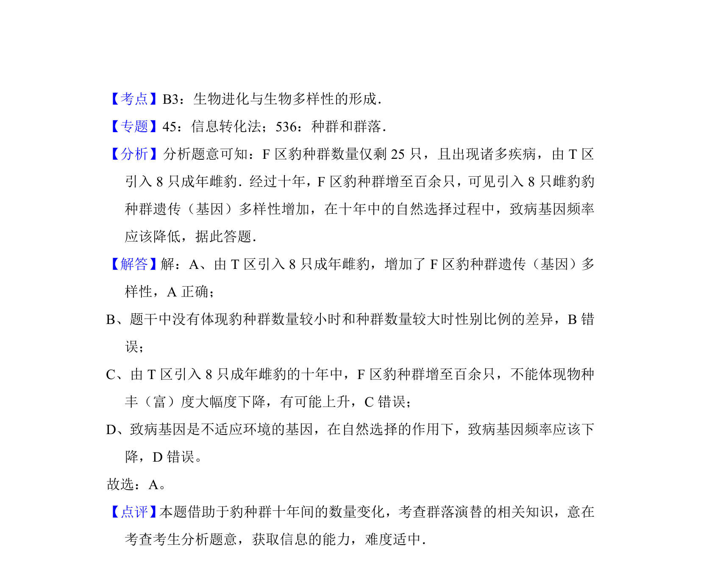

## 题面

## 摘要

该题考查酵母菌无氧呼吸过程中ATP的合成条件与场所

## 关联考点

- [[458-ATP合成|ATP合成]]
- [[242-酶|酶]]
- [[238-无氧呼吸|无氧呼吸]]

## 答案与解析

> 📄 原 PDF 第 2 页：`素材/真题/北京/2008-2024·（北京）生物高考真题/2016年高考生物试卷（北京）（解析卷）.pdf`

<!-- 题干文本-start -->
## 题干文本
3、生态系统的组成成分：（1）非生物的物质和能量（无机环境）；（2）生产
者（自养型）：主要是绿色植物，还有少数化能合成型生物；（3）消费者
（异养型）：主要是动物，还有营寄生生活的微生物；（4）分解者（异养
型）：主要是指营腐生生活细菌和真菌，还有少数动物．
<!-- 题干文本-end -->

<!-- 解析文本-start -->
## 解析文本
【解答】解：A、减数分裂包括减数第一次分裂和减数第二次分裂，其中减数第
一次分裂前期会发生同源染色体的联会，还可能会发生同源染色体的非姐妹
染色单体之间的交叉互换，在减数第一次分裂后期，会发生同源染色体分离，
非同源染色体自由组合，A正确；
B、染色体变异包括染色体结构变异和染色体数目变异，其中染色体结构变异包
括倒位、易位、缺失、重复，B错误；
C、单细胞生物包括原核生物和真核细胞，单细胞真核生物包括单细胞真菌、单
细胞藻类、单细胞动物，C正确；
D、生态系统由生物群落和无机环境组成，其中生物群落由生产者、消费者和分
解者组成，D正确。
故选：B。
【点评】 本题结合图解，考查细胞的减数分裂、原核细胞和真核细胞、生物变异、
生态系统的结构等知识，要求考生识记细胞减数分裂不同时期的特点；识记
一些常考生物的类别；识记染色体变异的类型；识记生态系统的组成成分，
能结合所学的知识准确判断各选项．
　
2．（6分）葡萄糖酒酿制期间，酵母细胞内由ADP转化为ATP的过程（　　）
A．在无氧条件下不能进行B．只能在线粒体中进行
C．不需要能量的输入D．需要酶的催化
<!-- 解析文本-end -->
