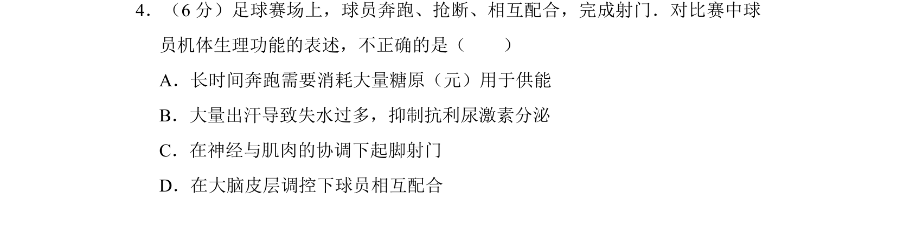
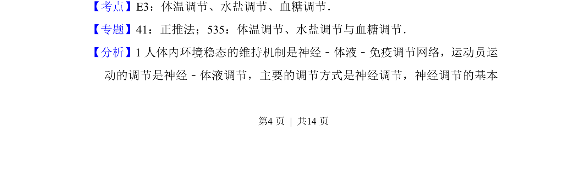
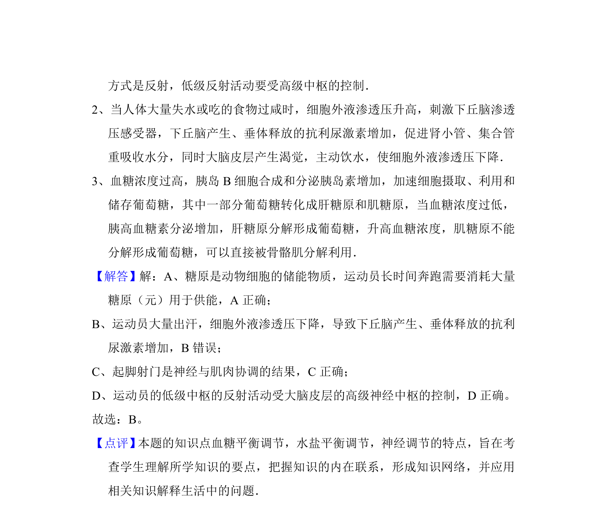

## 题面

## 摘要

考查足球运动中球员的神经调节、水盐平衡及血糖供能等生理功能

## 关联考点

- [[542-体温调节|体温调节]]
- [[740-水盐平衡|水盐调节]]
- [[512-血糖调节|血糖调节]]
- [[324-神经调节|神经调节]]

## 答案与解析

> 📄 原 PDF 第 4 页：`素材/真题/北京/2008-2024·（北京）生物高考真题/2016年高考生物试卷（北京）（解析卷）.pdf`
