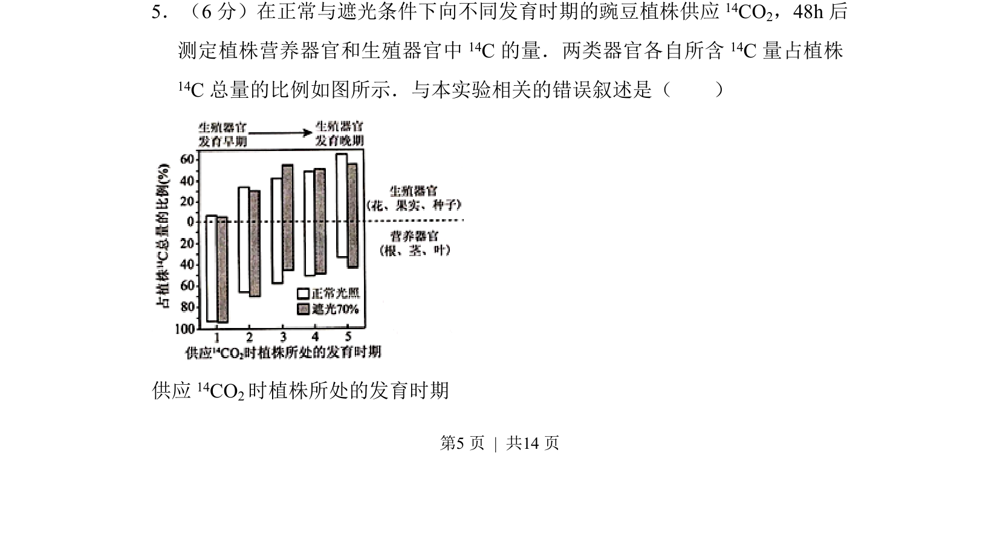
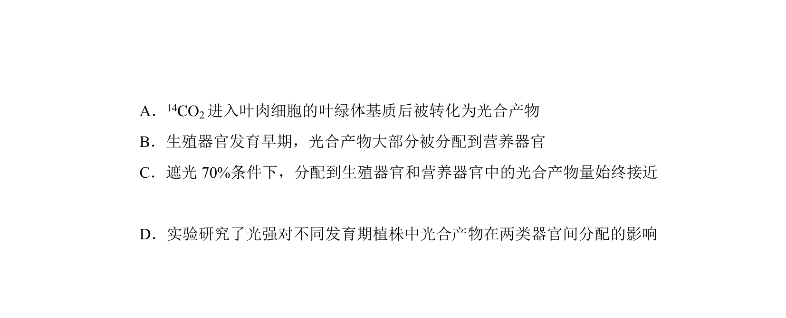
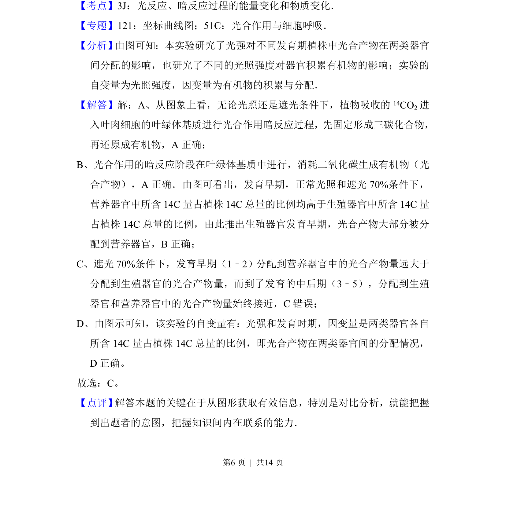

## 题面

## 摘要

探究光合产物(14C)在遮光和正常光下向营养和生殖器官分配规律及实验分析

## 关联考点

- [[033-光合作用|光合作用]]
- [[同化物运输]]
- [[源库关系]]
- [[666-实验分析|实验分析]]

## 答案与解析

> 📄 原 PDF 第 5 页：`素材/真题/北京/2008-2024·（北京）生物高考真题/2016年高考生物试卷（北京）（解析卷）.pdf`
