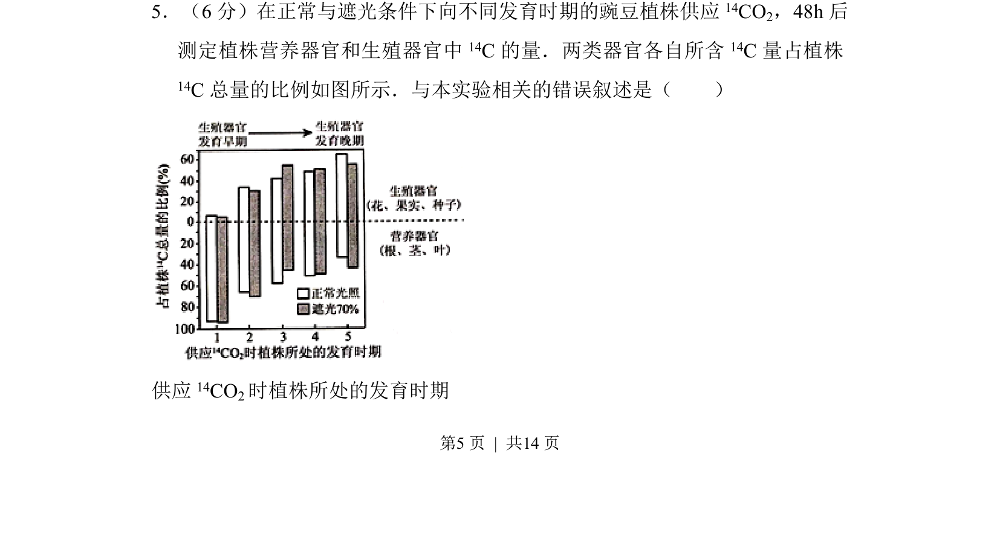
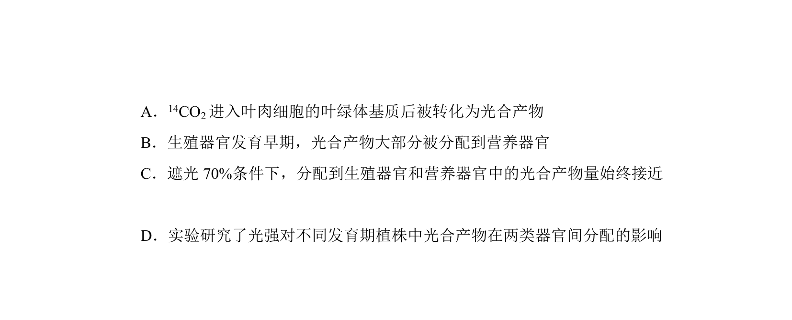
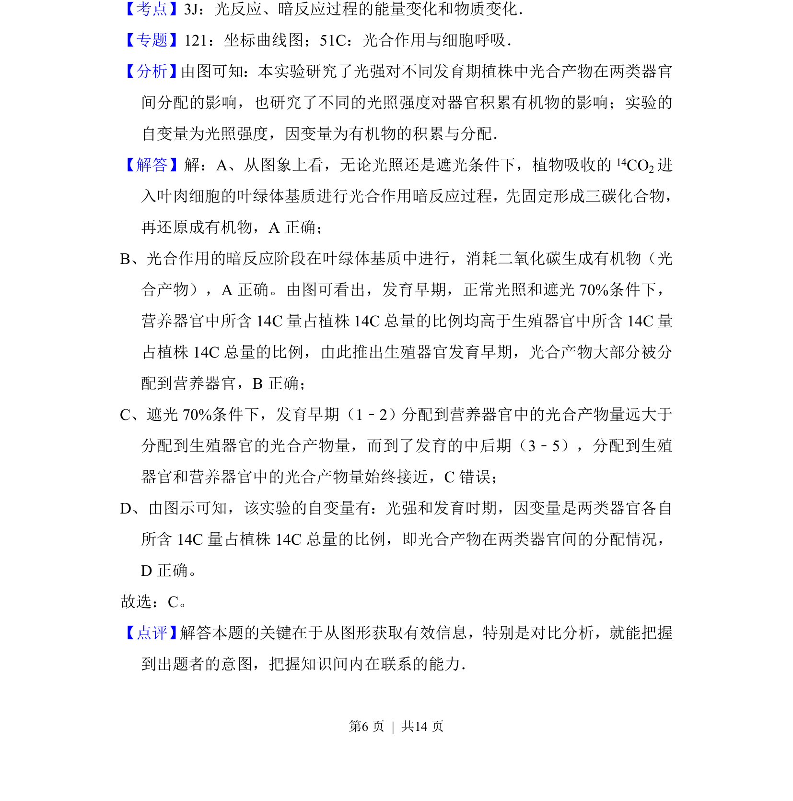

## 题面

## 摘要

探究光合产物(14C)在遮光和正常光下向营养和生殖器官分配规律及实验分析

## 关联考点

- [[033-光合作用|光合作用]]
- [[同化物运输]]
- [[源库关系]]
- [[666-实验分析|实验分析]]

## 答案与解析

> 📄 原 PDF 第 5 页：`素材/真题/北京/2008-2024·（北京）生物高考真题/2016年高考生物试卷（北京）（解析卷）.pdf`

<!-- 题干文本-start -->
## 题干文本
5．（6分）在正常与遮光条件下向不同发育时期的豌豆植株供应 14CO2，48h后
测定植株营养器官和生殖器官中 14C的量．两类器官各自所含 14C量占植株
14C总量的比例如图所示．与本实验相关的错误叙述是（　　）
供应 14CO2时植株所处的发育时期
<!-- 题干文本-end -->

<!-- 解析文本-start -->
## 解析文本

<!-- 解析文本-end -->
