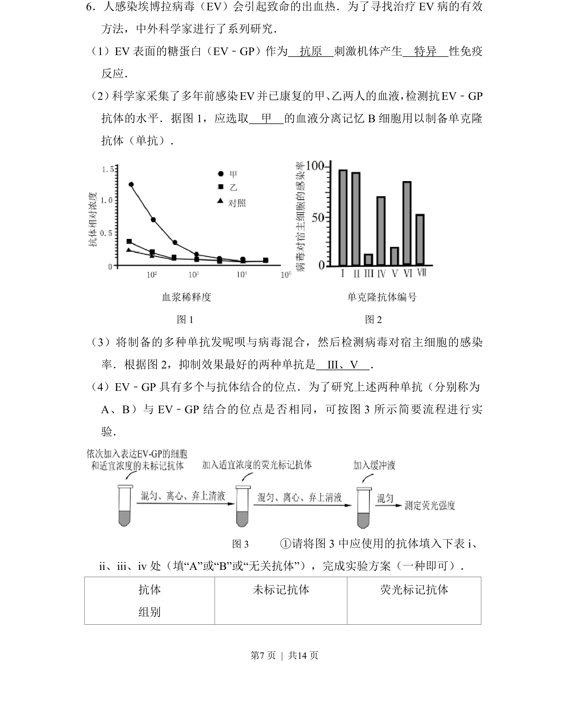
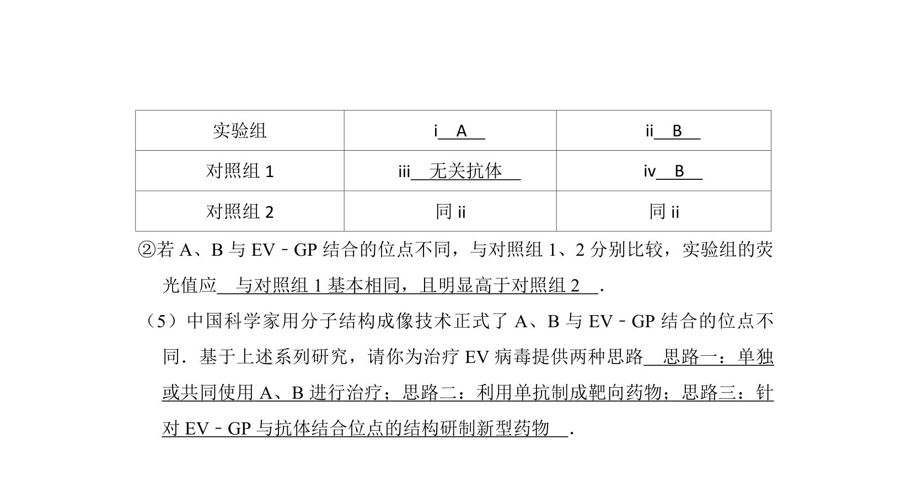
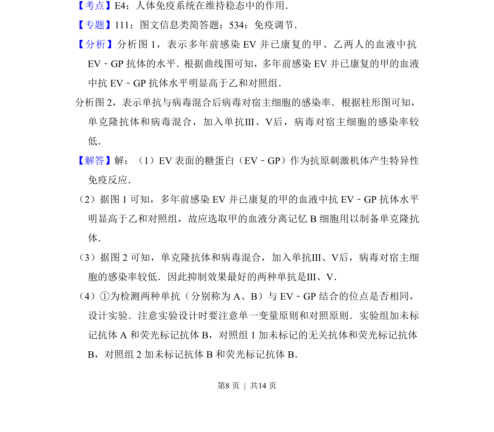
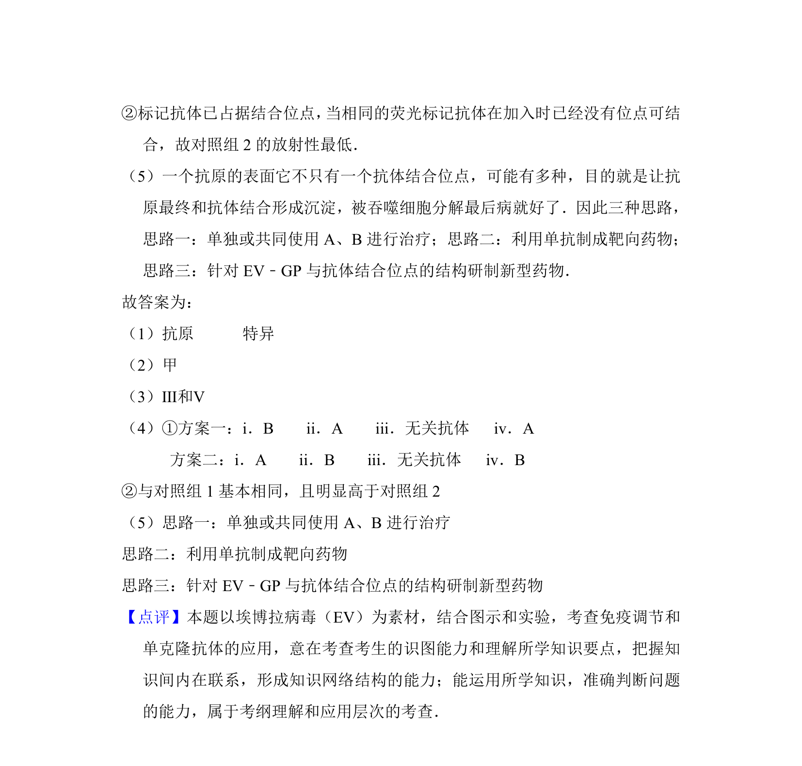

## 题面

## 摘要

该题通过埃博拉病毒情境考查免疫应答、单克隆抗体制备及抗原抗体结合实验设计。

## 关联考点

- [[163-抗原|抗原]]
- [[637-特异性免疫|特异性免疫]]
- [[451-单克隆抗体|单克隆抗体]]
- [[482-实验设计|实验设计]]

## 答案与解析

> 📄 原 PDF 第 7 页：`素材/真题/北京/2008-2024·（北京）生物高考真题/2016年高考生物试卷（北京）（解析卷）.pdf`
