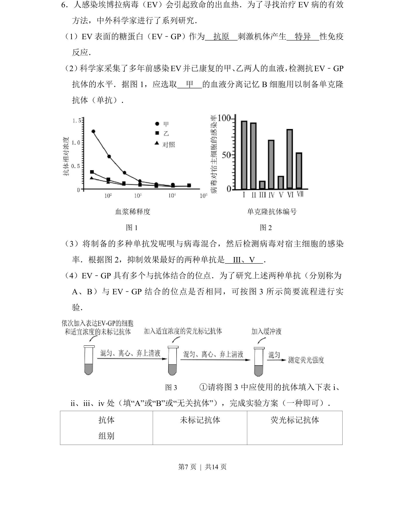
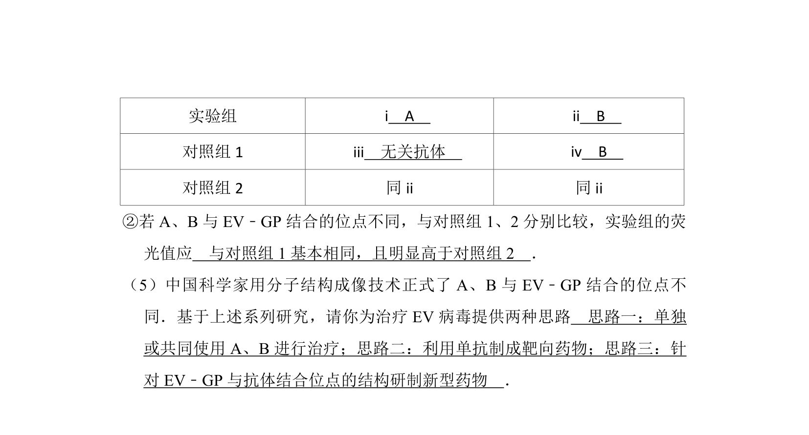
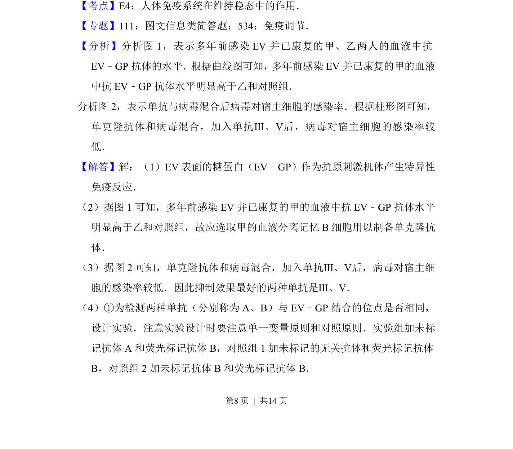
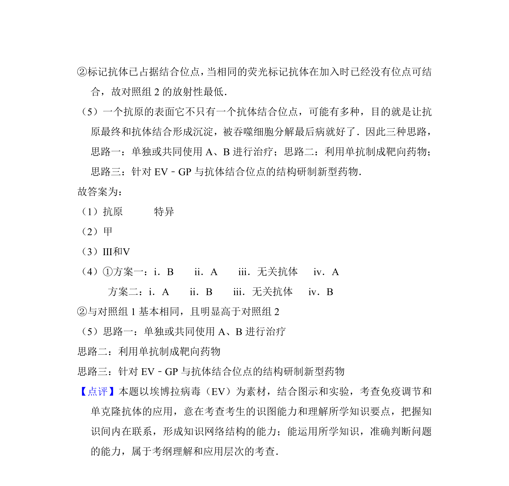

## 题面

## 摘要

该题通过埃博拉病毒情境考查免疫应答、单克隆抗体制备及抗原抗体结合实验设计。

## 关联考点

- [[163-抗原|抗原]]
- [[637-特异性免疫|特异性免疫]]
- [[451-单克隆抗体|单克隆抗体]]
- [[482-实验设计|实验设计]]

## 答案与解析

> 📄 原 PDF 第 7 页：`素材/真题/北京/2008-2024·（北京）生物高考真题/2016年高考生物试卷（北京）（解析卷）.pdf`

<!-- 题干文本-start -->
## 题干文本
6．人感染埃博拉病毒（EV）会引起致命的出血热．为了寻找治疗EV病的有效
方法，中外科学家进行了系列研究．
（1）EV表面的糖蛋白（EV﹣GP）作为　抗原　刺激机体产生　特异　性免疫
反应．
（2） 科学家采集了多年前感染EV并已康复的甲、 乙两人的血液， 检测抗EV﹣GP
抗体的水平．据图1，应选取　甲　的血液分离记忆B细胞用以制备单克隆
抗体（单抗）．
               血浆稀释度                           单克隆抗体编号
                  图1                                  图2
（3）将制备的多种单抗发呢呗与病毒混合，然后检测病毒对宿主细胞的感染
率．根据图2，抑制效果最好的两种单抗是　Ⅲ、Ⅴ　．
（4）EV﹣GP具有多个与抗体结合的位点．为了研究上述两种单抗（分别称为
A、B）与EV﹣GP结合的位点是否相同，可按图3所示简要流程进行实
验．
                             图3      ①请将图3中应使用的抗体填入下表i、
ii、iii、iv处（填“A”或“B”或“无关抗体”），完成实验方案（一种即可）．
抗体
组别
未标记抗体 荧光标记抗体
<!-- 题干文本-end -->

<!-- 解析文本-start -->
## 解析文本

<!-- 解析文本-end -->
