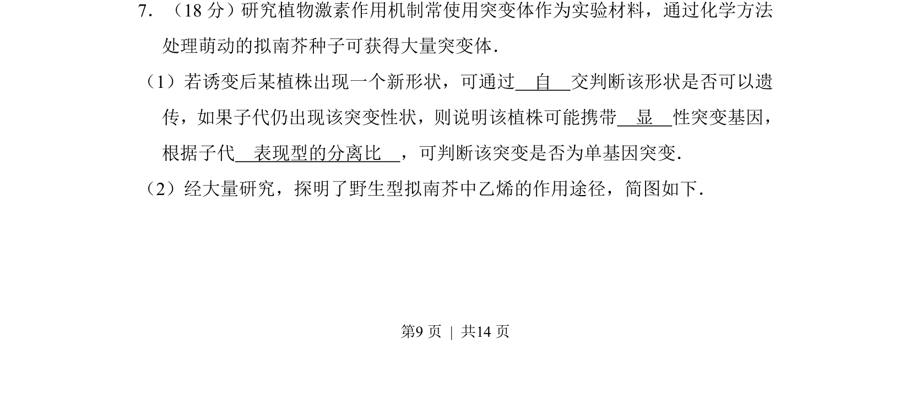
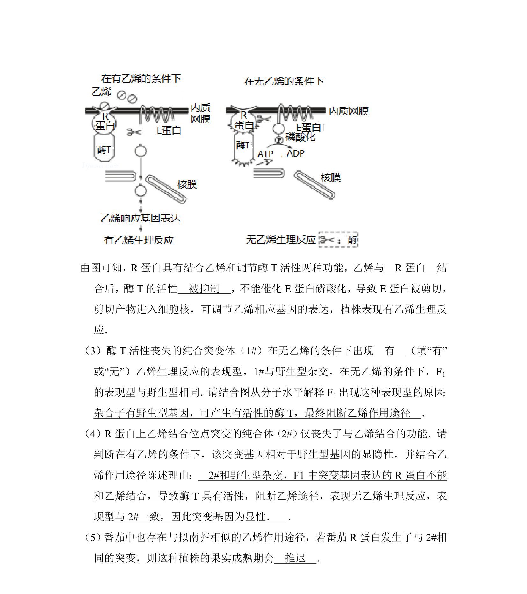
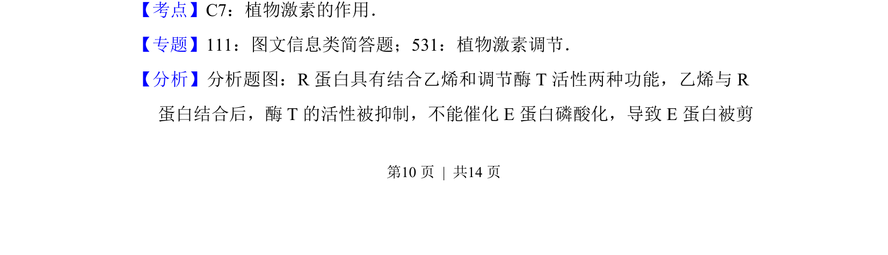
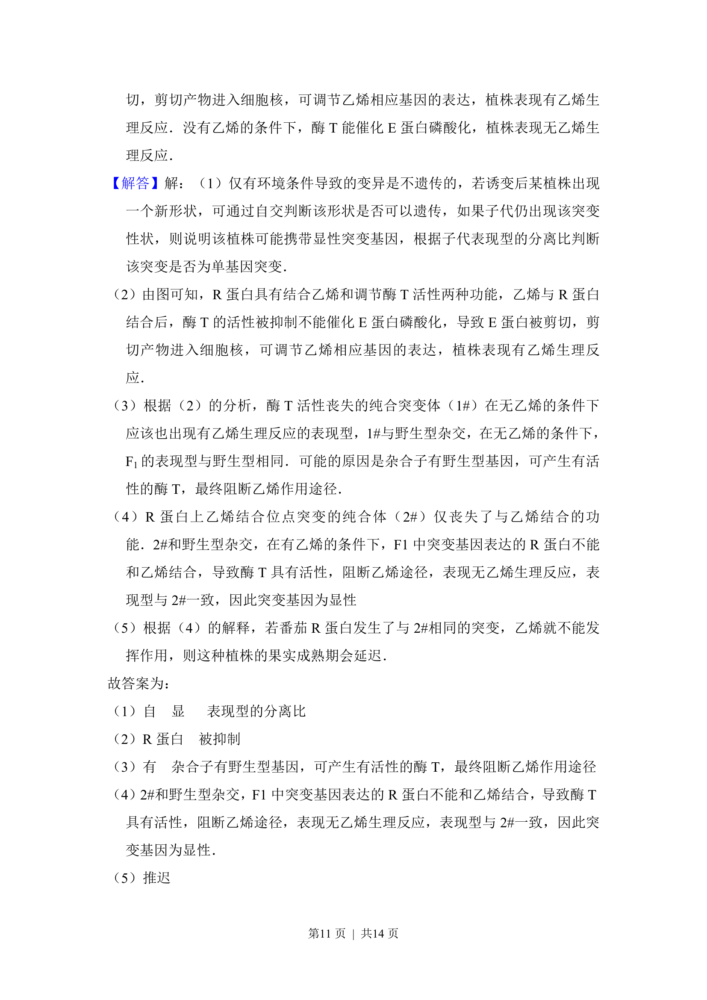

## 题面

## 摘要

该题考查化学诱变获得拟南芥突变体，通过自交和表现型分离比判断突变性状遗传方式，并结合乙烯作用途径简图分析。

## 关联考点

- [[709-诱变育种|诱变育种]]
- [[显性突变]]
- [[单基因突变]]
- [[乙烯信号途径]]

## 答案与解析

> 📄 原 PDF 第 9 页：`素材/真题/北京/2008-2024·（北京）生物高考真题/2016年高考生物试卷（北京）（解析卷）.pdf`
