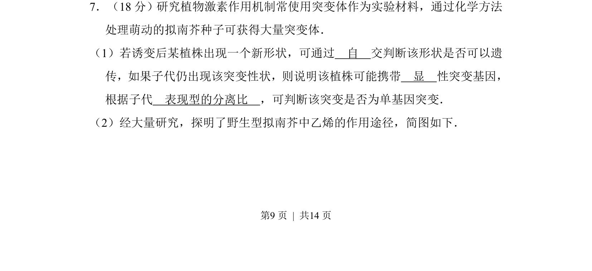
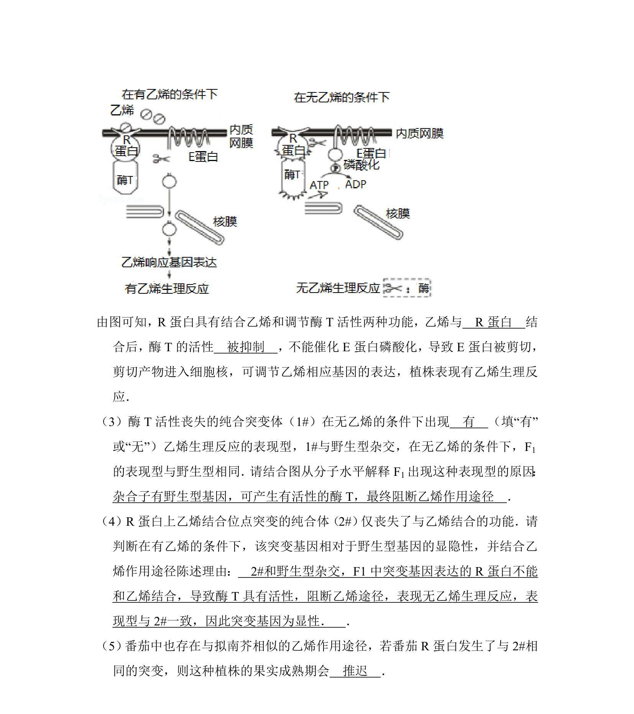
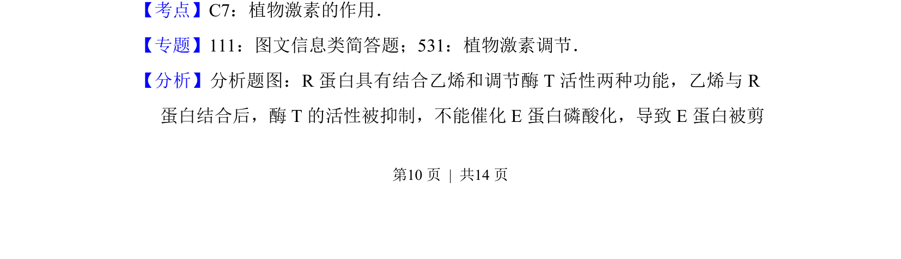
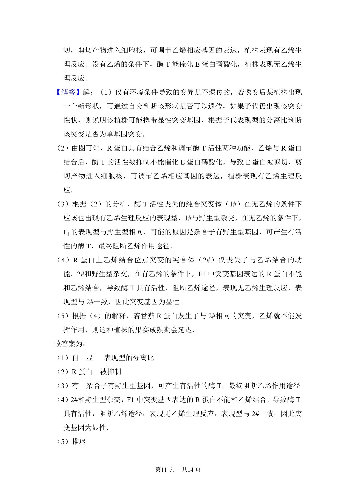

## 题面

## 摘要

该题考查化学诱变获得拟南芥突变体，通过自交和表现型分离比判断突变性状遗传方式，并结合乙烯作用途径简图分析。

## 关联考点

- [[709-诱变育种|诱变育种]]
- [[显性突变]]
- [[单基因突变]]
- [[乙烯信号途径]]

## 答案与解析

> 📄 原 PDF 第 9 页：`素材/真题/北京/2008-2024·（北京）生物高考真题/2016年高考生物试卷（北京）（解析卷）.pdf`

<!-- 题干文本-start -->
## 题干文本
7．（18分）研究植物激素作用机制常使用突变体作为实验材料，通过化学方法
处理萌动的拟南芥种子可获得大量突变体．
（1）若诱变后某植株出现一个新形状，可通过　自　交判断该形状是否可以遗
传，如果子代仍出现该突变性状，则说明该植株可能携带　显　性突变基因，
根据子代　表现型的分离比　，可判断该突变是否为单基因突变．
（2）经大量研究，探明了野生型拟南芥中乙烯的作用途径，简图如下．
<!-- 题干文本-end -->

<!-- 解析文本-start -->
## 解析文本

<!-- 解析文本-end -->
