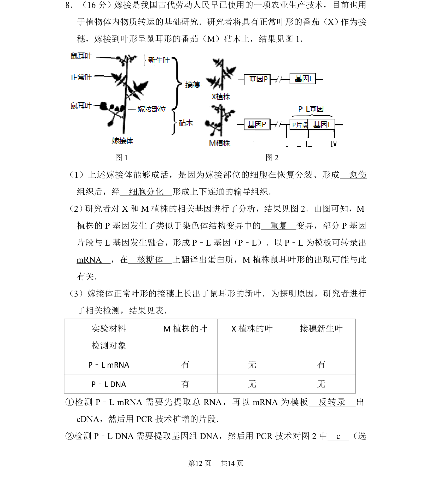
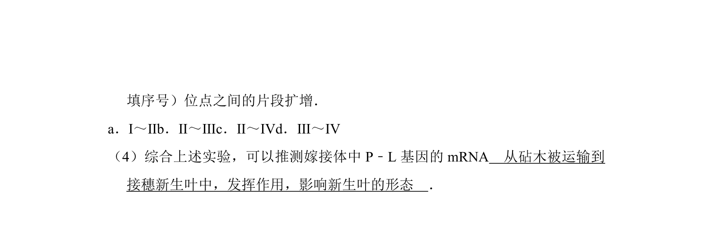
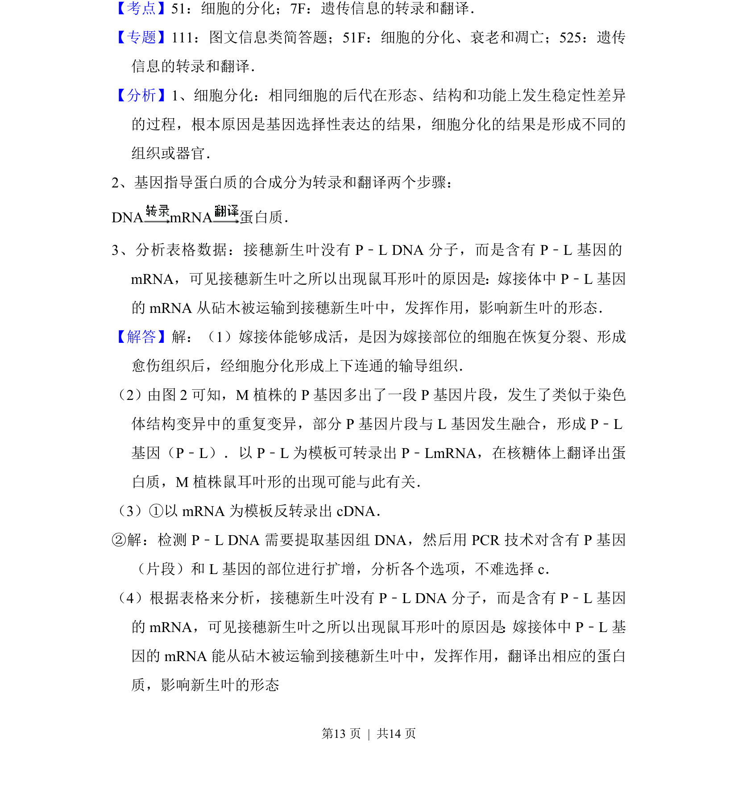
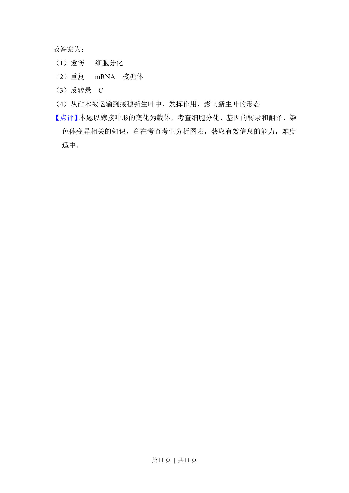

## 题面

## 摘要

本題考查嫁接成活原理、基因結構變異與表達及分子檢測技術。

## 关联考点

- [[045-细胞分化|细胞分化]]
- [[306-染色体结构变异|染色体结构变异]]
- [[479-基因表达|基因表达]]
- [[827-PCR技术|PCR技术]]

## 答案与解析

> 📄 原 PDF 第 12 页：`素材/真题/北京/2008-2024·（北京）生物高考真题/2016年高考生物试卷（北京）（解析卷）.pdf`
