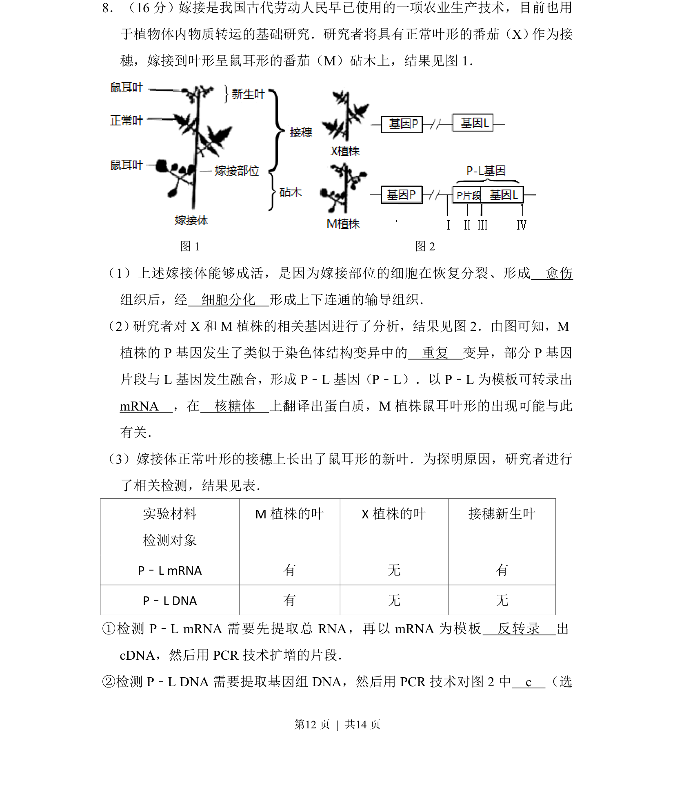
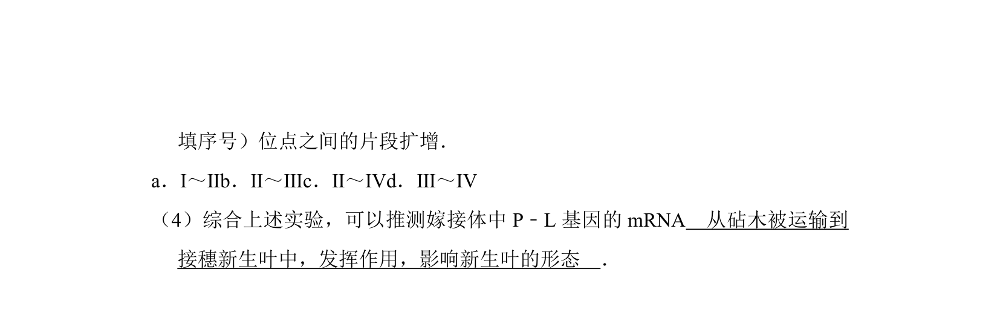
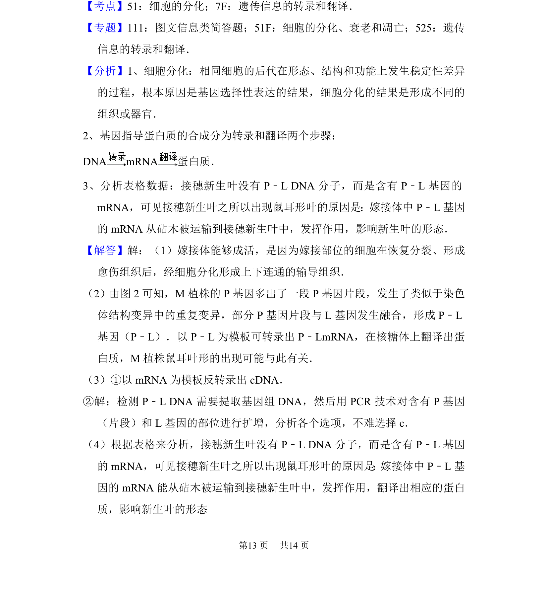
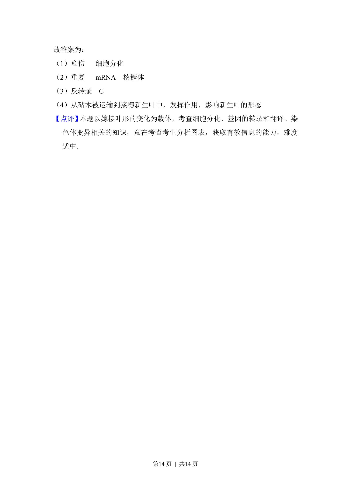

## 题面

## 摘要

本題考查嫁接成活原理、基因結構變異與表達及分子檢測技術。

## 关联考点

- [[045-细胞分化|细胞分化]]
- [[306-染色体结构变异|染色体结构变异]]
- [[843-基因的表达|基因表达]]
- [[827-PCR技术|PCR技术]]

## 答案与解析

> 📄 原 PDF 第 12 页：`素材/真题/北京/2008-2024·（北京）生物高考真题/2016年高考生物试卷（北京）（解析卷）.pdf`

<!-- 题干文本-start -->
## 题干文本
8．（16分）嫁接是我国古代劳动人民早已使用的一项农业生产技术，目前也用
于植物体内物质转运的基础研究．研究者将具有正常叶形的番茄（X） 作为接
穗，嫁接到叶形呈鼠耳形的番茄（M）砧木上，结果见图1．
             图1                                    图2
（1）上述嫁接体能够成活，是因为嫁接部位的细胞在恢复分裂、形成　愈伤　
组织后，经　细胞分化　形成上下连通的输导组织．
（2） 研究者对X和M植株的相关基因进行了分析，结果见图2．由图可知，M
植株的P基因发生了类似于染色体结构变异中的　重复　变异，部分P基因
片段与L基因发生融合，形成P﹣L基因（P﹣L）．以P﹣L为模板可转录出　
mRNA　，在　核糖体　上翻译出蛋白质，M植株鼠耳叶形的出现可能与此
有关．
（3）嫁接体正常叶形的接穗上长出了鼠耳形的新叶．为探明原因，研究者进行
了相关检测，结果见表．
实验材料
检测对象
M植株的叶 X植株的叶 接穗新生叶
P﹣L mRNA 有 无 有
P﹣L DNA 有 无 无
①检测P﹣L mRNA需要先提取总RNA，再以mRNA为模板　反转录　出
cDNA，然后用PCR技术扩增的片段．
②检测P﹣L DNA需要提取基因组DNA，然后用PCR技术对图2中　c　（选
<!-- 题干文本-end -->

<!-- 解析文本-start -->
## 解析文本

<!-- 解析文本-end -->
