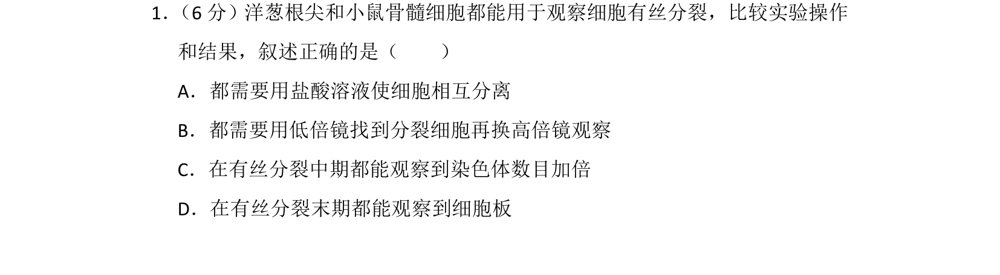
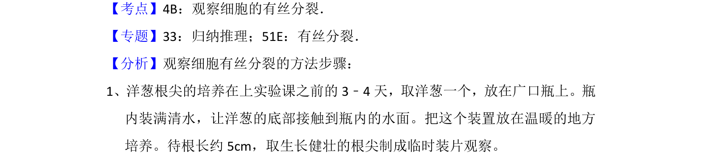

## 题面

## 摘要

比较洋葱根尖和小鼠骨髓细胞观察有丝分裂的实验操作及结果差异

## 关联考点

- [[观察细胞的有丝分裂]]
- [[046-细胞分裂|有丝分裂]]
- [[580-实验操作|实验操作]]
- [[616-染色体数目|染色体数目]]

## 答案与解析

> 📄 原 PDF 第 1 页：`素材/真题/北京/2008-2024·（北京）生物高考真题/2017年高考生物试卷（北京）（解析卷）.pdf`
