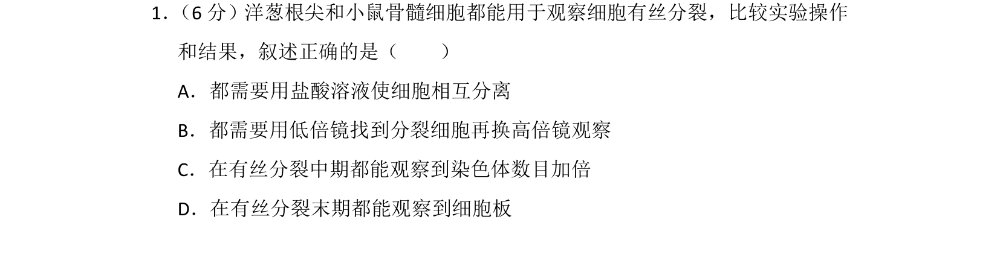
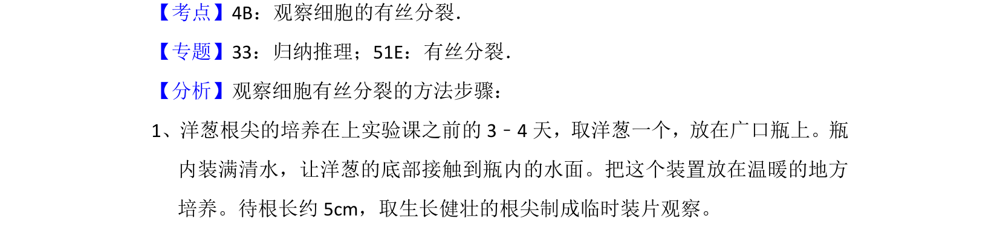

## 题面

## 摘要

比较洋葱根尖和小鼠骨髓细胞观察有丝分裂的实验操作及结果差异

## 关联考点

- [[902-观察细胞的有丝分裂|观察细胞的有丝分裂]]
- [[046-细胞分裂|有丝分裂]]
- [[580-实验操作|实验操作]]
- [[616-染色体数目|染色体数目]]

## 答案与解析

> 📄 原 PDF 第 1 页：`素材/真题/北京/2008-2024·（北京）生物高考真题/2017年高考生物试卷（北京）（解析卷）.pdf`

<!-- 题干文本-start -->
## 题干文本
1． （6分）洋葱根尖和小鼠骨髓细胞都能用于观察细胞有丝分裂，比较实验操作
和结果，叙述正确的是（　　）
A．都需要用盐酸溶液使细胞相互分离
B．都需要用低倍镜找到分裂细胞再换高倍镜观察
C．在有丝分裂中期都能观察到染色体数目加倍
D．在有丝分裂末期都能观察到细胞板
<!-- 题干文本-end -->

<!-- 解析文本-start -->
## 解析文本
【考点】4B：观察细胞的有丝分裂．菁优网版权所有
【专题】33：归纳推理；51E：有丝分裂．
【分析】观察细胞有丝分裂的方法步骤：
1、洋葱根尖的培养在上实验课之前的3﹣4天，取洋葱一个，放在广口瓶上。瓶
内装满清水，让洋葱的底部接触到瓶内的水面。把这个装置放在温暖的地方
培养。待根长约5cm，取生长健壮的根尖制成临时装片观察。
<!-- 解析文本-end -->
