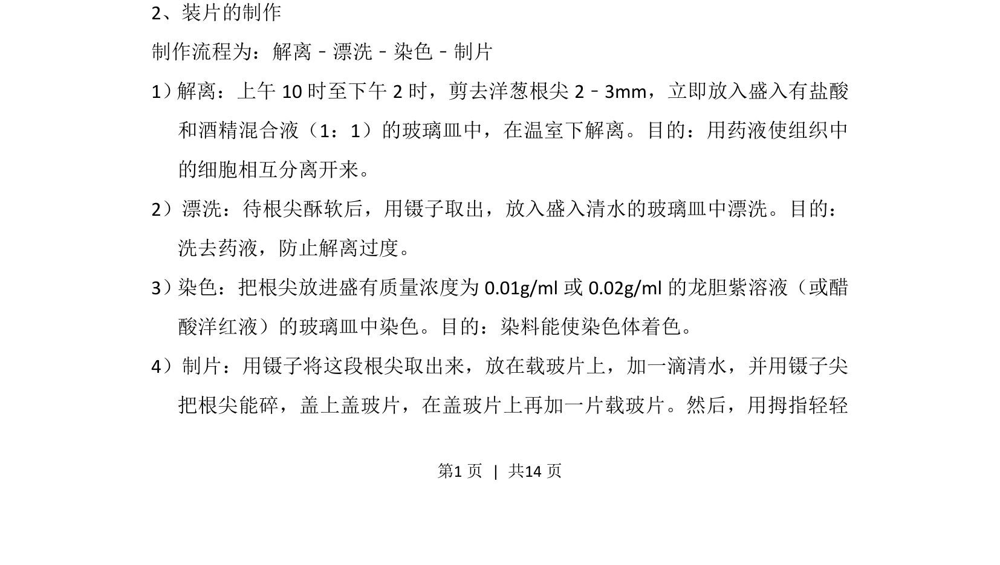
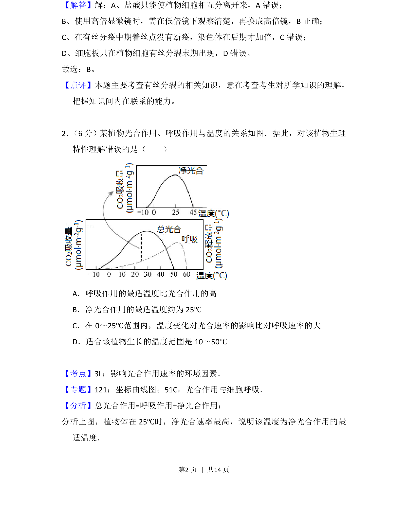
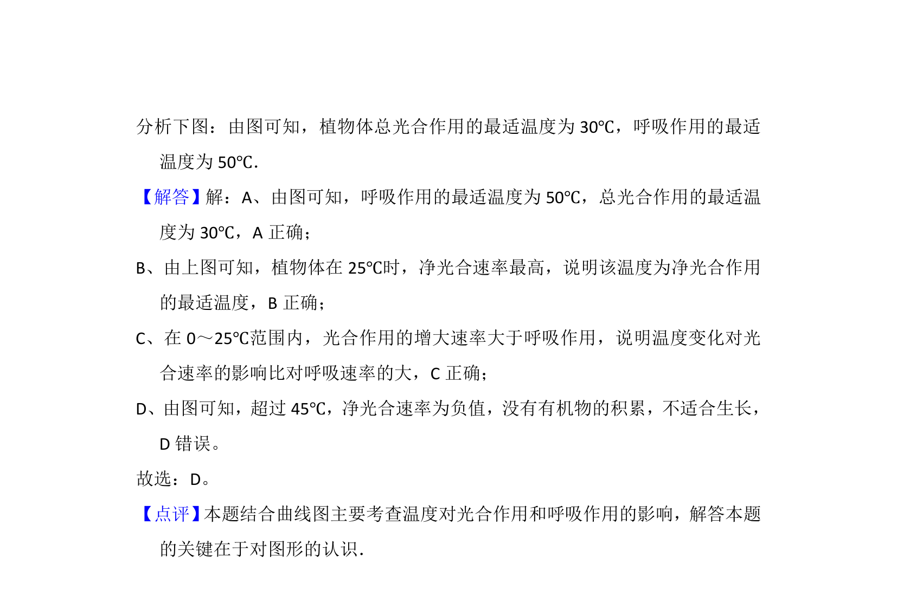

## 题面

## 摘要

观察植物细胞有丝分裂实验的装片制作步骤及目的。

## 关联考点

- [[901-观察植物细胞有丝分裂|观察植物细胞有丝分裂]]
- [[908-装片制作|装片制作]]
- [[903-解离|解离]]
- [[漂洗]]
- [[894-染色|染色]]

## 答案与解析

> 📄 原 PDF 第 1 页：`素材/真题/北京/2008-2024·（北京）生物高考真题/2017年高考生物试卷（北京）（解析卷）.pdf`
