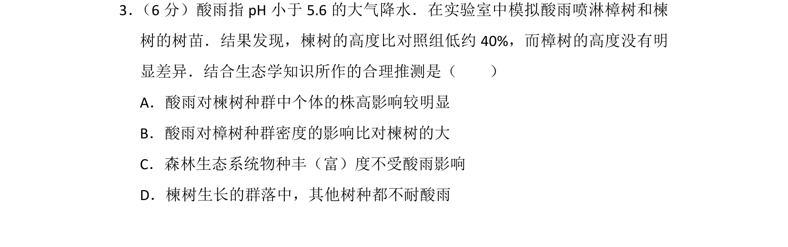
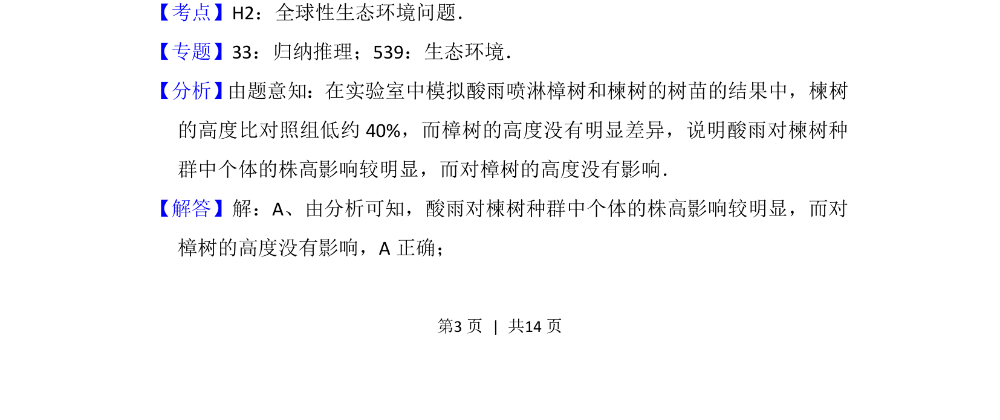
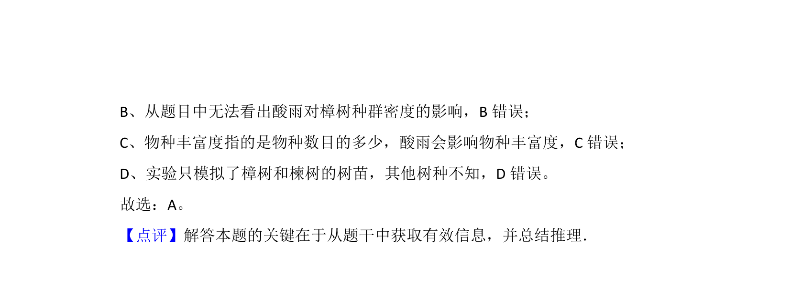

## 题面

## 摘要

通过模拟酸雨实验对比樟树和楝树生长差异，考查酸雨对植物种群个体特征的影响。

## 关联考点

- [[392-全球性生态环境问题|全球性生态环境问题]]
- [[862-种群的特征|种群特征]]
- [[群落生态学]]

## 答案与解析

> 📄 原 PDF 第 3 页：`素材/真题/北京/2008-2024·（北京）生物高考真题/2017年高考生物试卷（北京）（解析卷）.pdf`

<!-- 题干文本-start -->
## 题干文本
3． （6分）酸雨指pH小于5.6的大气降水．在实验室中模拟酸雨喷淋樟树和楝
树的树苗．结果发现，楝树的高度比对照组低约40%，而樟树的高度没有明
显差异．结合生态学知识所作的合理推测是（　　）
A．酸雨对楝树种群中个体的株高影响较明显
B．酸雨对樟树种群密度的影响比对楝树的大
C．森林生态系统物种丰（富）度不受酸雨影响
D．楝树生长的群落中，其他树种都不耐酸雨
<!-- 题干文本-end -->

<!-- 解析文本-start -->
## 解析文本
【考点】H2：全球性生态环境问题．菁优网版权所有
【专题】33：归纳推理；539：生态环境．
【分析】 由题意知：在实验室中模拟酸雨喷淋樟树和楝树的树苗的结果中，楝树
的高度比对照组低约40%，而樟树的高度没有明显差异，说明酸雨对楝树种
群中个体的株高影响较明显，而对樟树的高度没有影响．
【解答】解：A、由分析可知，酸雨对楝树种群中个体的株高影响较明显，而对
樟树的高度没有影响，A正确；
<!-- 解析文本-end -->
