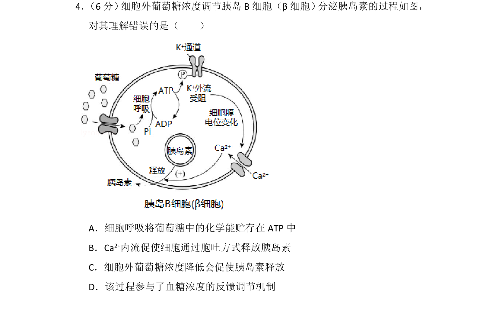
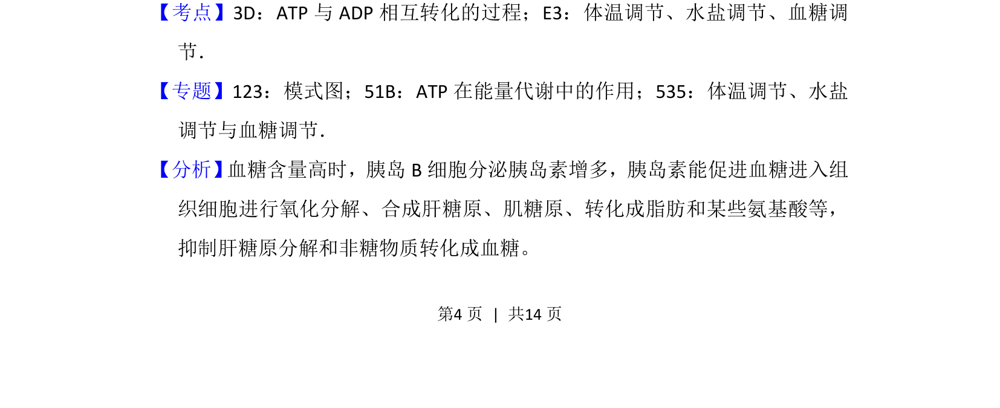
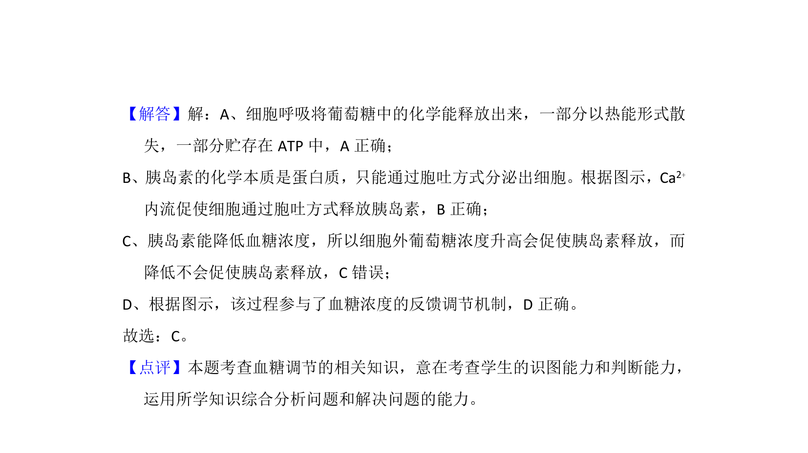

## 题面

## 摘要

胰岛B细胞以胞吐方式分泌胰岛素，受葡萄糖浓度及Ca²⁺内流调控，并参与血糖反馈调节。

## 关联考点

- [[512-血糖调节|血糖调节]]
- [[259-胞吐|胞吐]]
- [[ATP与ADP相互转化]]
- [[334-反馈调节|反馈调节]]

## 答案与解析

> 📄 原 PDF 第 4 页：`素材/真题/北京/2008-2024·（北京）生物高考真题/2017年高考生物试卷（北京）（解析卷）.pdf`
