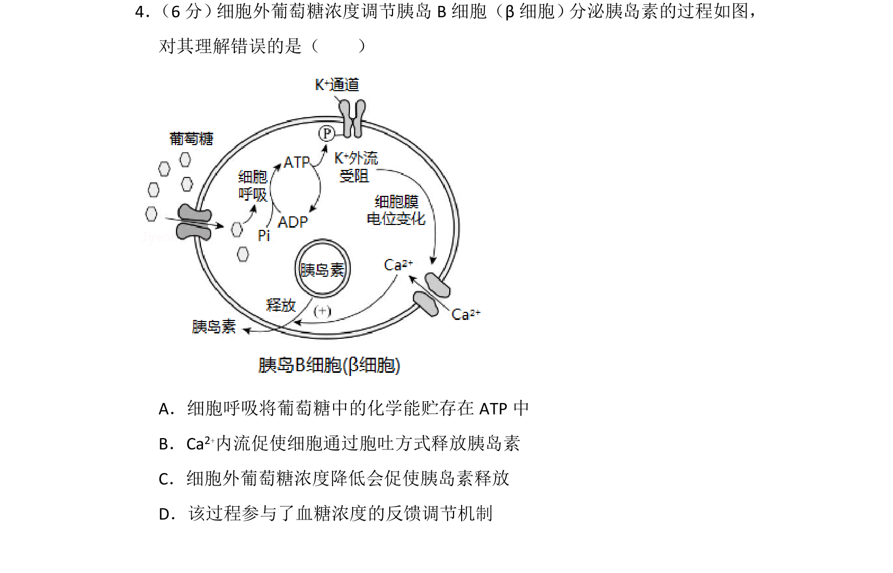
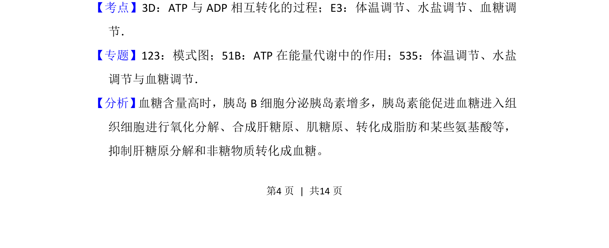
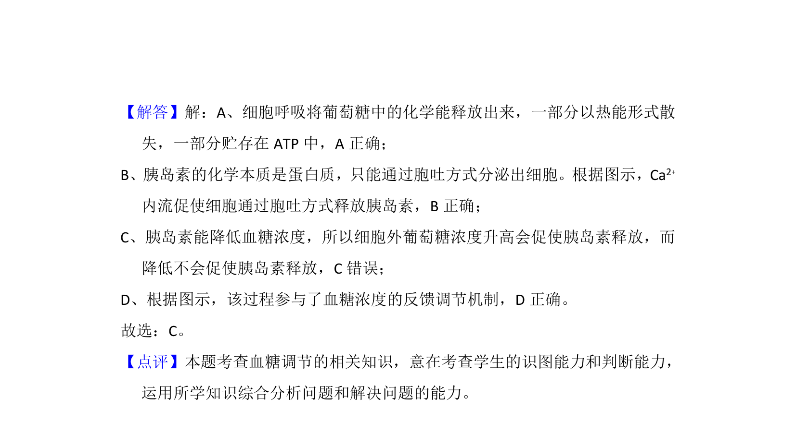

## 题面

## 摘要

胰岛B细胞以胞吐方式分泌胰岛素，受葡萄糖浓度及Ca²⁺内流调控，并参与血糖反馈调节。

## 关联考点

- [[512-血糖调节|血糖调节]]
- [[259-胞吐|胞吐]]
- [[ATP与ADP相互转化]]
- [[334-反馈调节|反馈调节]]

## 答案与解析

> 📄 原 PDF 第 4 页：`素材/真题/北京/2008-2024·（北京）生物高考真题/2017年高考生物试卷（北京）（解析卷）.pdf`

<!-- 题干文本-start -->
## 题干文本
4． （6分） 细胞外葡萄糖浓度调节胰岛B细胞（β细胞） 分泌胰岛素的过程如图，
对其理解错误的是（　　）
A．细胞呼吸将葡萄糖中的化学能贮存在ATP中
B．Ca2+内流促使细胞通过胞吐方式释放胰岛素
C．细胞外葡萄糖浓度降低会促使胰岛素释放
D．该过程参与了血糖浓度的反馈调节机制
<!-- 题干文本-end -->

<!-- 解析文本-start -->
## 解析文本
【考点】3D：ATP与ADP相互转化的过程；E3：体温调节、水盐调节、血糖调
节．菁优网版权所有
【专题】123：模式图；51B：ATP在能量代谢中的作用；535：体温调节、水盐
调节与血糖调节．
【分析】 血糖含量高时，胰岛B细胞分泌胰岛素增多，胰岛素能促进血糖进入组
织细胞进行氧化分解、合成肝糖原、肌糖原、转化成脂肪和某些氨基酸等，
抑制肝糖原分解和非糖物质转化成血糖。
<!-- 解析文本-end -->
