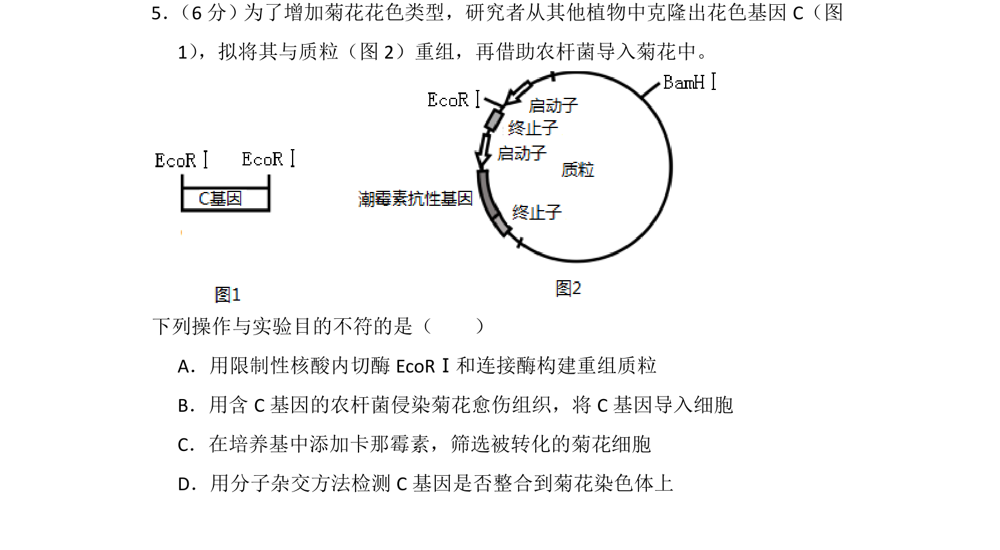
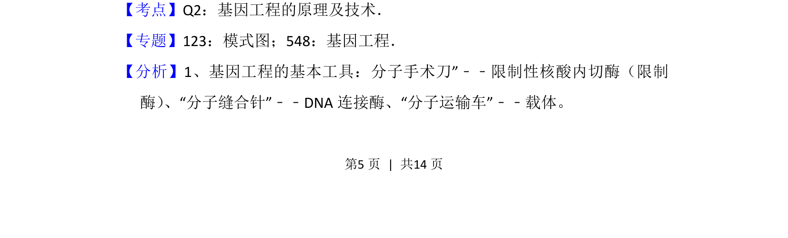
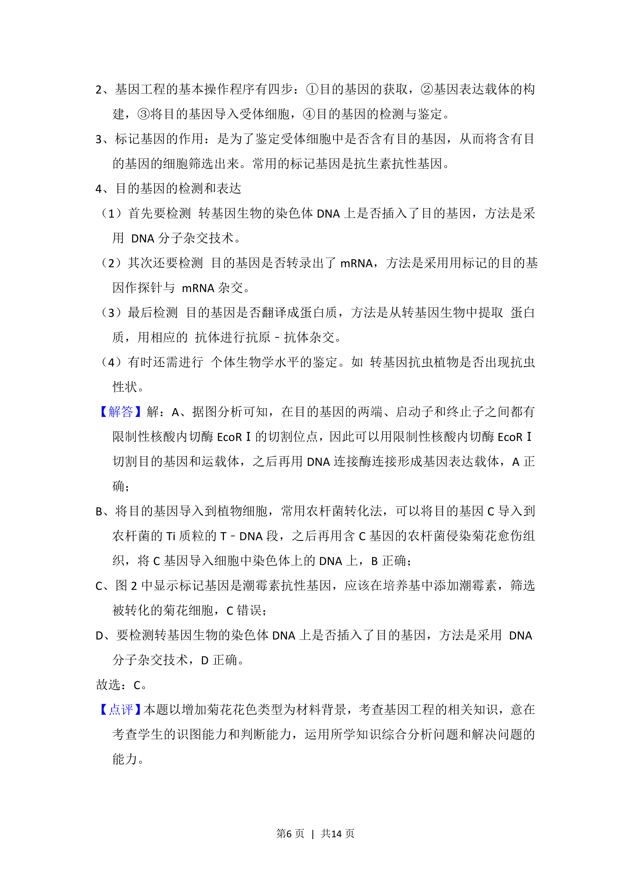

## 题面

## 摘要

该题考查基因工程中构建重组质粒、农杆菌介导转化、筛选及检测等操作步骤。

## 关联考点

- [[411-基因工程|基因工程]]
- [[422-限制性核酸内切酶|限制酶]]
- [[农杆菌转化]]
- [[分子杂交]]

## 答案与解析

> 📄 原 PDF 第 5 页：`素材/真题/北京/2008-2024·（北京）生物高考真题/2017年高考生物试卷（北京）（解析卷）.pdf`
