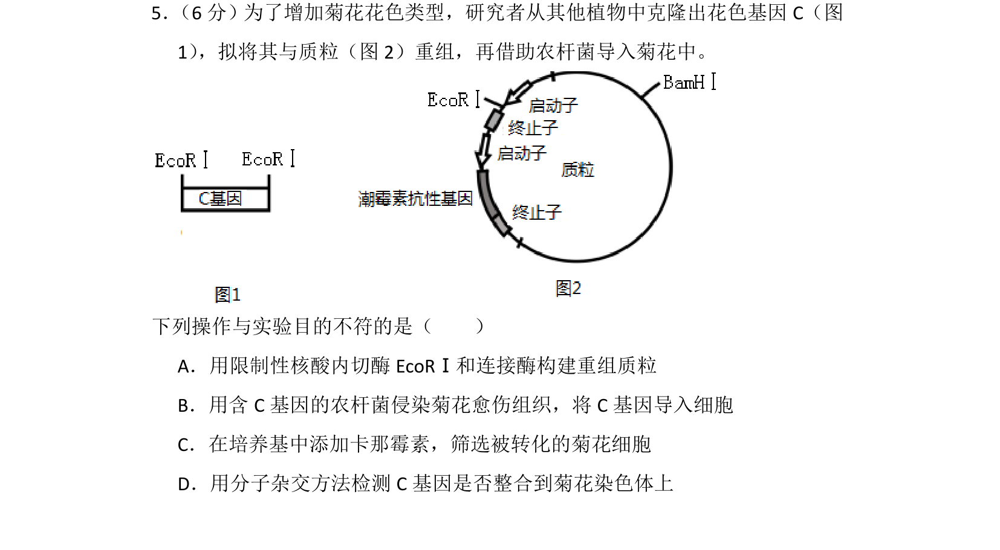
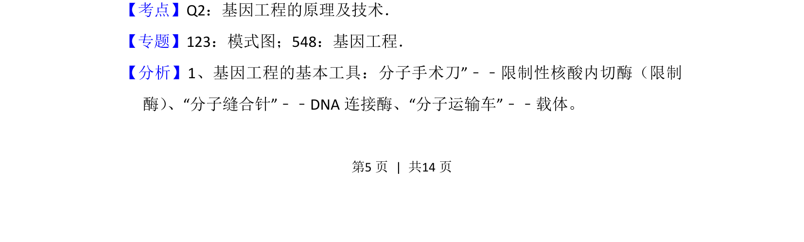
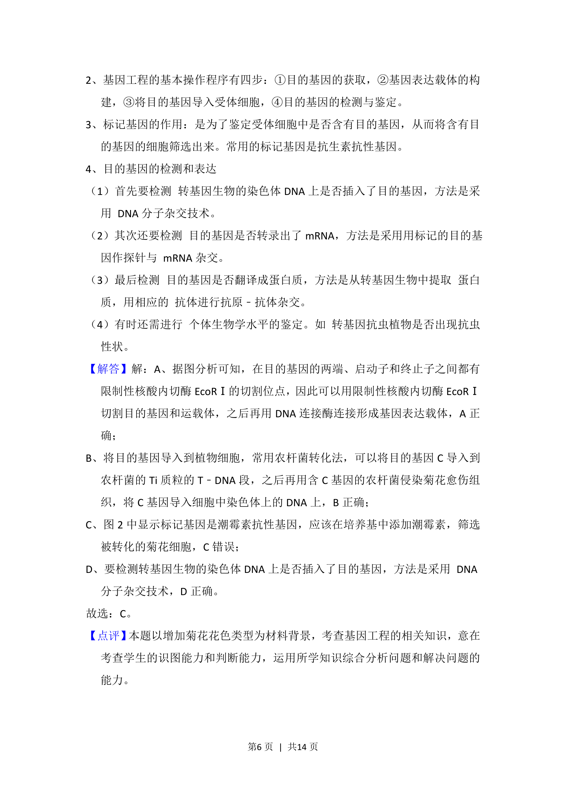

## 题面

## 摘要

该题考查基因工程中构建重组质粒、农杆菌介导转化、筛选及检测等操作步骤。

## 关联考点

- [[411-基因工程|基因工程]]
- [[422-限制性核酸内切酶|限制酶]]
- [[农杆菌转化]]
- [[分子杂交]]

## 答案与解析

> 📄 原 PDF 第 5 页：`素材/真题/北京/2008-2024·（北京）生物高考真题/2017年高考生物试卷（北京）（解析卷）.pdf`

<!-- 题干文本-start -->
## 题干文本
5． （6分）为了增加菊花花色类型，研究者从其他植物中克隆出花色基因C（图
1） ，拟将其与质粒（图2）重组，再借助农杆菌导入菊花中。
下列操作与实验目的不符的是（　　）
A．用限制性核酸内切酶EcoRⅠ和连接酶构建重组质粒
B．用含C基因的农杆菌侵染菊花愈伤组织，将C基因导入细胞
C．在培养基中添加卡那霉素，筛选被转化的菊花细胞
D．用分子杂交方法检测C基因是否整合到菊花染色体上
<!-- 题干文本-end -->

<!-- 解析文本-start -->
## 解析文本
【考点】Q2：基因工程的原理及技术．菁优网版权所有
【专题】123：模式图；548：基因工程．
【分析】1、基因工程的基本工具：分子手术刀”﹣﹣限制性核酸内切酶（限制
酶） 、“分子缝合针”﹣﹣DNA连接酶、“分子运输车”﹣﹣载体。
<!-- 解析文本-end -->
