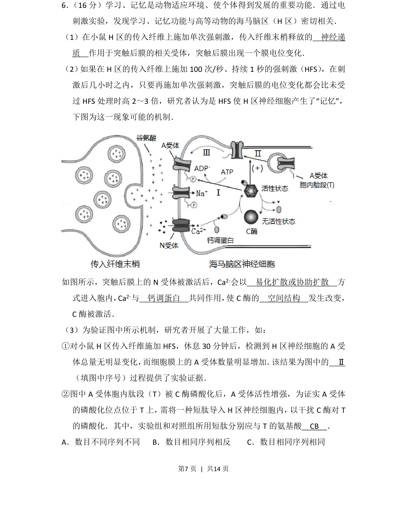
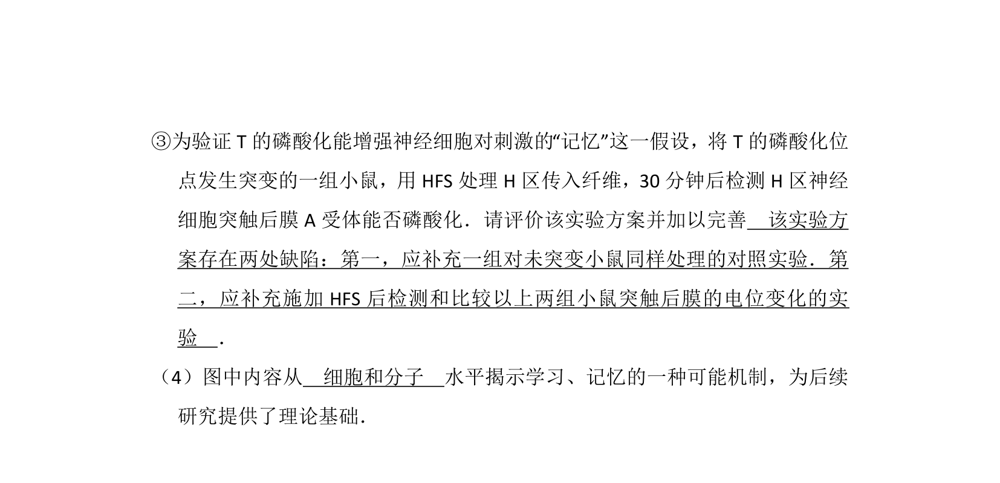
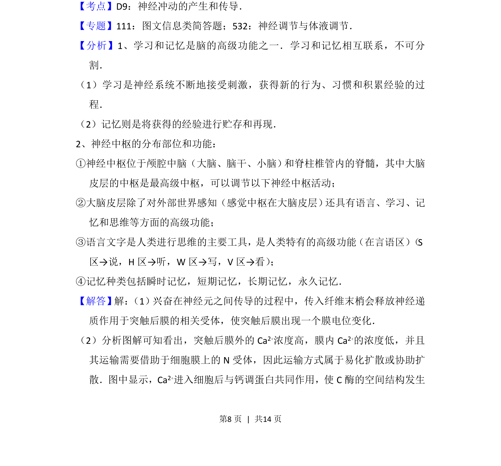
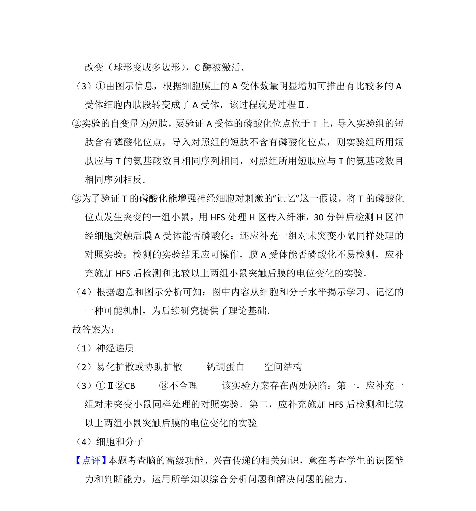

## 题面

## 摘要

本题以海马脑区神经调节为背景，考查突触传递、物质运输及实验验证机制。

## 关联考点

- [[324-神经调节|神经调节]]
- [[635-物质跨膜运输|物质跨膜运输]]
- [[蛋白质结构与功能]]
- [[482-实验设计|实验设计]]

## 答案与解析

> 📄 原 PDF 第 7 页：`素材/真题/北京/2008-2024·（北京）生物高考真题/2017年高考生物试卷（北京）（解析卷）.pdf`
