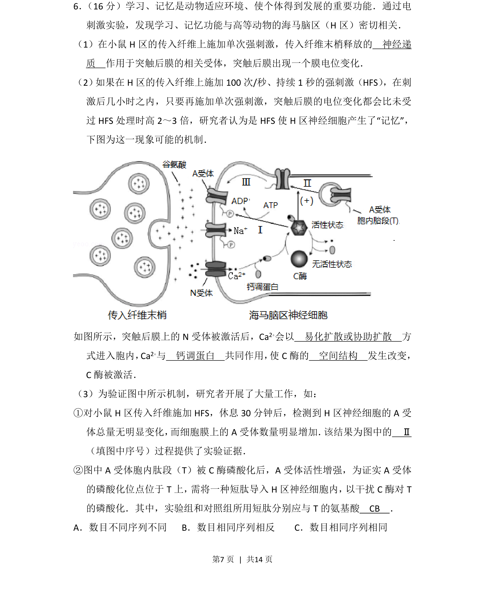
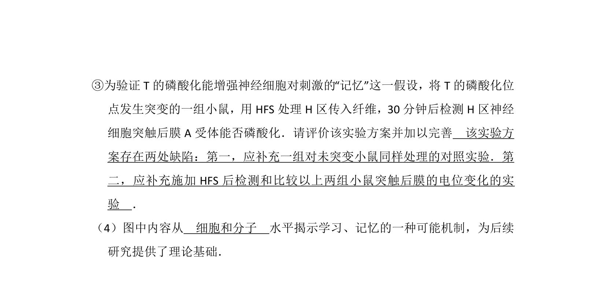
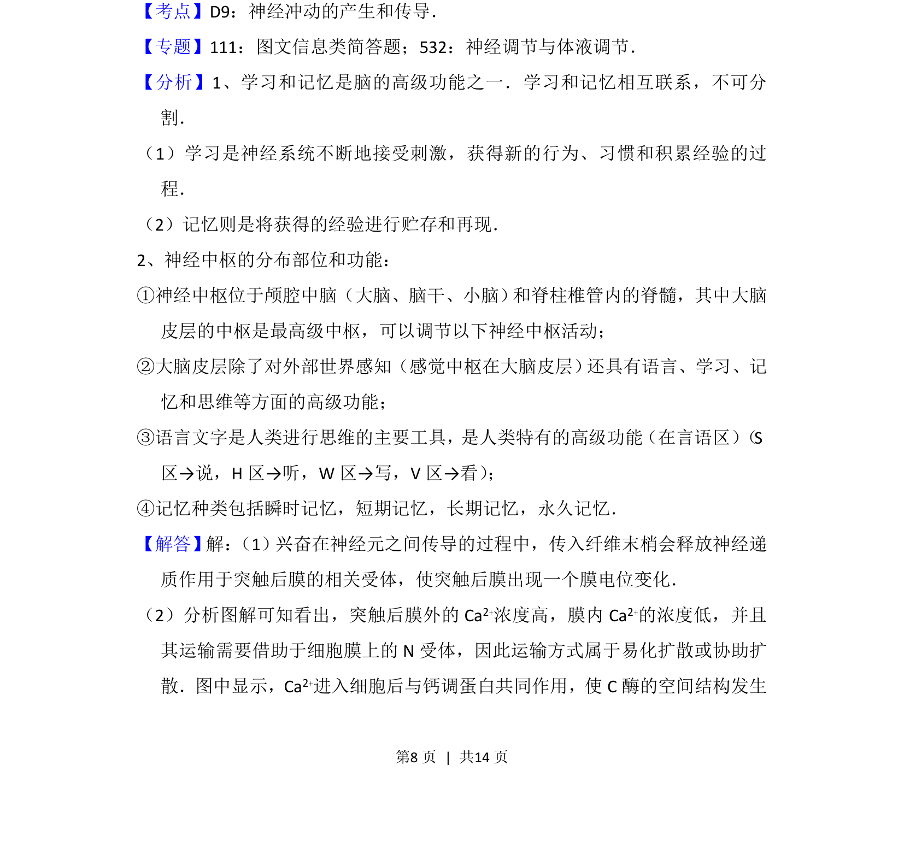
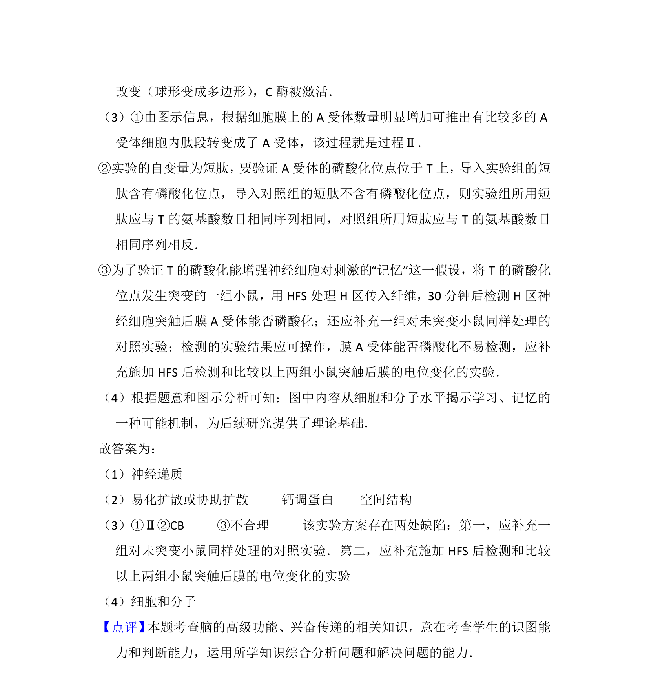

## 题面

## 摘要

本题以海马脑区神经调节为背景，考查突触传递、物质运输及实验验证机制。

## 关联考点

- [[324-神经调节|神经调节]]
- [[635-物质跨膜运输|物质跨膜运输]]
- [[蛋白质结构与功能]]
- [[482-实验设计|实验设计]]

## 答案与解析

> 📄 原 PDF 第 7 页：`素材/真题/北京/2008-2024·（北京）生物高考真题/2017年高考生物试卷（北京）（解析卷）.pdf`

<!-- 题干文本-start -->
## 题干文本
6． （16分）学习、记忆是动物适应环境、使个体得到发展的重要功能．通过电
刺激实验，发现学习、记忆功能与高等动物的海马脑区（H区）密切相关．
（1）在小鼠H区的传入纤维上施加单次强刺激，传入纤维末梢释放的　神经递
质　作用于突触后膜的相关受体，突触后膜出现一个膜电位变化．
（2） 如果在H区的传入纤维上施加100次/秒、持续1秒的强刺激（HFS） ，在刺
激后几小时之内，只要再施加单次强刺激，突触后膜的电位变化都会比未受
过HFS处理时高2～3倍，研究者认为是HFS使H区神经细胞产生了“记忆”，
下图为这一现象可能的机制．
如图所示，突触后膜上的N受体被激活后，Ca 2+会以　易化扩散或协助扩散　方
式进入胞内，Ca2+与　钙调蛋白　共同作用， 使C酶的　空间结构　发生改变，
C酶被激活．
（3）为验证图中所示机制，研究者开展了大量工作，如：
①对小鼠H区传入纤维施加HFS，休息30分钟后，检测到H区神经细胞的A受
体总量无明显变化， 而细胞膜上的A受体数量明显增加． 该结果为图中的　Ⅱ　
（填图中序号）过程提供了实验证据．
②图中A受体胞内肽段（T）被C酶磷酸化后，A受体活性增强，为证实A受体
的磷酸化位点位于T上， 需将一种短肽导入H区神经细胞内， 以干扰C酶对T
的磷酸化．其中，实验组和对照组所用短肽分别应与T的氨基酸　CB　．
A．数目不同序列不同   B．数目相同序列相反    C．数目相同序列相同
<!-- 题干文本-end -->

<!-- 解析文本-start -->
## 解析文本

<!-- 解析文本-end -->
