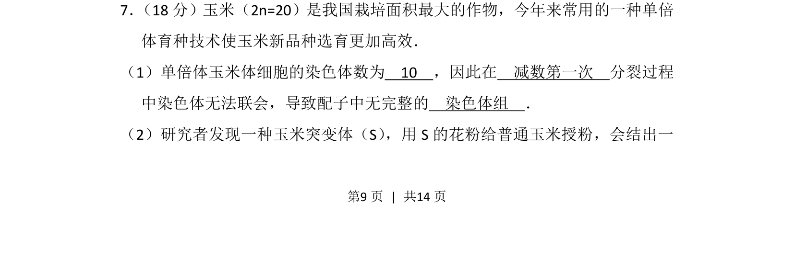
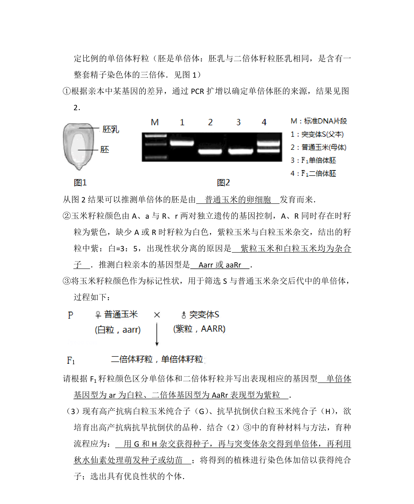
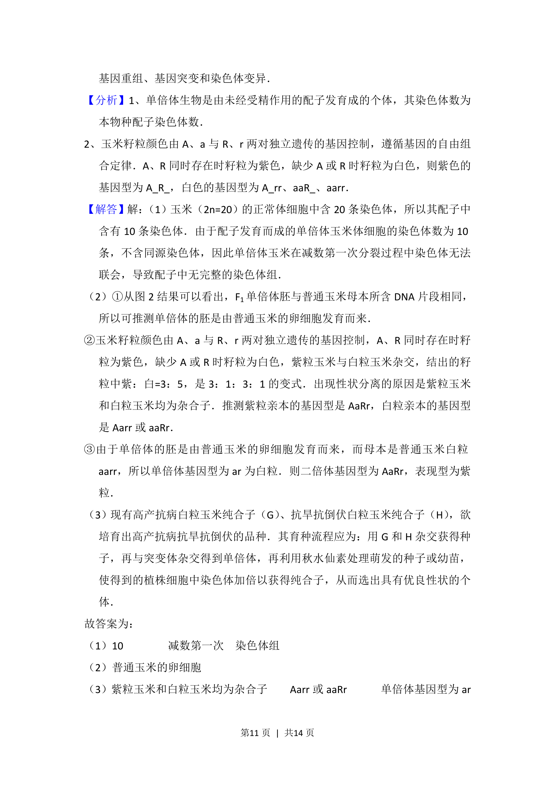
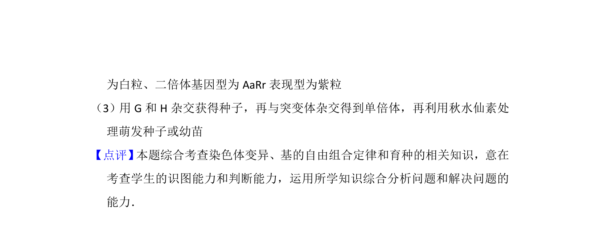

## 题面

## 摘要

玉米单倍体育种技术中染色体数目变化、减数分裂异常及配子染色体组完整性分析

## 关联考点

- [[300-单倍体|单倍体]]
- [[277-减数分裂（高中必二）|减数分裂]]
- [[807-染色体组|染色体组]]
- [[255-联会|联会]]

## 答案与解析

> 📄 原 PDF 第 9 页：`素材/真题/北京/2008-2024·（北京）生物高考真题/2017年高考生物试卷（北京）（解析卷）.pdf`
