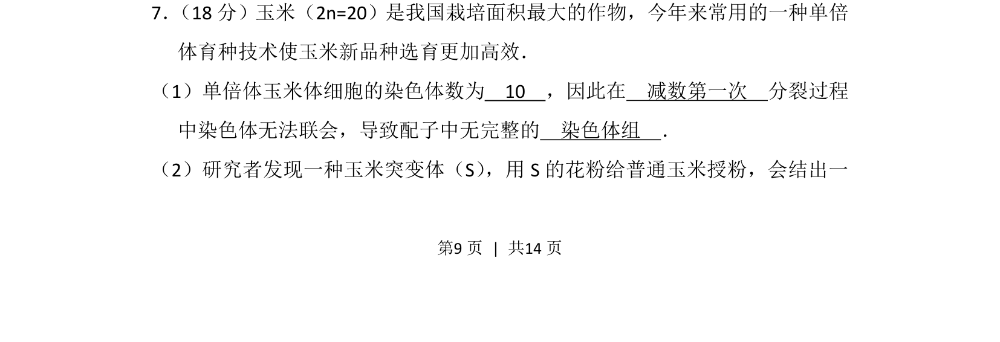
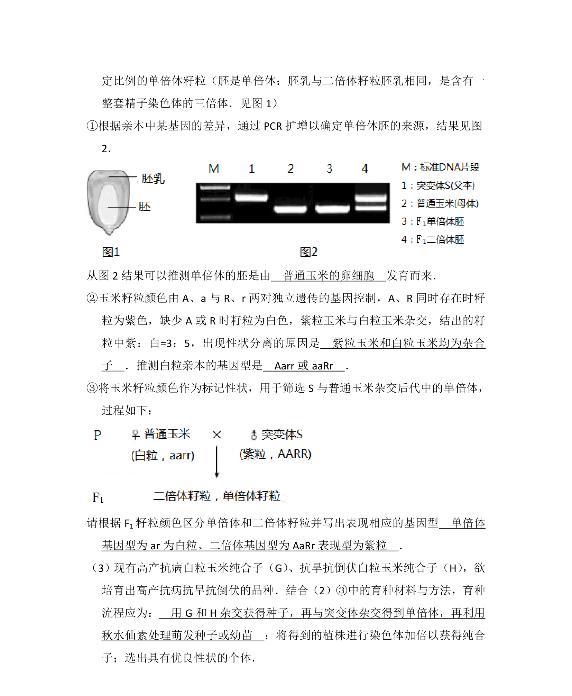
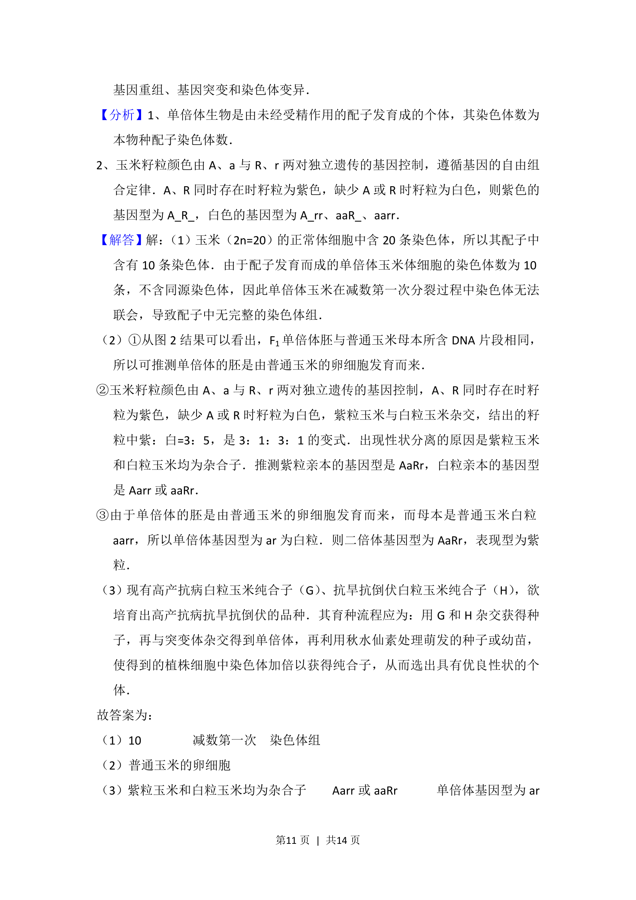
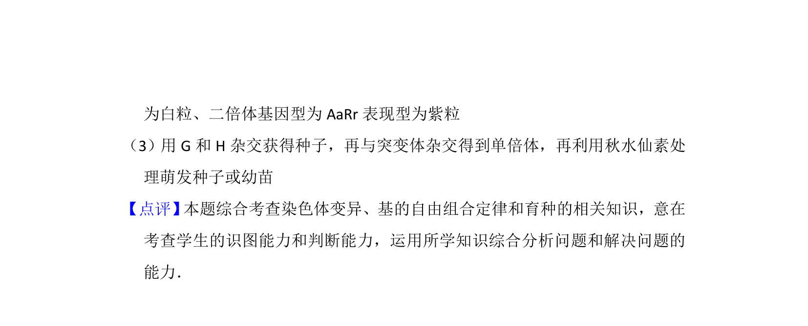

## 题面

## 摘要

玉米单倍体育种技术中染色体数目变化、减数分裂异常及配子染色体组完整性分析

## 关联考点

- [[300-单倍体|单倍体]]
- [[277-减数分裂（高中必二）|减数分裂]]
- [[807-染色体组|染色体组]]
- [[255-联会|联会]]

## 答案与解析

> 📄 原 PDF 第 9 页：`素材/真题/北京/2008-2024·（北京）生物高考真题/2017年高考生物试卷（北京）（解析卷）.pdf`

<!-- 题干文本-start -->
## 题干文本
7． （18分）玉米（2n=20）是我国栽培面积最大的作物，今年来常用的一种单倍
体育种技术使玉米新品种选育更加高效．
（1）单倍体玉米体细胞的染色体数为　10　，因此在　减数第一次　分裂过程
中染色体无法联会，导致配子中无完整的　染色体组　．
（2）研究者发现一种玉米突变体（S） ，用S的花粉给普通玉米授粉，会结出一
<!-- 题干文本-end -->

<!-- 解析文本-start -->
## 解析文本

<!-- 解析文本-end -->
