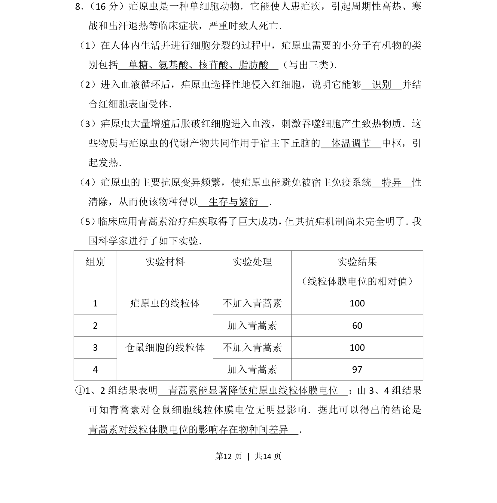
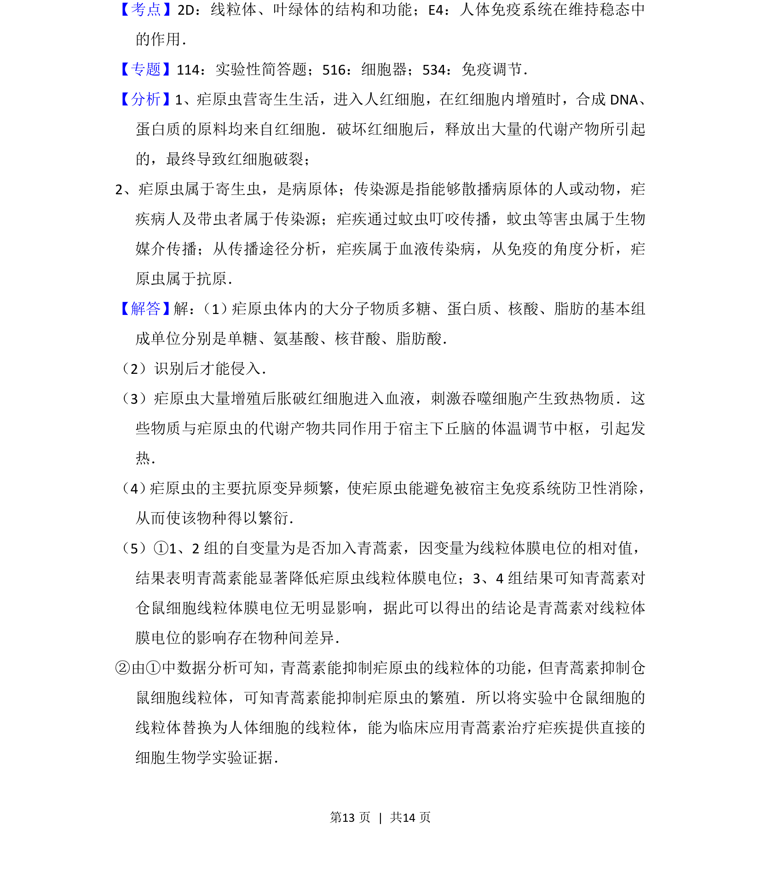
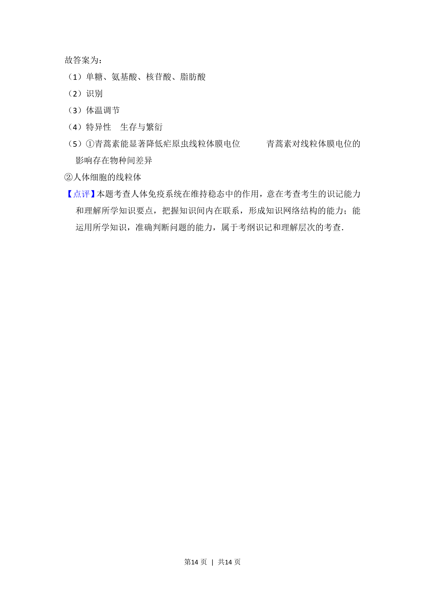

## 题面

## 摘要

本题以疟原虫为情境，综合考查细胞分子组成、免疫调节、体温调节及实验分析能力。

## 关联考点

- [[单糖氨基酸核苷酸脂肪酸]]
- [[细胞识别]]
- [[体温调节中枢]]
- [[抗原变异与免疫逃逸]]

## 答案与解析

> 📄 原 PDF 第 12 页：`素材/真题/北京/2008-2024·（北京）生物高考真题/2017年高考生物试卷（北京）（解析卷）.pdf`
