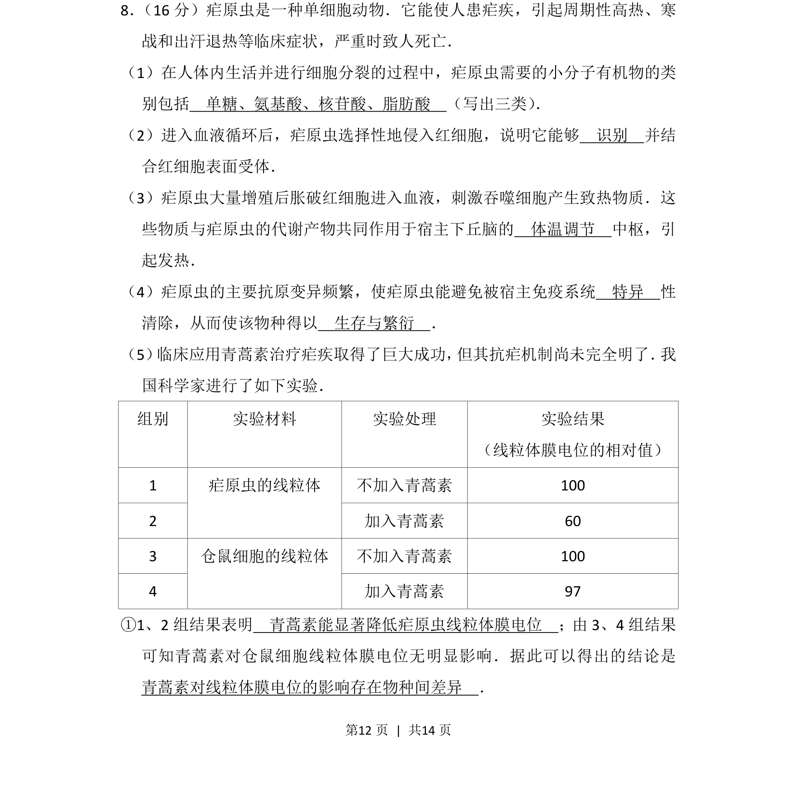
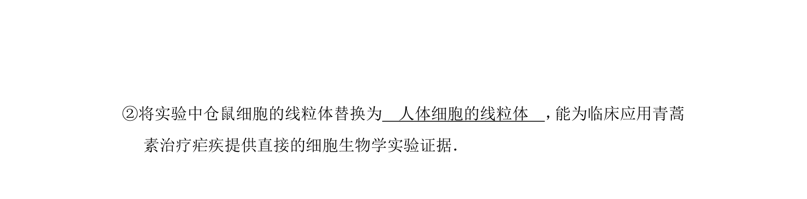
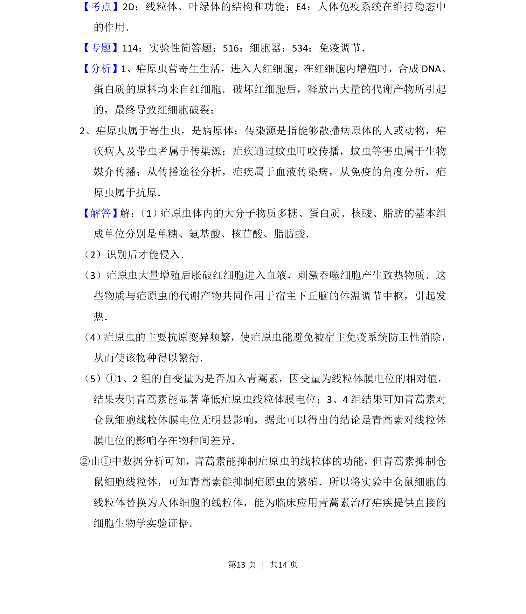
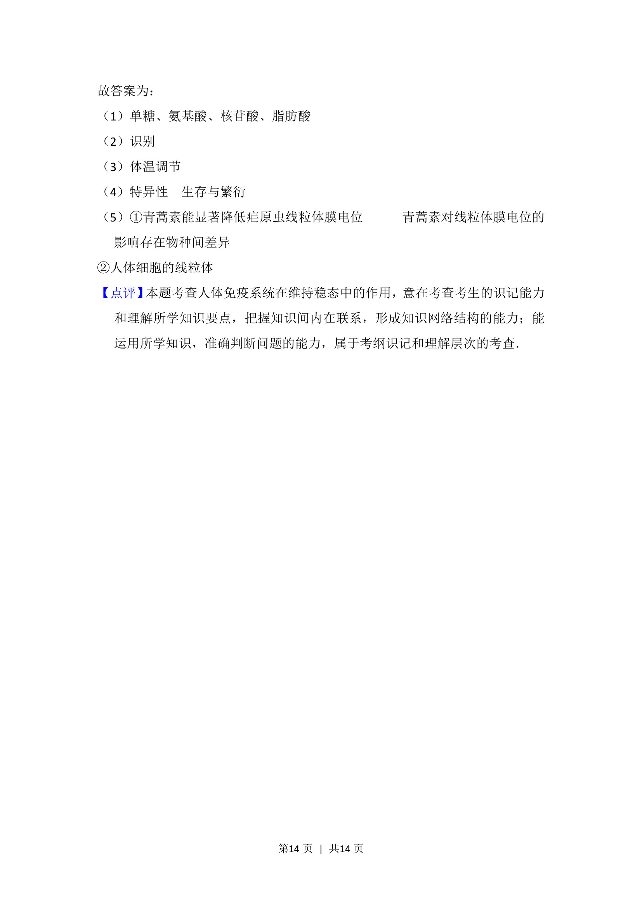

## 题面

## 摘要

本题以疟原虫为情境，综合考查细胞分子组成、免疫调节、体温调节及实验分析能力。

## 关联考点

- [[单糖氨基酸核苷酸脂肪酸]]
- [[细胞识别]]
- [[体温调节中枢]]
- [[抗原变异与免疫逃逸]]

## 答案与解析

> 📄 原 PDF 第 12 页：`素材/真题/北京/2008-2024·（北京）生物高考真题/2017年高考生物试卷（北京）（解析卷）.pdf`

<!-- 题干文本-start -->
## 题干文本
8． （16分）疟原虫是一种单细胞动物．它能使人患疟疾，引起周期性高热、寒
战和出汗退热等临床症状，严重时致人死亡．
（1）在人体内生活并进行细胞分裂的过程中，疟原虫需要的小分子有机物的类
别包括　单糖、氨基酸、核苷酸、脂肪酸　（写出三类） ．
（2）进入血液循环后，疟原虫选择性地侵入红细胞，说明它能够　识别　并结
合红细胞表面受体．
（3）疟原虫大量增殖后胀破红细胞进入血液，刺激吞噬细胞产生致热物质．这
些物质与疟原虫的代谢产物共同作用于宿主下丘脑的　体温调节　中枢，引
起发热．
（4）疟原虫的主要抗原变异频繁，使疟原虫能避免被宿主免疫系统　特异　性
清除，从而使该物种得以　生存与繁衍　．
（5） 临床应用青蒿素治疗疟疾取得了巨大成功， 但其抗疟机制尚未完全明了． 我
国科学家进行了如下实验．
组别 实验材料 实验处理 实验结果
（线粒体膜电位的相对值）
1 不加入青蒿素 100
2
疟原虫的线粒体
加入青蒿素 60
3 不加入青蒿素 100
4
仓鼠细胞的线粒体
加入青蒿素 97
①1、2组结果表明　青蒿素能显著降低疟原虫线粒体膜电位　；由3、4组结果
可知青蒿素对仓鼠细胞线粒体膜电位无明显影响．据此可以得出的结论是　
青蒿素对线粒体膜电位的影响存在物种间差异　．
<!-- 题干文本-end -->

<!-- 解析文本-start -->
## 解析文本

<!-- 解析文本-end -->
