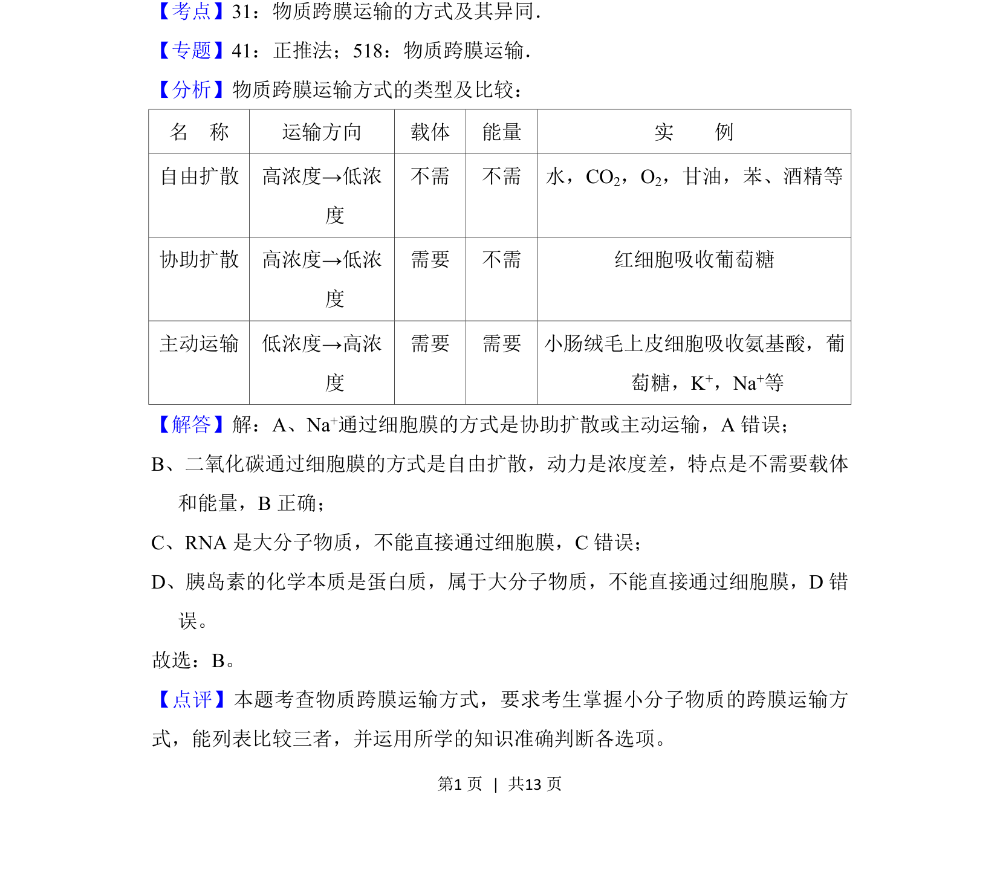

## 题面

## 摘要

该题考查物质跨膜运输方式，要求判断以自由扩散通过细胞膜的物质。

## 关联考点

- [[635-物质跨膜运输|物质跨膜运输]]
- [[261-自由扩散|自由扩散]]
- [[细胞膜选择透过性]]

## 答案与解析

> 📄 原 PDF 第 1 页：`素材/真题/北京/2008-2024·（北京）生物高考真题/2018年高考生物试卷（北京）（解析卷）.pdf`
